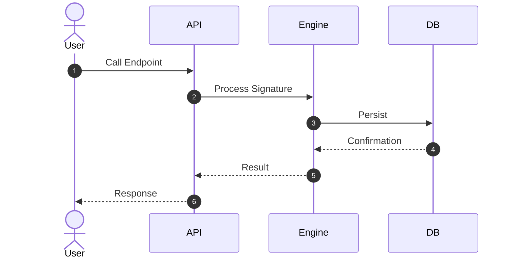

# Command: /generate-tech-spec [feature-name]

Generates the **Technical Details Document** (`2_tech_spec.md`) for a feature based strictly on its non-technical specification (`1_spec.md`).

## Pre-Execution Validation

> [!IMPORTANT]
> **MANDATORY CHECK**: Before generating, verify:
> 1. `features/<feature-name>/1_spec.md` **EXISTS**. If not → STOP and tell the user to run `/generate-spec <feature-name>` first.
> 2. `1_spec.md` contains at least **1 User Story** with Given-When-Then acceptance criteria. If not → STOP and report the spec is incomplete.
> 3. Check if `features/<feature-name>/2_tech_spec.md` already exists. If yes → **warn the user** and ask if they want to overwrite.

## Operating Instructions

1. Read `features/<feature-name>/1_spec.md` as the **primary source** of requirements.
2. Optionally scan existing source code (`backend/`, `frontend/`) ONLY to understand naming conventions, existing patterns, and current data models for **consistency** — NOT for requirements.
3. Translate **every** business user story and acceptance criteria into technical components, function contracts, and data structures.
4. Define clear interface definitions and function signatures so test generation agents can create tests without reading code implementation.
5. Read `features/*/3_summary.md` to identify integration points with existing features.

---

## Output Target
- Path: `features/<feature-name>/2_tech_spec.md`

---

## Technical Details Template Format (`2_tech_spec.md`)

```markdown
# Technical Specification: [Feature Name]

| Metadata | Details |
|---|---|
| **Feature Name** | [Feature Name] |
| **Derived From** | `features/<feature-name>/1_spec.md` |
| **Status** | Draft |
| **Author** | Technical Architect (AI) |
| **Created Date** | YYYY-MM-DD |

---

## 1. System Architecture & Components
- High-level design breakdown of services, modules, and handlers required.
- Component responsibility matrix.

---

## 2. Interface Definitions & Function Signatures
*Note: These signatures are the CONTRACT used by test-generators to create unbiased TDD unit tests. They must be precise and complete.*

```python
# Pydantic Models & Function Signatures

from pydantic import BaseModel
from typing import Optional, Any

class FeatureInput(BaseModel):
    id: str
    payload: dict[str, Any]

class FeatureResult(BaseModel):
    success: bool
    data: Optional[Any] = None
    error: Optional[str] = None

async def process_feature(input: FeatureInput) -> FeatureResult:
    """[Description of what this function does]

    Args:
        input: [parameter description]

    Returns:
        [return value description]

    Raises:
        ErrorType: [when this error occurs]
    """
    ...
```

---

## 3. Data Models & Schemas
- Database tables, JSON schemas, or state definitions.
- Field-level documentation with types, nullability, and constraints.

---

## 4. API Contracts
### `METHOD /api/v1/endpoint`
- **Request Parameters / Body**:
- **Response (200 OK)**:
- **Response (400 Bad Request)**:
- **Response (404 Not Found)**:
- **Response (500 Internal Server Error)**:

---

## 5. Error Types & Handling
| Error Code | Trigger | HTTP Status | User Message |
|---|---|---|---|
| ERR_001 | [condition] | [status] | [message] |

---

## 6. Spec-to-Component Traceability
| User Story (from 1_spec.md) | Technical Component | Function/Endpoint |
|---|---|---|
| US-01 | [Component] | [function()] |
| US-02 | [Component] | [function()] |

---

## 7. Sequence Diagram

```

## Minimum Quality Requirements
- Every User Story from `1_spec.md` appears in the **Traceability** table (Section 6)
- All function signatures have **docstring comments** with Args, Returns, Raises
- Error types defined for every edge case in `1_spec.md` Section 4
- At least one **sequence diagram** for the primary workflow
