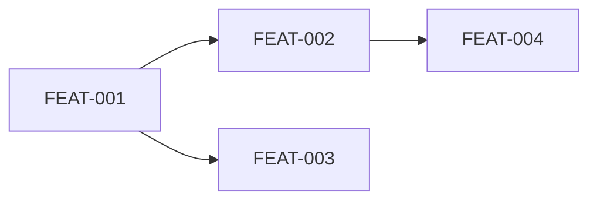

# Command: /plan-features [project-name]

Reads a problem statement (from conversation input or a design document) and decomposes it into discrete, independently buildable features with a dependency graph and recommended build order.

## When to Use This Command
- **Starting a new project** — run this FIRST before any `/generate-spec`
- **Adding a major capability** — re-run to update the index with new features
- **Reviewing scope** — validate that features are properly decomposed

## Critical Rules

> [!CAUTION]
> ### ABSOLUTE PROHIBITIONS
> 1. **DO NOT READ CODE FILES** — you plan WHAT to build, not HOW
> 2. **DO NOT include implementation details** in feature descriptions — no function names, no API routes, no schemas
> 3. **DO NOT create features for infrastructure** — "Database Setup", "CI/CD Pipeline" are NOT features. Features are user-facing capabilities.
> 4. Each feature MUST have 2-5 user stories. If more → split. If fewer → merge.

## Allowed Context Sources
1. **User conversation** — problem statement, requirements, constraints
2. **Design documents** — `docs/` directory (`.md` files only)
3. `features/INDEX.md` — existing index for deduplication
4. `features/*/3_summary.md` — existing summaries for understanding what's built

---

## Step-by-Step Execution

### Step 1: Identify Personas
List all user types who will interact with the system.

### Step 2: Map Core Workflows
For each persona, identify their primary workflows (each is a candidate feature).

### Step 3: Identify Data Entities
List the core business objects. Each entity's lifecycle may be a separate feature.

### Step 4: Decompose into Features
Apply decomposition patterns (by workflow, persona, entity, or integration).

### Step 5: Map Dependencies
For each feature, list what other features it depends on and classify as HARD or SOFT.

### Step 6: Assign Build Phases
- Phase 1: Features with NO dependencies
- Phase 2: Features depending only on Phase 1
- Phase N: Features depending on Phase N-1 or lower

### Step 7: Check Deduplication
Compare against existing `features/INDEX.md` — mark overlaps as `EXISTING`.

---

## Output Target
- Path: `features/INDEX.md`

## Output Format (`features/INDEX.md`)

```markdown
# Feature Index

> Auto-generated by `/plan-features`. This is the single source of truth for all features,
> their dependencies, and build order. AI agents read this to know WHICH summaries to load.
>
> **Last Updated**: YYYY-MM-DD

---

## Personas
| ID | Persona | Description |
|---|---|---|
| P1 | [Name] | [One-line role description] |

---

## Feature Registry

| Feature ID | Feature Name | Folder | Phase | Status | Depends On | Primary Persona |
|---|---|---|---|---|---|---|
| FEAT-001 | [Name] | `features/[name]/` | 1 | [Status] | None | P1 |
| FEAT-002 | [Name] | `features/[name]/` | 2 | Planned | FEAT-001 (HARD) | P1, P2 |

### Status Values:
- `Planned` — Not started
- `Spec Ready` — `1_spec.md` exists
- `Tech Spec Ready` — `2_tech_spec.md` exists
- `Tests Ready` — Test files generated
- `Implemented` — Code written, tests pass
- `Verified` — `/validate-feature` passed
- `Complete` — `3_summary.md` generated

---

## Dependency Graph



---

## Build Order

### Phase 1 (No Dependencies — Start Here)
- [ ] FEAT-001: [Name] — [one-line description]

### Phase 2 (Depends on Phase 1)
- [ ] FEAT-002: [Name] — [one-line description]

### Phase 3 (Depends on Phase 2)
- [ ] FEAT-003: [Name] — [one-line description]

---

## Feature-to-Summary Quick Reference
> **For AI agents**: When working on a feature, read ONLY the summaries listed in its "Depends On" column.

| Working On | Load These Summaries |
|---|---|
| FEAT-002 | `features/[feat-001-folder]/3_summary.md` |
| FEAT-003 | `features/[feat-001-folder]/3_summary.md` |
| FEAT-004 | `features/[feat-002-folder]/3_summary.md` |
```

## Quality Checks Before Saving:
- [ ] Every feature has 2-5 user stories scope (not listed here, but validated during spec generation)
- [ ] No circular dependencies in the graph
- [ ] Every feature has at least one Primary Persona
- [ ] Build phases are correctly ordered (no feature depends on a higher-phase feature)
- [ ] Zero implementation details in feature descriptions
- [ ] Existing features from INDEX.md are preserved, not duplicated
