# 🔄 Complete Feature Lifecycle Guide

> Your end-to-end playbook for developing features using the coding harness — from problem statement to production code.

---

## The Big Picture

```mermaid
graph LR
    A["📋 Problem Statement"] --> B["/plan-features"]
    B --> C["features/INDEX.md"]
    C --> D["/generate-spec"]
    D --> E["1_spec.md"]
    E --> F["/generate-tech-spec"]
    F --> G["2_tech_spec.md"]
    G --> H["/generate-tests"]
    H --> I["tests/"]
    I --> J["/implement-feature"]
    J --> K["Source Code"]
    K --> L["/validate-feature"]
    L --> M["/generate-summary"]
    M --> N["3_summary.md"]
    N --> O["Update INDEX.md"]
```



---

## Phase 0: Plan Features (Run Once Per Project/Major Scope)

### What You Do
Describe your problem to the AI. Paste a design doc, explain the system, or just describe the pain point.

### Command
```
/plan-features support-ticket-manager
```

### What the AI Sees
| ✅ Can Read | ❌ Cannot Read |
|---|---|
| Your conversation (problem statement) | ANY code files |
| `docs/*.md` (design docs) | `src/`, `lib/`, `app/` |
| `features/INDEX.md` (existing index) | `package.json`, config files |
| `features/*/3_summary.md` (existing summaries) | Database schemas |

### What It Produces
[features/INDEX.md](file:///Users/rohit/Documents/support_ticket_manager/features/INDEX.md) — containing:
- Persona registry (who uses the system)
- Feature list with IDs, phases, and dependencies
- Dependency graph (Mermaid diagram)
- Build order (Phase 1 → 2 → 3...)
- **Summary loading reference** — tells each future agent which 1-3 summaries to load

### Why This Matters for Context
Without INDEX.md, every agent would load ALL `3_summary.md` files to understand the system. At 20 features, that's 20 files polluting the context window. With INDEX.md, each agent loads only 1-3 relevant summaries.

### Example Output
```markdown
## Feature Registry
| Feature ID | Feature Name | Phase | Status | Depends On |
|---|---|---|---|---|
| FEAT-001 | Ticket Ingestion | 1 | Planned | None |
| FEAT-002 | Order Context Matching | 1 | Planned | None |
| FEAT-003 | SLA Tracking | 2 | Planned | FEAT-001 (HARD) |
| FEAT-004 | Agent Dashboard | 2 | Planned | FEAT-001 (SOFT), FEAT-002 (SOFT) |
```

---

## Phase 1: Generate Spec (Per Feature)

### Prerequisite
✅ Feature must be listed in `features/INDEX.md`

### Command
```
/generate-spec ticket-ingestion
```

### What the AI Sees
| ✅ Can Read | ❌ Cannot Read |
|---|---|
| `features/INDEX.md` (find dependencies) | ANY code files |
| `features/<dep>/3_summary.md` (ONLY deps from INDEX) | ALL other summaries |
| Your conversation | Config, build, test files |

> [!IMPORTANT]
> **KEY INSIGHT**: The spec-writer reads INDEX.md first → finds "Depends On: FEAT-001" → loads ONLY `features/ticket-ingestion/3_summary.md` → ignores the other 19 features. This is how context stays clean.

### What It Produces
`features/<feature-name>/1_spec.md` containing:
- Problem statement (business language only)
- User stories with Given-When-Then acceptance criteria (min 2)
- Edge cases table (min 2 entries)
- **ZERO** technical details

### Quality Gate
Before saving, the agent self-validates:
- [ ] ≥ 2 user stories with Given-When-Then
- [ ] ≥ 2 edge cases
- [ ] Zero code terms (no function names, no API routes)

---

## Phase 2: Generate Tech Spec (Per Feature)

### Prerequisite
✅ `features/<feature-name>/1_spec.md` must exist with at least 1 user story

### Command
```
/generate-tech-spec ticket-ingestion
```

### What the AI Sees
| ✅ Can Read | ❌ Cannot Read |
|---|---|
| `features/<name>/1_spec.md` (PRIMARY) | Test files |
| Existing source code (conventions ONLY) | Other feature specs |
| `features/<dep>/3_summary.md` (from INDEX) | — |

### What It Produces
`features/<feature-name>/2_tech_spec.md` containing:
- System architecture & components
- **Complete function signatures** with type hints, docstrings, Pydantic models
- Data models with field-level documentation
- API contracts (all status codes)
- **Spec-to-Component traceability table** (maps every US-XX to a function)
- Sequence diagram

### Why Traceability Matters
The traceability table ensures no user story falls through the cracks:
```markdown
| User Story | Technical Component | Function/Endpoint |
|---|---|---|
| US-01: Order Linking | TicketOrderMatcher | matchOrderContext() |
| US-02: SLA Tracking | ResolutionAnalytics | computeSLAMetrics() |
```

---

## Phase 3: Generate Tests (Per Feature)

### Prerequisites
✅ `1_spec.md` AND `2_tech_spec.md` must exist

### Command
```
/generate-tests ticket-ingestion
```

### What the AI Sees — THE MOST RESTRICTED AGENT
| ✅ Can Read | ❌ Cannot Read |
|---|---|
| `features/<name>/1_spec.md` | **ALL source code** |
| `features/<name>/2_tech_spec.md` | **ALL summaries** |
| **NOTHING ELSE** | **INDEX.md, package.json, everything** |

> [!CAUTION]
> **This is the unbiased TDD firewall.** The test-engineer sees ONLY the spec and the contracts. It cannot see how you implemented the feature. This means tests validate the SPEC, not the code.

### What It Produces
`features/<feature-name>/tests/test_<feature_name>.py` containing:
- Happy path tests (from acceptance criteria success scenarios)
- Failure tests (from acceptance criteria failure scenarios)
- Edge case tests (from Section 4 of spec)
- Boundary tests (null, empty, max values)
- Error type tests (from tech spec error definitions)

### Language
- This project uses Python → `test_<feature_name>.py` (pytest)

---

## Phase 4: Implement Feature

### Prerequisites
✅ `2_tech_spec.md` AND test files must exist

### Command
```
/implement-feature ticket-ingestion
```

### What the AI Sees
| ✅ Can Read | ❌ Cannot Read |
|---|---|
| `features/<name>/2_tech_spec.md` | `1_spec.md` (not needed for coding) |
| `features/<name>/tests/` | Other feature test files |
| Existing source code (for patterns) | — |
| `features/*/3_summary.md` (integration) | — |

### What It Does
- Writes production code that satisfies ALL test assertions
- Matches function signatures from `2_tech_spec.md` exactly
- Does NOT modify generated test files
- Follows existing project conventions

---

## Phase 5: Validate Feature

### Command
```
/validate-feature ticket-ingestion
```

### What It Checks
Runs a 5-stage validation across the entire pipeline:

| Stage | Check |
|---|---|
| 1. Spec | `1_spec.md` exists, has user stories, has edge cases, no tech language |
| 2. Tech Spec | `2_tech_spec.md` exists, has signatures, traces back to spec |
| 3. Tests | Test files exist, cover all acceptance scenarios |
| 4. Implementation | Source files export the defined signatures |
| 5. Summary | `3_summary.md` exists, matches tech spec interfaces |

### Output
A status report telling you exactly what's done and what's missing.

---

## Phase 6: Generate Summary

### Prerequisites
✅ ALL prior stages must be complete

### Command
```
/generate-summary ticket-ingestion
```

### What It Produces
`features/<feature-name>/3_summary.md` — a **≤ 50 line** context capsule that future features will read.

### After Summary Generation
Update `features/INDEX.md`:
1. Change the feature's Status from `Planned` → `Complete`
2. Verify the Feature-to-Summary reference table is accurate

---

## 🔗 How Features Connect to Each Other

### The INDEX.md Flow

```
┌──────────────────┐
│ features/INDEX.md │
│                  │
│ FEAT-001: None   │──── No deps, build first
│ FEAT-002: None   │──── No deps, build in parallel
│ FEAT-003: FEAT-001│──── Reads FEAT-001's 3_summary.md
│ FEAT-004: FEAT-001,│─── Reads FEAT-001 + FEAT-002 summaries
│           FEAT-002│
└──────────────────┘
```

### What Each Agent Loads Per Feature

When you run `/generate-spec sla-tracking` and INDEX.md says it depends on `FEAT-001`:

```
spec-writer reads:
  1. features/INDEX.md                           ← find deps
  2. features/ticket-ingestion/3_summary.md      ← ONLY this dep
  3. (your conversation)                         ← requirements
  
  DOES NOT READ:
  ✗ features/agent-dashboard/3_summary.md        ← not a dependency
  ✗ features/order-matching/3_summary.md          ← not a dependency
  ✗ src/anything                                  ← code is forbidden
```

### Adding a New Feature That Depends on Existing Ones

1. Run `/plan-features` again (or manually edit INDEX.md)
2. Add the new feature row with its dependencies:
   ```
   | FEAT-005 | SLA Reports | features/sla-reports/ | 3 | Planned | FEAT-001 (HARD), FEAT-003 (HARD) | P2 |
   ```
3. Add its summary loading reference:
   ```
   | FEAT-005 | features/ticket-ingestion/3_summary.md, features/sla-tracking/3_summary.md |
   ```
4. Run the pipeline: `/generate-spec` → `/generate-tech-spec` → `/generate-tests` → `/implement-feature` → `/validate-feature` → `/generate-summary`

---

## 📁 Where Everything Lives

```
project/
├── features/
│   ├── INDEX.md                          ← Feature registry + dependency graph
│   ├── MANIFEST.md                       ← Lifecycle status (legacy, kept for reference)
│   ├── ticket-ingestion/
│   │   ├── 1_spec.md                     ← Non-technical spec
│   │   ├── 2_tech_spec.md                ← Technical blueprint
│   │   ├── 3_summary.md                  ← Context capsule (≤50 lines)
│   │   └── tests/
│   │       └── test_ticket_ingestion.py  ← Unbiased tests
│   ├── sla-tracking/
│   │   ├── 1_spec.md
│   │   ├── 2_tech_spec.md
│   │   ├── 3_summary.md
│   │   └── tests/
│   │       └── test_sla_tracking.py
│   └── ...
├── backend/                              ← FastAPI application (written by /implement-feature)
├── frontend/                             ← Static HTML/JS/CSS
├── docs/                                 ← Design docs, PRDs
├── .opencode/
│   ├── commands/                         ← Slash commands (7 total)
│   ├── agents/                           ← Agent definitions (6 total)
│   ├── skills/                           ← Skill guidance (5 total)
│   └── mcp.json
├── AGENTS.md                             ← Architecture overview
└── opencode.jsonc                        ← Harness configuration
```

---

## 🚀 Quick Reference: "I Want to Build Feature X"

```
Step 0: /plan-features (if INDEX.md doesn't exist or feature not listed)
Step 1: /generate-spec <feature-name>
Step 2: /generate-tech-spec <feature-name>
Step 3: /generate-tests <feature-name>
Step 4: /implement-feature <feature-name>
Step 5: /validate-feature <feature-name>
Step 6: /generate-summary <feature-name>
Step 7: Update INDEX.md status → "Complete"
```

Each step blocks until prerequisites are met. If you skip a step, the command will tell you what's missing.
