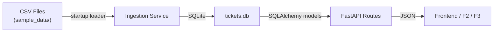
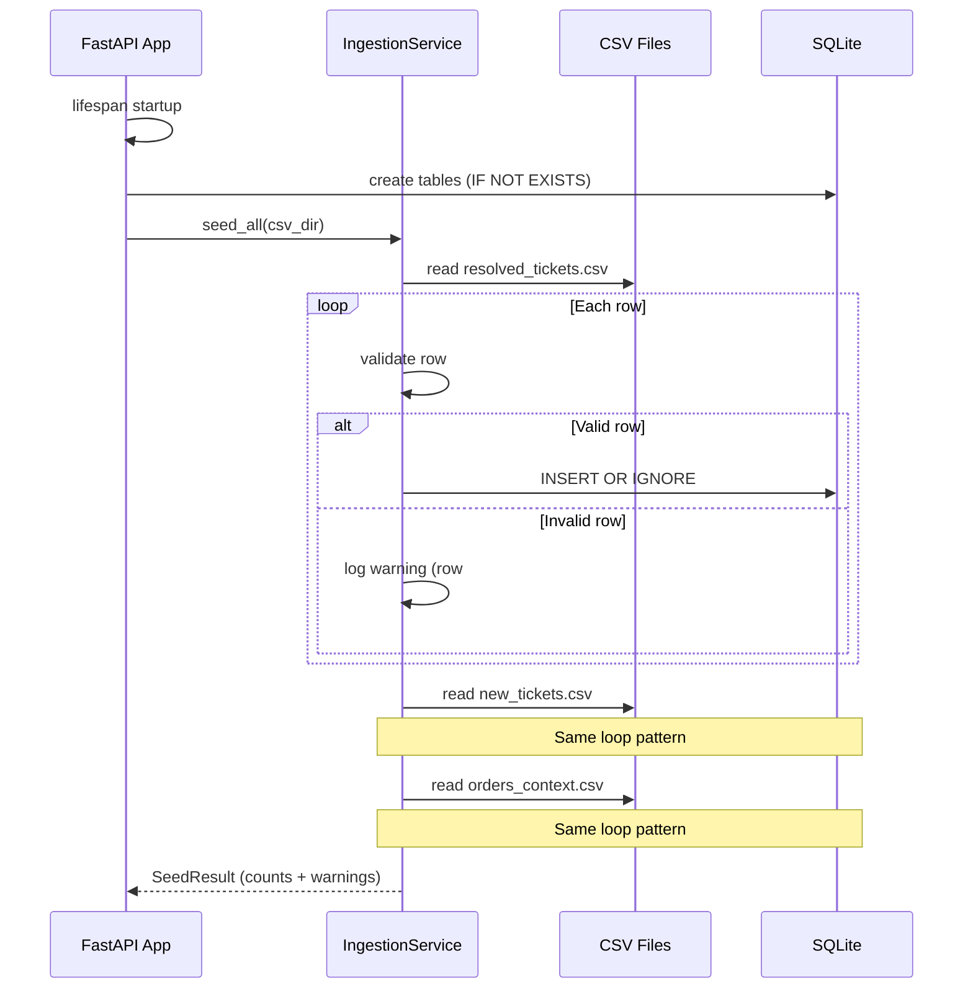
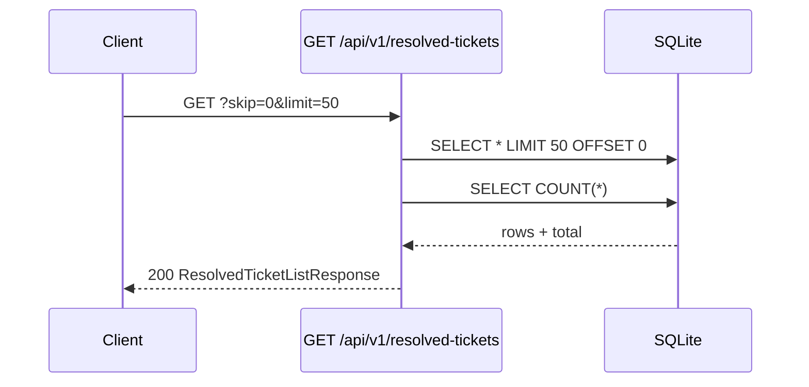
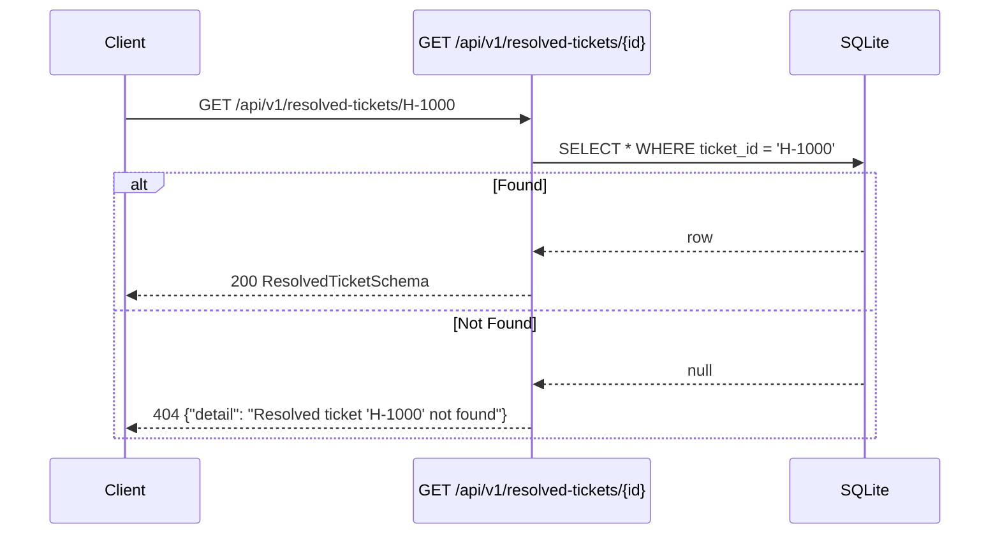

# F1 · Data Ingestion & Storage — Technical Specification

> **Feature ID**: F1  
> **Spec**: [1_spec.md](file:///Users/rohit/Documents/support_ticket_manager/features/F1-data-ingestion/1_spec.md)  
> **Status**: Tech Spec Draft  
> **Dependencies**: None  
> **Downstream consumers**: F2 (Similarity Engine), F3 (Resolution Engine), F5 (Dashboard)

---

## 1. Architecture Overview



F1 is a **read-only data layer** with a one-time bulk-load capability. It comprises:

1. **Database schema** — three SQLite tables mirroring the CSV datasets.
2. **Pydantic models** — request/response validation for all API contracts.
3. **Ingestion service** — idempotent CSV loader with row-level error handling.
4. **REST API routes** — list and detail endpoints for each entity.

---

## 2. CSV Column Mapping

> Answers **OQ-1** from the spec. Actual headers confirmed from source files.

### `resolved_tickets.csv` (300 data rows)

| CSV Column | DB Field | Python Type | Notes |
|---|---|---|---|
| `ticket_id` | `ticket_id` | `str` | Format: `H-NNNN` (e.g., `H-1000`) |
| `category` | `category` | `str` | e.g., `missing_item`, `wrong_item` |
| `description` | `description` | `str` | Free-text customer issue |
| `resolution_action` | `action_taken` | `str` | `refund` / `redelivery` / `coupon` |
| `resolution_note` | `resolution_note` | `str` | Human-written resolution note |
| `time_to_resolve_min` | `time_to_resolve_min` | `int` | Minutes to resolve |
| `csat` | `csat_score` | `float` | Customer satisfaction score |

### `new_tickets.csv` (30 data rows)

| CSV Column | DB Field | Python Type | Notes |
|---|---|---|---|
| `ticket_id` | `ticket_id` | `str` | Format: `N-NNN` (e.g., `N-000`) |
| `created_at` | `created_at` | `str` | ISO 8601 datetime |
| `order_id` | `order_id` | `str` | Format: `ORD-NNNN`, FK to orders |
| `description` | `description` | `str` | Free-text customer issue |

### `orders_context.csv` (30 data rows)

| CSV Column | DB Field | Python Type | Notes |
|---|---|---|---|
| `order_id` | `order_id` | `str` | Format: `ORD-NNNN` |
| `items` | `items` | `str` | Comma-separated or count |
| `value_inr` | `value` | `float` | Order value in INR |
| `delivery_time_min` | `delivery_time` | `str` | Delivery time in minutes |
| `delivery_status` | `status` | `str` | `delivered` / `cancelled` / `in_transit` |

---

## 3. Database Schema

**Engine**: SQLite via `aiosqlite` (async) with SQLAlchemy ORM.  
**Database file**: `backend/tickets.db` (created on startup, gitignored).

```sql
CREATE TABLE IF NOT EXISTS resolved_tickets (
    ticket_id   TEXT PRIMARY KEY,          -- "H-1000"
    category    TEXT NOT NULL,
    description TEXT NOT NULL,
    action_taken TEXT NOT NULL,            -- refund / redelivery / coupon
    resolution_note TEXT NOT NULL,
    time_to_resolve_min INTEGER NOT NULL,
    csat_score  REAL NOT NULL
);

CREATE TABLE IF NOT EXISTS new_tickets (
    ticket_id   TEXT PRIMARY KEY,          -- "N-000"
    created_at  TEXT NOT NULL,             -- ISO 8601
    order_id    TEXT NOT NULL,             -- FK reference (not enforced)
    description TEXT NOT NULL
);

CREATE TABLE IF NOT EXISTS orders_context (
    order_id       TEXT PRIMARY KEY,       -- "ORD-9900"
    items          TEXT NOT NULL,
    value          REAL NOT NULL,          -- INR
    delivery_time  TEXT NOT NULL,          -- e.g., "24"
    status         TEXT NOT NULL           -- delivered / cancelled / in_transit
);
```

> [!NOTE]
> Foreign key from `new_tickets.order_id → orders_context.order_id` is **not enforced** at the DB level. Per spec business rule #4, new tickets referencing non-existent orders are still loaded; missing context is handled at resolution time (F3).

---

## 4. Pydantic Models

File: `backend/app/models/ticket_models.py`

```python
from pydantic import BaseModel, Field
from typing import Optional


# ── Resolved Tickets ──────────────────────────────────────────────

class ResolvedTicketSchema(BaseModel):
    """Response schema for a single resolved ticket."""
    ticket_id: str = Field(..., examples=["H-1000"])
    category: str = Field(..., examples=["missing_item"])
    description: str = Field(..., examples=["milk packet missing from my order"])
    action_taken: str = Field(..., examples=["redelivery"])
    resolution_note: str = Field(..., examples=["missing item re-sent"])
    time_to_resolve_min: int = Field(..., examples=[32])
    csat_score: float = Field(..., examples=[5.0])

    class Config:
        from_attributes = True


# ── New Tickets ───────────────────────────────────────────────────

class NewTicketSchema(BaseModel):
    """Response schema for a single new/incoming ticket."""
    ticket_id: str = Field(..., examples=["N-000"])
    created_at: str = Field(..., examples=["2026-08-07T20:58:00"])
    order_id: str = Field(..., examples=["ORD-9900"])
    description: str = Field(..., examples=["fruits were rotten"])

    class Config:
        from_attributes = True


# ── Order Context ─────────────────────────────────────────────────

class OrderContextSchema(BaseModel):
    """Response schema for a single order."""
    order_id: str = Field(..., examples=["ORD-9900"])
    items: str = Field(..., examples=["1"])
    value: float = Field(..., examples=[999.0])
    delivery_time: str = Field(..., examples=["24"])
    status: str = Field(..., examples=["cancelled"])

    class Config:
        from_attributes = True


# ── Pagination ────────────────────────────────────────────────────

class PaginatedResponse(BaseModel):
    """Wrapper for paginated list responses."""
    total: int
    skip: int
    limit: int
    items: list  # overridden in specific responses


class ResolvedTicketListResponse(PaginatedResponse):
    items: list[ResolvedTicketSchema]


class NewTicketListResponse(PaginatedResponse):
    items: list[NewTicketSchema]


class OrderContextListResponse(PaginatedResponse):
    items: list[OrderContextSchema]
```

> Answers **OQ-2**: Pagination is **offset-based** (`skip` / `limit`) for simplicity. Cursor-based is unnecessary given the dataset sizes (~300 resolved, ~30 new, ~30 orders).

---

## 5. API Contracts

**Base path**: `/api/v1`

### 5.1 Resolved Tickets

| Method | Path | Description | Response |
|---|---|---|---|
| `GET` | `/resolved-tickets` | List all resolved tickets (paginated) | `ResolvedTicketListResponse` |
| `GET` | `/resolved-tickets/{ticket_id}` | Get a single resolved ticket | `ResolvedTicketSchema` |

**Query Parameters** (list endpoint):

| Param | Type | Default | Description |
|---|---|---|---|
| `skip` | `int` | `0` | Number of records to skip |
| `limit` | `int` | `50` | Maximum records to return (max: 500) |

**Error Responses**:
- `404 Not Found` — `{"detail": "Resolved ticket '<ticket_id>' not found"}`

### 5.2 New Tickets

| Method | Path | Description | Response |
|---|---|---|---|
| `GET` | `/new-tickets` | List all new tickets (paginated) | `NewTicketListResponse` |
| `GET` | `/new-tickets/{ticket_id}` | Get a single new ticket | `NewTicketSchema` |

**Query Parameters**: Same as resolved tickets (`skip`, `limit`).

**Error Responses**:
- `404 Not Found` — `{"detail": "New ticket '<ticket_id>' not found"}`

### 5.3 Orders

| Method | Path | Description | Response |
|---|---|---|---|
| `GET` | `/orders` | List all orders (paginated) | `OrderContextListResponse` |
| `GET` | `/orders/{order_id}` | Get a single order | `OrderContextSchema` |

**Query Parameters**: Same as resolved tickets (`skip`, `limit`).

**Error Responses**:
- `404 Not Found` — `{"detail": "Order '<order_id>' not found"}`

### 5.4 Data Seeding

| Method | Path | Description | Response |
|---|---|---|---|
| `POST` | `/seed` | Trigger CSV ingestion (idempotent) | `SeedResponse` |

```python
class SeedResponse(BaseModel):
    """Response from the seeding endpoint."""
    resolved_tickets_loaded: int
    new_tickets_loaded: int
    orders_loaded: int
    warnings: list[str]  # skipped rows with reasons
```

### 5.5 Health Check

| Method | Path | Description | Response |
|---|---|---|---|
| `GET` | `/health` | Liveness check with table counts | `HealthResponse` |

```python
class HealthResponse(BaseModel):
    status: str  # "ok"
    resolved_tickets_count: int
    new_tickets_count: int
    orders_count: int
```

---

## 6. Sequence Diagrams

### 6.1 Startup & Data Seeding



### 6.2 List Endpoint Request



### 6.3 Detail Endpoint Request



---

## 7. Service Layer — Function Signatures

File: `backend/app/services/ingestion_service.py`

```python
from dataclasses import dataclass, field
from pathlib import Path


@dataclass
class SeedResult:
    """Result of a seeding operation for a single CSV."""
    table_name: str
    rows_loaded: int = 0
    rows_skipped: int = 0
    warnings: list[str] = field(default_factory=list)


async def seed_resolved_tickets(csv_path: Path, db) -> SeedResult:
    """
    Parse resolved_tickets.csv and INSERT OR IGNORE into the
    resolved_tickets table. Returns counts and warnings for skipped rows.
    """
    ...


async def seed_new_tickets(csv_path: Path, db) -> SeedResult:
    """
    Parse new_tickets.csv and INSERT OR IGNORE into the
    new_tickets table. Returns counts and warnings for skipped rows.
    """
    ...


async def seed_orders(csv_path: Path, db) -> SeedResult:
    """
    Parse orders_context.csv and INSERT OR IGNORE into the
    orders_context table. Returns counts and warnings for skipped rows.
    """
    ...


async def seed_all(csv_dir: Path, db) -> dict[str, SeedResult]:
    """
    Convenience function that seeds all three tables from the given
    directory. Returns a dict mapping table name → SeedResult.
    Called from FastAPI lifespan and from POST /api/v1/seed.
    """
    ...
```

File: `backend/app/services/ticket_service.py`

```python
from typing import Optional


async def list_resolved_tickets(
    db, skip: int = 0, limit: int = 50
) -> tuple[list, int]:
    """
    Returns (rows, total_count) for resolved tickets with pagination.
    """
    ...


async def get_resolved_ticket(db, ticket_id: str) -> Optional[dict]:
    """
    Returns a single resolved ticket by ID, or None if not found.
    """
    ...


async def list_new_tickets(
    db, skip: int = 0, limit: int = 50
) -> tuple[list, int]:
    """Returns (rows, total_count) for new tickets with pagination."""
    ...


async def get_new_ticket(db, ticket_id: str) -> Optional[dict]:
    """Returns a single new ticket by ID, or None if not found."""
    ...


async def list_orders(
    db, skip: int = 0, limit: int = 50
) -> tuple[list, int]:
    """Returns (rows, total_count) for orders with pagination."""
    ...


async def get_order(db, order_id: str) -> Optional[dict]:
    """Returns a single order by ID, or None if not found."""
    ...
```

---

## 8. Project File Layout

```
backend/
├── app/
│   ├── __init__.py
│   ├── main.py                    # FastAPI app, lifespan, CORS
│   ├── core/
│   │   ├── __init__.py
│   │   ├── config.py              # Settings (DB path, CSV dir, etc.)
│   │   └── database.py            # SQLite engine, session, table creation
│   ├── models/
│   │   ├── __init__.py
│   │   ├── db_models.py           # SQLAlchemy ORM models
│   │   └── ticket_models.py       # Pydantic schemas (§4 above)
│   ├── routes/
│   │   ├── __init__.py
│   │   ├── tickets.py             # /resolved-tickets, /new-tickets
│   │   ├── orders.py              # /orders
│   │   └── seed.py                # /seed, /health
│   └── services/
│       ├── __init__.py
│       ├── ingestion_service.py   # CSV loading (§7 above)
│       └── ticket_service.py      # Query helpers (§7 above)
├── tests/                         # (populated by /generate-tests)
├── tickets.db                     # SQLite file (gitignored)
└── requirements.txt
```

---

## 9. Configuration

File: `backend/app/core/config.py`

```python
from pydantic_settings import BaseSettings
from pathlib import Path


class Settings(BaseSettings):
    """Application settings loaded from environment or defaults."""

    # Database
    DATABASE_URL: str = "sqlite+aiosqlite:///./tickets.db"

    # CSV data directory (relative to project root)
    CSV_DIR: Path = Path(__file__).resolve().parents[3] / "sample_data"

    # Pagination defaults
    DEFAULT_PAGE_LIMIT: int = 50
    MAX_PAGE_LIMIT: int = 500

    # Auto-seed on startup
    AUTO_SEED_ON_STARTUP: bool = True

    class Config:
        env_prefix = "STM_"  # e.g., STM_DATABASE_URL


settings = Settings()
```

---

## 10. Key Technical Decisions

| Decision | Rationale |
|---|---|
| **String IDs** (not integer) | CSV data uses `H-1000`, `N-000`, `ORD-9900` formats. Using `TEXT PRIMARY KEY` preserves original identifiers. |
| **`INSERT OR IGNORE`** for idempotency | Primary key conflicts are silently skipped, achieving re-seed safety without requiring `UPSERT` complexity. Satisfies AC-4. |
| **Row-level try/except** in loader | Each CSV row is validated independently. A `ValueError` or missing-field error skips that row and logs a warning. Satisfies AC-5. |
| **Offset pagination** (`skip`/`limit`) | Simple, stateless, sufficient for dataset sizes ≤ 300 rows. Answers OQ-2. |
| **Async SQLite** (`aiosqlite`) | Keeps the entire FastAPI stack async-consistent. No thread-pool hacks needed. |
| **Auto-seed on startup** | Controlled by `AUTO_SEED_ON_STARTUP` setting. Can be disabled in tests or when manually seeding via `POST /seed`. |
| **No FK enforcement** | Per spec business rule #4, new tickets with unknown order IDs are valid. FK constraints would reject them. |

---

## 11. OQ Resolutions

| # | Question | Resolution |
|---|---|---|
| OQ-1 | CSV column headers | ✅ Confirmed from actual files — see §2 Column Mapping. Headers differ from spec assumptions (e.g., `resolution_action` not `action_taken`, `value_inr` not `value`). Mapping is documented. |
| OQ-2 | Pagination style | ✅ Offset-based (`skip`/`limit`). See §10 rationale. |
| OQ-3 | Orphaned order references | ✅ Per spec business rule #4: tickets with unknown order IDs are loaded. Handled at resolution time (F3). |

---

## 12. Dependencies (requirements.txt)

```
fastapi>=0.115.0
uvicorn[standard]>=0.30.0
sqlalchemy>=2.0.0
aiosqlite>=0.20.0
pydantic>=2.0.0
pydantic-settings>=2.0.0
```

---

## 13. CORS Configuration

Since the frontend (`frontend/`) will be served separately during development:

```python
# In main.py
app.add_middleware(
    CORSMiddleware,
    allow_origins=["*"],  # tighten in production
    allow_methods=["*"],
    allow_headers=["*"],
)
```

---

## 14. Acceptance Criteria → Implementation Mapping

| AC | Implementation |
|---|---|
| AC-1, AC-2, AC-3 | `seed_all()` → `INSERT OR IGNORE` for each CSV |
| AC-4 | `INSERT OR IGNORE` on primary key — re-running seed is a no-op |
| AC-5 | Row-level `try/except` in `seed_*()` with `logger.warning()` |
| AC-6, AC-7, AC-8 | `GET /api/v1/{entity}` list endpoints with pagination |
| AC-9 | `GET /api/v1/{entity}/{id}` detail endpoints |
| AC-10 | `HTTPException(status_code=404)` when query returns None |
| AC-11, AC-12, AC-13 | Pydantic schemas enforce required fields; DB columns are `NOT NULL` |
| AC-14 | SQLite file on disk (`tickets.db`), not in-memory |
