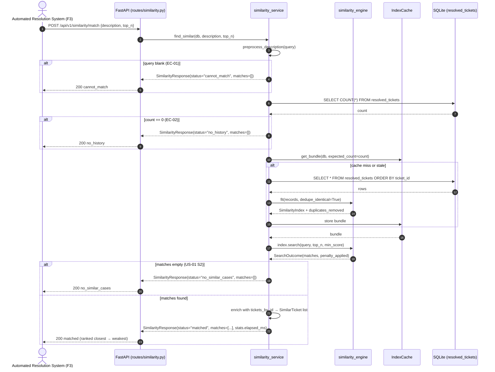
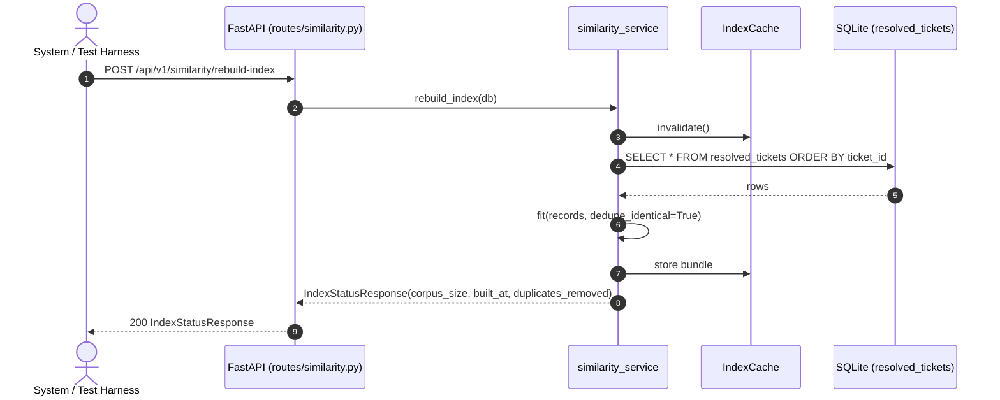

# Technical Specification: Similarity Engine

| Metadata | Details |
|---|---|
| **Feature Name** | Similarity Engine |
| **Feature ID** | FEAT-002 (F2) |
| **Derived From** | `features/F2-similarity-engine/1_spec.md` |
| **Status** | Draft |
| **Author** | Technical Architect (AI) |
| **Created Date** | 2026-08-08 |

---

## 1. System Architecture & Components

### 1.1 Component Overview

The Similarity Engine is a stateless-at-the-API, stateful-in-memory service. It reads the persisted `resolved_tickets` table (populated by **F1 · Data Ingestion & Storage** — required dependency) and answers "which past resolved tickets most closely match this new ticket?" via TF-IDF + cosine similarity.

```
┌────────────────────────────────────────────────────────────────────┐
│  Client (Automated Resolution System / F3 Resolution Engine)        │
└───────────────────────────────┬────────────────────────────────────┘
                                │ POST /api/v1/similarity/match
┌───────────────────────────────▼────────────────────────────────────┐
│  routes/similarity.py            FastAPI router (thin)              │
└───────────────────────────────┬────────────────────────────────────┘
┌───────────────────────────────▼────────────────────────────────────┐
│  services/similarity_service.py  Orchestration + index cache        │
│    - load_resolved_corpus(db)                                       │
│    - get_bundle(db)  (cached SimilarityIndexBundle)                 │
│    - find_similar(db, description, top_n) -> SimilarityResponse     │
│    - rebuild_index(db) -> IndexStatusResponse                       │
└───────────────────────────────┬────────────────────────────────────┘
┌───────────────────────────────▼────────────────────────────────────┐
│  services/similarity_engine.py   Pure ML logic (no I/O)             │
│    - preprocess_description / count_tokens / short_query_penalty    │
│    - SimilarityIndex.fit(records)  (TF-IDF on corpus)               │
│    - SimilarityIndex.search(query, ...)  (cosine similarity)        │
└───────────────────────────────┬────────────────────────────────────┘
┌───────────────────────────────▼────────────────────────────────────┐
│  SQLite (dev) / PostgreSQL (prod)                                   │
│    resolved_tickets  (F1 schema, read-only from F2's perspective)   │
└─────────────────────────────────────────────────────────────────────┘
```

### 1.2 Component Responsibility Matrix

| Component | File (convention) | Responsibility |
|---|---|---|
| Pydantic Models | `backend/app/models/similarity_models.py` | Request/response contracts: `SimilarityQuery`, `SimilarTicket`, `SimilarityResponse`, `SimilarityStats`, `IndexStatusResponse`, `SimilarityStatus` enum |
| Similarity Engine (pure) | `backend/app/services/similarity_engine.py` | Deterministic preprocessing, TF-IDF index construction, cosine-similarity ranking, short-query damping, no DB dependency |
| Similarity Service (orchestration) | `backend/app/services/similarity_service.py` | Loads corpus from DB, manages in-memory index cache with staleness detection, maps matches back to full ticket records, measures elapsed time |
| API Router | `backend/app/routes/similarity.py` | HTTP endpoints `POST /api/v1/similarity/match`, `POST /api/v1/similarity/rebuild-index` |
| App Wiring | `backend/app/main.py` | Register `similarity.router` |
| Config | `backend/app/core/config.py` | Add `SIMILARITY_*` settings |
| Dependencies | `backend/requirements.txt` | Add `scikit-learn>=1.4.0` |

### 1.3 Design Decisions (mapping business rules to mechanism)

| Business Rule (from `1_spec.md` §3.2) | Technical Mechanism |
|---|---|
| Exactly the top-3 closest past cases, never more | `top_n` fixed default 3; endpoint accepts 1..10 |
| Ordered closest → weakest; #1 is the single most similar | Sort by `(similarity_score DESC, ticket_id ASC)` |
| Every result carries a similarity rating 0.0–1.0 | `similarity_score` field; normalized cosine similarity |
| No match → say so explicitly, never force a weak match | `SimilarityStatus.NO_SIMILAR_CASES` when best score < `min_score` |
| Consistent & repeatable results | Deterministic preprocessing + stable tie-break key `(score DESC, ticket_id ASC)`; TF-IDF has no randomness |
| **EC-01** blank description → cannot match | Preprocess to `""` → `SimilarityStatus.CANNOT_MATCH`, `matches=[]` |
| **EC-02** no history → nothing to match against | Empty corpus → `SimilarityStatus.NO_HISTORY`, `matches=[]` |
| **EC-03** extremely short description → honestly low ratings | `short_query_penalty()` damps raw score by `tokens / min_meaningful_tokens` |
| **EC-04** word-for-word identical past tickets → show distinct precedents | `fit_index(dedupe_identical=True)` keeps one record per unique normalized description |
| **EC-05** tied scores → fixed, predictable ordering | Tie-break key includes `ticket_id ASC` |
| **EC-06** extremely long rambling description → only relevant part matters | `preprocess_description(max_chars=512)` truncates query and corpus descriptions |

### 1.4 Naming Consistency Note

The `SimilarTicket` model uses `ticket_id` (not the `resolved_ticket_id` sketched in `features/INDEX.md`) to stay consistent with the F1 exported contract `ResolvedTicketSchema.ticket_id` and the F1 route `GET /api/v1/resolved-tickets/{ticket_id}`. Downstream consumers (F3, F5) look up full past tickets by this id.

---

## 2. Interface Definitions & Function Signatures

> [!IMPORTANT]
> These signatures are the **CONTRACT** used by test-generators for unbiased TDD. They must be implemented exactly as documented.

### 2.1 Pydantic Models — `backend/app/models/similarity_models.py`

```python
from enum import Enum
from typing import List

from pydantic import BaseModel, ConfigDict, Field


class SimilarityStatus(str, Enum):
    """Lifecycle status of a similarity match request.

    MATCHED          - at least one past case met the minimum similarity threshold
    NO_SIMILAR_CASES - corpus exists but no past case is similar enough (US-01 S2)
    CANNOT_MATCH     - query description is empty/blank after preprocessing (EC-01)
    NO_HISTORY       - no resolved tickets exist in history yet (EC-02)
    """

    MATCHED = "matched"
    NO_SIMILAR_CASES = "no_similar_cases"
    CANNOT_MATCH = "cannot_match"
    NO_HISTORY = "no_history"


class SimilarityQuery(BaseModel):
    """Request body for the similarity match endpoint."""

    description: str = Field(
        ...,
        min_length=1,
        examples=["milk packet missing from order"],
        description="Full free-text description of the new/incoming ticket.",
    )
    top_n: int = Field(
        default=3,
        ge=1,
        le=10,
        examples=[3],
        description="Number of most-similar past cases to return. Defaults to 3.",
    )


class SimilarTicket(BaseModel):
    """A single matched past resolved ticket with its similarity rating."""

    model_config = ConfigDict(from_attributes=True)

    ticket_id: str = Field(..., examples=["H-1000"])
    category: str = Field(..., examples=["missing_item"])
    description: str = Field(..., examples=["milk packet missing from my order"])
    action_taken: str = Field(..., examples=["redelivery"])
    resolution_note: str = Field(..., examples=["missing item re-sent"])
    similarity_score: float = Field(
        ...,
        ge=0.0,
        le=1.0,
        examples=[0.93],
        description="Cosine similarity between query and this past case, 0.0 (no similarity) to 1.0 (perfect match).",
    )


class SimilarityStats(BaseModel):
    """Engine diagnostics returned with every match response."""

    corpus_size: int = Field(..., description="Number of distinct past cases in the index.")
    elapsed_ms: float = Field(..., description="Wall-clock time for the request, in milliseconds.")
    min_score_threshold: float = Field(..., description="Minimum similarity threshold applied.")
    short_query_penalty_applied: bool = Field(
        ..., description="True when the query was too short and scores were damped (EC-03)."
    )


class SimilarityResponse(BaseModel):
    """Response for a similarity match request."""

    query: str = Field(..., description="Echo of the original request description.")
    status: SimilarityStatus
    matches: List[SimilarTicket] = Field(
        default_factory=list,
        description="Ranked past cases, most similar first. Empty for non-MATCHED statuses.",
    )
    stats: SimilarityStats


class IndexStatusResponse(BaseModel):
    """Response from the rebuild-index endpoint."""

    corpus_size: int = Field(..., description="Number of distinct past cases now in the index.")
    built_at: str = Field(..., description="ISO-8601 UTC timestamp of when the index was built.")
    duplicates_removed: int = Field(
        ..., description="Number of word-for-word identical descriptions dropped during fit (EC-04)."
    )
```

### 2.2 Pure Engine — `backend/app/services/similarity_engine.py`

```python
from datetime import datetime, timezone
from typing import Any, List, Optional

from pydantic import BaseModel, Field

from app.models.similarity_models import SimilarTicket


class CorpusRecord(BaseModel):
    """A single past resolved ticket's identity + description, as fed to the index."""

    ticket_id: str
    description: str


class RankedMatch(BaseModel):
    """A raw ranked match produced by the index (pre-enrichment)."""

    ticket_id: str
    similarity_score: float = Field(..., ge=0.0, le=1.0)


class SearchOutcome(BaseModel):
    """Result of a search over the index."""

    matches: List[RankedMatch]
    short_query_penalty_applied: bool


def preprocess_description(text: str, max_chars: int = 512) -> str:
    """Normalize a raw description for matching.

    Steps: strip whitespace, collapse internal whitespace to single spaces,
    then truncate to the first ``max_chars`` characters (EC-06: long rambling
    descriptions should only let the most relevant part influence the match).

    Args:
        text: Raw description string (may be empty, None is not accepted).
        max_chars: Maximum character length to keep (default 512).

    Returns:
        Normalized description. Returns an empty string ``""`` when ``text``
        is empty, whitespace-only, or truncates to zero characters.

    Raises:
        SimilarityEngineError: If ``text`` is ``None`` (use empty string instead).
    """
    ...


def count_tokens(text: str) -> int:
    """Count whitespace-delimited tokens in a preprocessed description.

    Args:
        text: Already-preprocessed description (see ``preprocess_description``).

    Returns:
        Number of tokens. Returns 0 for an empty string.
    """
    ...


def short_query_penalty(
    raw_score: float,
    token_count: int,
    min_meaningful_tokens: int = 3,
) -> float:
    """Damp a raw similarity score for extremely short queries (EC-03).

    When ``token_count < min_meaningful_tokens``, the score is multiplied by
    ``token_count / min_meaningful_tokens`` so a one-word query like "refund"
    can never present as a confident routine match. When ``token_count`` is 0,
    returns 0.0. Otherwise returns ``raw_score`` unchanged.

    Args:
        raw_score: Raw cosine similarity in [0.0, 1.0].
        token_count: Number of tokens in the preprocessed query.
        min_meaningful_tokens: Token threshold below which damping applies (default 3).

    Returns:
        Adjusted score in [0.0, 1.0].
    """
    ...


class SimilarityIndex:
    """Immutable, precomputed TF-IDF index over the resolved-ticket corpus.

    Built once via ``fit()`` and reused across queries for performance (US-03).
    Deterministic: the same corpus and query always produce the same ranking.
    """

    def __init__(
        self,
        vectorizer: Any,
        document_matrix: Any,
        doc_ids: List[str],
        descriptions: List[str],
        built_at: str,
    ) -> None:
        """Construct an index.

        Args:
            vectorizer: Fitted ``sklearn.feature_extraction.text.TfidfVectorizer``.
            document_matrix: Sparse TF-IDF document-term matrix (rows align with ``doc_ids``).
            doc_ids: Ticket ids aligned with matrix rows (corpus order).
            descriptions: Preprocessed descriptions aligned with matrix rows.
            built_at: ISO-8601 UTC build timestamp.
        """
        ...

    @classmethod
    def fit(
        cls,
        records: List[CorpusRecord],
        max_chars: int = 512,
        dedupe_identical: bool = True,
    ) -> "SimilarityIndex":
        """Build an index from a corpus of past resolved tickets.

        Fits a ``TfidfVectorizer`` (default English stop-word removal is
        disabled; token pattern defaults) on all preprocessed descriptions.
        When ``dedupe_identical`` is True (EC-04), only the first record per
        unique normalized description is kept so word-for-word identical past
        tickets do not inflate the top-N with repeats.

        Args:
            records: All resolved tickets to index.
            max_chars: Corpus description truncation length (EC-06).
            dedupe_identical: Drop word-for-word duplicate descriptions (EC-04).

        Returns:
            A ready-to-search ``SimilarityIndex``.

        Raises:
            SimilarityEngineError: If ``records`` is empty.
        """
        ...

    def search(
        self,
        query: str,
        top_n: int = 3,
        min_score: float = 0.10,
        min_meaningful_tokens: int = 3,
    ) -> SearchOutcome:
        """Rank the corpus against a preprocessed query.

        Computes cosine similarity between the query TF-IDF vector and every
        corpus row, applies ``short_query_penalty`` when the query is too short
        (EC-03), drops scores below ``min_score``, sorts by
        ``(similarity_score DESC, ticket_id ASC)`` (deterministic tie-break,
        EC-05), and returns the top ``top_n``.

        Args:
            query: Preprocessed query description (may be empty; empty yields zero matches).
            top_n: Number of results to return (1..10).
            min_score: Minimum similarity for a match to be reported (default 0.10).
            min_meaningful_tokens: Threshold for short-query damping (EC-03).

        Returns:
            ``SearchOutcome`` with ranked matches (possibly empty) and the
            ``short_query_penalty_applied`` flag.

        Raises:
            InvalidTopNError: If ``top_n`` is outside 1..10.
            SimilarityEngineError: If the index has no documents.
        """
        ...
```

### 2.3 Orchestration Service — `backend/app/services/similarity_service.py`

```python
from datetime import datetime, timezone
from typing import Dict, List, Optional

from sqlalchemy.ext.asyncio import AsyncSession

from app.models.db_models import ResolvedTicket
from app.models.similarity_models import (
    IndexStatusResponse,
    SimilarTicket,
    SimilarityResponse,
    SimilarityStats,
    SimilarityStatus,
)
from app.services.similarity_engine import (
    CorpusRecord,
    SimilarityIndex,
    preprocess_description,
)


class SimilarityIndexBundle:
    """Cached artifact combining the pure index with full ticket records."""

    index: SimilarityIndex
    tickets_by_id: Dict[str, ResolvedTicket]  # full ORM rows for enrichment
    corpus_size: int                          # distinct records in index
    built_at: str                             # ISO-8601 UTC
    duplicates_removed: int


class IndexCache:
    """Process-wide in-memory cache for the SimilarityIndexBundle.

    Thread-safety: reads/writes are protected by an asyncio lock so concurrent
    requests share one index (US-03 large-volume back-to-back requirement).
    """

    _bundle: Optional[SimilarityIndexBundle] = None

    @classmethod
    def invalidate(cls) -> None:
        """Drop the cached bundle; the next call to ``get_bundle`` rebuilds it."""

    @classmethod
    async def get_bundle(cls, db: AsyncSession) -> SimilarityIndexBundle:
        """Return the current bundle, rebuilding it if absent or stale.

        Staleness detection: rebuilds when the persisted ``resolved_tickets``
        row count differs from the cached ``corpus_size`` (e.g., after an F1
        re-seed). Loading all resolved tickets may raise on DB failure.

        Args:
            db: Async DB session.

        Returns:
            The (possibly freshly built) bundle.

        Raises:
            CorpusLoadError: If the resolved-tickets table cannot be read.
        """
        ...


async def load_resolved_corpus(db: AsyncSession) -> List[ResolvedTicket]:
    """Fetch every row from the ``resolved_tickets`` table.

    Args:
        db: Async DB session.

    Returns:
        All resolved tickets as ORM objects, in ascending ``ticket_id`` order.

    Raises:
        CorpusLoadError: If the database query fails.
    """
    ...


async def find_similar(
    db: AsyncSession,
    description: str,
    top_n: int = 3,
) -> SimilarityResponse:
    """Main entry point: find the most similar resolved tickets for a description.

    Pipeline:
      1. ``preprocess_description`` the query. If it becomes empty → return
         ``SimilarityStatus.CANNOT_MATCH`` with empty matches (EC-01).
      2. Load/cache the index bundle. If the corpus is empty → return
         ``SimilarityStatus.NO_HISTORY`` with empty matches (EC-02).
      3. ``index.search(...)``. If no match clears ``min_score`` → return
         ``SimilarityStatus.NO_SIMILAR_CASES`` with empty matches (US-01 S2).
      4. Otherwise return ``SimilarityStatus.MATCHED`` with top-N enriched
         ``SimilarTicket`` records (US-01, US-02), measuring ``elapsed_ms``
         around steps 1–4 (US-03).

    Args:
        db: Async DB session.
        description: Raw new-ticket description (may be blank).
        top_n: Number of past cases to return (default 3).

    Returns:
        A complete ``SimilarityResponse``. Status is one of MATCHED,
        NO_SIMILAR_CASES, CANNOT_MATCH, NO_HISTORY.

    Raises:
        CorpusLoadError: If the resolved-tickets table cannot be read (→ 500).
        SimilarityEngineError: On unexpected engine failure (→ 500).
    """
    ...


async def rebuild_index(db: AsyncSession) -> IndexStatusResponse:
    """Force a fresh index build from the persisted history.

    Discards the cached bundle, reloads the corpus, and reports index stats.
    Useful after F1 seeding and for verifying EC-02/EC-04 behaviour.

    Args:
        db: Async DB session.

    Returns:
        Index status with corpus size, build time, and duplicate count.

    Raises:
        CorpusLoadError: If the resolved-tickets table cannot be read.
    """
    ...
```

### 2.4 API Router — `backend/app/routes/similarity.py`

```python
from fastapi import APIRouter, Depends
from sqlalchemy.ext.asyncio import AsyncSession

from app.core.database import get_db
from app.models.similarity_models import IndexStatusResponse, SimilarityQuery, SimilarityResponse
from app.services import similarity_service

router = APIRouter(prefix="/api/v1", tags=["similarity"])


@router.post("/similarity/match", response_model=SimilarityResponse)
async def match_similar_tickets(
    payload: SimilarityQuery,
    db: AsyncSession = Depends(get_db),
) -> SimilarityResponse:
    """Return the top-N most similar resolved tickets for a ticket description.

    Args:
        payload: Request body (description + optional top_n).
        db: Async DB session dependency.

    Returns:
        A SimilarityResponse (200). See API contract §4.1 for statuses.

    Raises:
        HTTPException(500): On CorpusLoadError / SimilarityEngineError.
    """
    return await similarity_service.find_similar(db, payload.description, payload.top_n)


@router.post("/similarity/rebuild-index", response_model=IndexStatusResponse)
async def rebuild_similarity_index(
    db: AsyncSession = Depends(get_db),
) -> IndexStatusResponse:
    """Force a rebuild of the in-memory similarity index from persisted history.

    Returns:
        Index status with corpus size, build time, and duplicate count (200).

    Raises:
        HTTPException(500): On CorpusLoadError / SimilarityEngineError.
    """
    return await similarity_service.rebuild_index(db)
```

---

## 3. Data Models & Schemas

### 3.1 Database Tables

The Similarity Engine introduces **no new database tables**. It reads the F1-owned `resolved_tickets` table:

| Column | Type | Nullable | Notes |
|---|---|---|---|
| `ticket_id` | String | No (PK) | Lookup key echoed as `SimilarTicket.ticket_id` |
| `category` | String | No | E.g. `missing_item` |
| `description` | String | No | Source of match features |
| `action_taken` | String | No | E.g. `redelivery` |
| `resolution_note` | String | No | Resolution evidence |
| `time_to_resolve_min` | Integer | No | Not used by F2 |
| `csat_score` | Float | No | Not used by F2 |

Index build also requires a non-empty description per record; records with blank `description` are skipped with a logged warning during `fit()`.

### 3.2 JSON Response Schema (`SimilarityResponse`)

```json
{
  "query": "milk packet missing from order",
  "status": "matched",
  "matches": [
    {
      "ticket_id": "H-1000",
      "category": "missing_item",
      "description": "milk packet missing from my order",
      "action_taken": "redelivery",
      "resolution_note": "missing item re-sent",
      "similarity_score": 0.93
    }
  ],
  "stats": {
    "corpus_size": 2453,
    "elapsed_ms": 42.1,
    "min_score_threshold": 0.1,
    "short_query_penalty_applied": false
  }
}
```

| Field | Type | Nullable | Constraints |
|---|---|---|---|
| `query` | string | No | Echo of request description (preprocessed input) |
| `status` | enum | No | `matched` \| `no_similar_cases` \| `cannot_match` \| `no_history` |
| `matches` | array[`SimilarTicket`] | No | Empty array for all non-`matched` statuses; length ≤ `top_n` when `matched` |
| `matches[].ticket_id` | string | No | FK to `resolved_tickets.ticket_id` |
| `matches[].category` | string | No | |
| `matches[].description` | string | No | Full stored description (not truncated) |
| `matches[].action_taken` | string | No | |
| `matches[].resolution_note` | string | No | |
| `matches[].similarity_score` | float | No | `0.0 ≤ score ≤ 1.0` |
| `stats.corpus_size` | int | No | `≥ 0` |
| `stats.elapsed_ms` | float | No | `≥ 0` |
| `stats.min_score_threshold` | float | No | Mirrors configured `SIMILARITY_MIN_SCORE` |
| `stats.short_query_penalty_applied` | bool | No | |

### 3.3 Status Semantics

| `status` | Trigger | `matches` | Consumer Guidance (F3/F5) |
|---|---|---|---|
| `matched` | ≥1 past case ≥ `min_score` | Top-N enriched tickets | Use as precedents; treat `similarity_score` as confidence |
| `no_similar_cases` | Corpus exists, best score < `min_score` | `[]` | Novel problem → route to human lane (US-01 S2) |
| `cannot_match` | Query blank/whitespace after preprocessing | `[]` | Invalid for auto-resolution → human review (EC-01) |
| `no_history` | No resolved tickets persisted | `[]` | Fresh system → human review until history accumulates (EC-02) |

### 3.4 Configuration Additions — `backend/app/core/config.py`

```python
# Similarity Engine settings (env prefix: STM_)
SIMILARITY_TOP_N_DEFAULT: int = 3
SIMILARITY_TOP_N_MAX: int = 10
SIMILARITY_MIN_SCORE: float = 0.10          # below this → NO_SIMILAR_CASES
SIMILARITY_MIN_MEANINGFUL_TOKENS: int = 3   # EC-03 damping threshold
SIMILARITY_MAX_QUERY_CHARS: int = 512       # EC-06 truncation length
SIMILARITY_DEDUPE_IDENTICAL: bool = True    # EC-04
```

---

## 4. API Contracts

### 4.1 `POST /api/v1/similarity/match`

- **Purpose**: Return the top-N most similar resolved tickets for a new ticket description, ranked closest → weakest.
- **Request Body** (`SimilarityQuery`):
  ```json
  {
    "description": "milk packet missing from order",
    "top_n": 3
  }
  ```
  | Param | Type | Required | Constraints |
  |---|---|---|---|
  | `description` | string | Yes | `min_length=1`; whitespace-only allowed at service level (→ `cannot_match`) |
  | `top_n` | int | No | Default `3`; `1 ≤ top_n ≤ 10` |

- **Response (200 OK)** — `SimilarityResponse`
  - Status `matched` with 1–3 enriched `SimilarTicket` objects (see §3.2).
  - Status `no_similar_cases` | `cannot_match` | `no_history` with `matches: []` and full `stats`.

- **Response (400 Bad Request)**:
  ```json
  { "detail": "top_n must be between 1 and 10 (got: 0)" }
  ```
  Raised by the service's defensive `InvalidTopNError` guard (unreachable via normal route validation, which returns 422 first).

- **Response (404 Not Found)**: Not applicable — no path resource is addressed by this endpoint.

- **Response (422 Unprocessable Entity)** — FastAPI automatic validation:
  - `description` missing or empty string.
  - `top_n` outside `1..10` or non-integer.
  - Malformed JSON body.
  ```json
  { "detail": [ { "loc": ["body", "description"], "msg": "...", "type": "..." } ] }
  ```

- **Response (500 Internal Server Error)**:
  ```json
  { "detail": "Similarity engine failed: <message>" }
  ```
  Raised on `CorpusLoadError` (resolved-tickets table unreadable) or `SimilarityEngineError` (unexpected engine failure).

- **Performance Contract (US-03)**: For a single request against a fully populated history, `stats.elapsed_ms < 500` and the index must be reused (not refit) across back-to-back requests.

### 4.2 `POST /api/v1/similarity/rebuild-index`

- **Purpose**: Force a fresh index build from persisted history (e.g., after F1 seeding). Auxiliary/operational endpoint.
- **Request Body**: none.
- **Response (200 OK)** — `IndexStatusResponse`
  ```json
  {
    "corpus_size": 2453,
    "built_at": "2026-08-08T10:15:30Z",
    "duplicates_removed": 12
  }
  ```
- **Response (400)**: Not applicable.
- **Response (404)**: Not applicable.
- **Response (500)**: On `CorpusLoadError` / `SimilarityEngineError` (same shape as §4.1).

---

## 5. Error Types & Handling

```python
class SimilarityEngineError(Exception):
    """Base class for all similarity engine failures."""


class CorpusLoadError(SimilarityEngineError):
    """Raised when the resolved-tickets corpus cannot be read from the database."""


class InvalidTopNError(SimilarityEngineError):
    """Raised when ``top_n`` is not within the inclusive range 1..10."""
```

| Error Code | Trigger | HTTP Status | User Message |
|---|---|---|---|
| ERR_001 | `InvalidTopNError` — `top_n` outside 1..10 (service-level guard) | 400 | `top_n must be between 1 and 10 (got: {n})` |
| ERR_002 | `CorpusLoadError` — DB read failure on `resolved_tickets` | 500 | `Similarity engine failed: unable to load resolved ticket history` |
| ERR_003 | `SimilarityEngineError` — unexpected engine failure (e.g., `fit()` on empty corpus) | 500 | `Similarity engine failed: {message}` |
| ERR_004 | FastAPI body validation — missing/empty `description`, invalid `top_n`, malformed JSON | 422 | FastAPI-generated `detail` array |

Business edge cases **EC-01..EC-06 are not HTTP errors**; they are encoded as `SimilarityStatus` values in a `200 OK` response so downstream consumers (F3) can react to them. See §3.3.

---

## 6. Spec-to-Component Traceability

### 6.1 User Stories

| User Story (from `1_spec.md`) | Technical Component | Function/Endpoint |
|---|---|---|
| US-01 · Find the Most Similar Past Cases for Any New Ticket | Similarity Service + Engine | `find_similar()` · `SimilarityIndex.search()` · `POST /api/v1/similarity/match` |
| US-02 · See How Closely Each Past Case Matches | Pydantic Response Models | `SimilarTicket.similarity_score` · `SimilarityResponse` |
| US-03 · Get Match Results Quickly Enough to Be Useful in Real Time | Index Cache + Engine | `IndexCache.get_bundle()` · `SimilarityIndex.fit()` · `stats.elapsed_ms` |

### 6.2 Edge Cases & Business Exceptions

| Edge Case (from `1_spec.md` §4) | Technical Component | Function/Mechanism |
|---|---|---|
| EC-01 · Empty/blank description | Preprocessor + Service | `preprocess_description()` → `SimilarityStatus.CANNOT_MATCH` |
| EC-02 · No resolved tickets in history | Cache + Service | `IndexCache.get_bundle()` → `SimilarityStatus.NO_HISTORY` |
| EC-03 · Extremely short description | Penalty function | `short_query_penalty()` with `SIMILARITY_MIN_MEANINGFUL_TOKENS=3` |
| EC-04 · Word-for-word identical past tickets | Index fit | `SimilarityIndex.fit(dedupe_identical=True)` · `duplicates_removed` |
| EC-05 · Tied similarity scores | Ranking | Stable sort key `(score DESC, ticket_id ASC)` in `search()` |
| EC-06 · Extremely long rambling description | Preprocessor | `preprocess_description(max_chars=512)` truncation |

---

## 7. Sequence Diagrams

### 7.1 Primary Workflow — Similarity Match Request



### 7.2 Auxiliary Workflow — Index Rebuild



---

## 8. Implementation Notes for Downstream Stages

1. **Dependency (F1)**: The engine reads only the F1-persisted `resolved_tickets` table. If F1 seeding has not run, `NO_HISTORY` is returned (EC-02). `IndexCache` auto-detects staleness after a re-seed by comparing row counts.
2. **New dependency**: Add `scikit-learn>=1.4.0` to `backend/requirements.txt` (brings `numpy`/`scipy` for sparse TF-IDF matrices).
3. **Determinism guarantee**: No random components in the pipeline; `TfidfVectorizer` is seeded-free and deterministic. Sorting is fully specified by `(similarity_score DESC, ticket_id ASC)`.
4. **Performance**: The index is fit once per corpus generation and reused; `elapsed_ms` is measured with `time.perf_counter()` around `find_similar` steps 1–4 to satisfy the US-03 `< 500 ms` contract.
5. **Downstream consumers**: F3 (Resolution Engine) consumes `SimilarityResponse.status` + `matches`; F5 (Dashboard) renders `similarity_score` with visual emphasis on low ratings (US-02 S2), e.g., color-coded thresholds the frontend owns.
