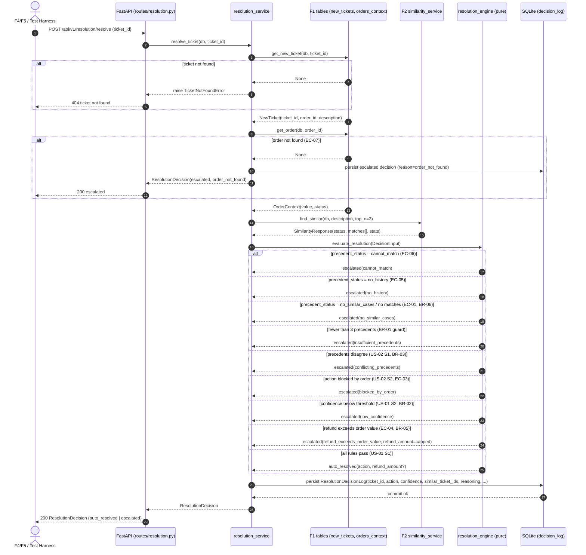
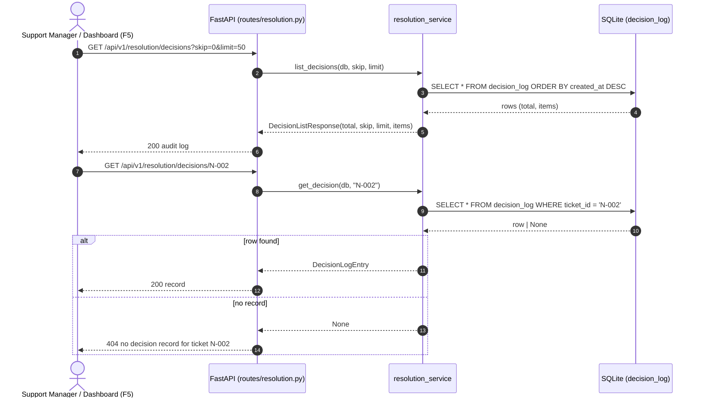

# Technical Specification: Resolution Engine

| Metadata | Details |
|---|---|
| **Feature Name** | Resolution Engine |
| **Feature ID** | FEAT-003 (F3) |
| **Derived From** | `features/F3-resolution-engine/1_spec.md` |
| **Status** | Draft |
| **Author** | Technical Architect (AI) |
| **Created Date** | 2026-08-08 |

---

## 1. System Architecture & Components

### 1.1 Component Overview

The Resolution Engine is the decision layer between the Similarity Engine (F2) and the Reply Drafting / Dashboard features (F4/F5). For each new ticket it:

1. Reads the ticket and its linked order facts from **F1**-persisted tables (`new_tickets`, `orders_context`).
2. Asks **F2** (`similarity_service.find_similar`) for the top-3 similar past resolved tickets and their similarity scores.
3. Evaluates, in a **pure, deterministic** decision function, whether the ticket may be auto-resolved (`refund` / `redelivery` / `coupon`) or must be escalated to the human review lane — enforcing the spec's business rules (BR-01..BR-07) and edge cases (EC-01..EC-08).
4. Persists a full **decision record** in a new `decision_log` table so every decision is auditable (US-03).

```
┌──────────────────────────────────────────────────────────────────────────┐
│  Consumers: F4 Reply Drafting, F5 Two-Lane Dashboard, test harness        │
└───────────────────────────────────┬──────────────────────────────────────┘
                                    │ POST /api/v1/resolution/resolve
                                    │ GET  /api/v1/resolution/decisions
                                    │ GET  /api/v1/resolution/decisions/{id}
                                    │ GET  /api/v1/resolution/stats
┌───────────────────────────────────▼──────────────────────────────────────┐
│  routes/resolution.py                FastAPI router (thin)                │
└───────────────────────────────────┬──────────────────────────────────────┘
┌───────────────────────────────────▼──────────────────────────────────────┐
│  services/resolution_service.py    Orchestration + persistence            │
│    - resolve_ticket(db, ticket_id) -> ResolutionDecision                  │
│    - list_decisions(db, skip, limit) / get_decision(db, ticket_id)        │
│    - compute_resolution_stats(db) -> ResolutionStats                      │
└───────────────────────────────────┬──────────────────────────────────────┘
┌───────────────────────────────────▼──────────────────────────────────────┐
│  services/resolution_engine.py    Pure decision logic (no I/O)            │
│    - canonicalize_action / precedents_agree / most_common_action          │
│    - confidence_meets_threshold / action_allowed_by_order                 │
│    - derive_proposed_refund / apply_refund_cap                            │
│    - evaluate_resolution(DecisionInput) -> ResolutionDecision             │
└───────────────────────────────────┬──────────────────────────────────────┘
                                    │  depends on (reads)
┌───────────────────────────────────▼──────────────────────────────────────┐
│  F1 tables: new_tickets, orders_context, resolved_tickets (read-only)     │
│  F2 service: similarity_service.find_similar(db, description, top_n=3)    │
│  New table: decision_log (write)                                          │
└───────────────────────────────────────────────────────────────────────────┘
```

### 1.2 Component Responsibility Matrix

| Component | File (convention) | Responsibility |
|---|---|---|
| Pydantic Models | `backend/app/models/resolution_models.py` | Contracts: `ResolutionRequest`, `DecisionInput`, `ResolutionDecision`, `DecisionLogEntry`, `DecisionListResponse`, `ResolutionStats`; enums `ResolutionAction`, `ResolutionOutcome`, `EscalationReason` |
| Resolution Engine (pure) | `backend/app/services/resolution_engine.py` | Deterministic decision matrix (BR-01..BR-07, EC-01..EC-08); no DB dependency; exact reasoning strings |
| Resolution Service (orchestration) | `backend/app/services/resolution_service.py` | Loads ticket/order (F1), calls F2 `find_similar`, invokes `evaluate_resolution`, persists `decision_log` records, serves audit list/stats |
| API Router | `backend/app/routes/resolution.py` | HTTP endpoints listed in §1.1 |
| ORM Model | `backend/app/models/db_models.py` | Add `ResolutionDecisionLog` table |
| App Wiring | `backend/app/main.py` | Register `resolution.router` |
| Config | `backend/app/core/config.py` | Add `RESOLUTION_*` settings (env prefix `STM_`) |

### 1.3 Design Decisions (mapping business rules to mechanism)

| Business Rule (from `1_spec.md` §3.2) | Technical Mechanism |
|---|---|
| **BR-01** Agree before acting — top-3 precedents must agree | `precedents_agree()` over canonicalized actions; requires exactly `expected_precedents` (3) matches, else escalate `insufficient_precedents` |
| **BR-02** Confidence bar (default 75%) | Config `RESOLUTION_CONFIDENCE_THRESHOLD: float = 0.75`; `confidence_meets_threshold()` uses `>=` (EC-08 boundary) |
| **BR-03** Never guess on disagreement | `conflicting_precedents` escalation **first** in the matrix — before confidence, so score never overrides disagreement |
| **BR-04** Order facts override precedent | `action_allowed_by_order()` blocks `redelivery` when order status is `cancelled` → escalate `blocked_by_order` |
| **BR-05** No over-refunding | `derive_proposed_refund()` + `apply_refund_cap()`; refund capped at order value, escalate `refund_exceeds_order_value` when capped |
| **BR-06** Act only on evidence | Zero precedents / `no_similar_cases` / `no_history` / `cannot_match` → escalate, never auto-resolve |
| **BR-07** Every decision is traceable | `evaluate_resolution()` output persisted to `decision_log` with action, confidence, evidence ids, reasoning, outcome, timestamp |

### 1.4 Naming Consistency Notes

- **Canonical actions** use the `refund | redelivery | coupon` vocabulary from `features/INDEX.md` (`ResolutionAction` enum). The raw `action_taken` strings persisted by F1 (`full_refund`, `partial_refund`, `refund_reissue`, `redelivery`, `coupon`, `escalation`, `apology_no_action`, ...) are normalized by `canonicalize_action()`; history actions the system cannot apply map to `other` and are never auto-resolved.
- **Confidence** is defined as the top (most similar) precedent's `similarity_score` from F2 — the single representative match confidence referenced by the spec (§3.1 step 4, US-01 S1/S2). It is `0.0` when no precedents exist.
- **Ticket ids** reuse the F1 `NewTicket.ticket_id` string PK (`N-000` style) and F2 `SimilarTicket.ticket_id` (`H-1000` style) so F4/F5 can join decision records back to tickets and evidence.
- **Timestamps** use ISO-8601 UTC strings (`created_at`), matching the F1 `NewTicket.created_at` convention.

---

## 2. Interface Definitions & Function Signatures

> [!IMPORTANT]
> These signatures are the **CONTRACT** used by test-generators for unbiased TDD. They must be implemented exactly as documented.

### 2.1 Pydantic Models — `backend/app/models/resolution_models.py`

```python
from enum import Enum
from typing import Dict, List, Optional

from pydantic import BaseModel, Field

from app.models.similarity_models import SimilarTicket, SimilarityStatus


class ResolutionAction(str, Enum):
    """Canonical action vocabulary the engine may apply or suggest.

    REFUND     - money returned to the customer (covers full/partial/reissue)
    REDELIVERY - replacement shipped for the order
    COUPON     - discount coupon issued to the customer
    OTHER      - history action the system cannot apply (e.g. apology, manual escalation)
    """

    REFUND = "refund"
    REDELIVERY = "redelivery"
    COUPON = "coupon"
    OTHER = "other"


class ResolutionOutcome(str, Enum):
    """Final lane assignment for the ticket."""

    AUTO_RESOLVED = "auto_resolved"
    ESCALATED = "escalated"


class EscalationReason(str, Enum):
    """Machine-readable reason a ticket was sent to the human review lane."""

    LOW_CONFIDENCE = "low_confidence"                     # US-01 S2, BR-02
    CONFLICTING_PRECEDENTS = "conflicting_precedents"     # US-02 S1, BR-03
    BLOCKED_BY_ORDER = "blocked_by_order"                 # US-02 S2, BR-04, EC-03
    REFUND_EXCEEDS_ORDER_VALUE = "refund_exceeds_order_value"  # EC-04, BR-05
    NO_SIMILAR_CASES = "no_similar_cases"                 # EC-01, BR-06
    INSUFFICIENT_PRECEDENTS = "insufficient_precedents"   # BR-01 guard (fewer than 3 matches)
    NON_RESOLVABLE_ACTION = "non_resolvable_action"       # precedents agree on `other`
    CANNOT_MATCH = "cannot_match"                         # EC-06
    NO_HISTORY = "no_history"                             # EC-05
    ORDER_NOT_FOUND = "order_not_found"                   # EC-07


class ResolutionRequest(BaseModel):
    """Request body for the resolve endpoint."""

    ticket_id: str = Field(
        ...,
        min_length=1,
        examples=["N-002"],
        description="Id of the new/incoming ticket to resolve (F1 new_tickets.ticket_id).",
    )


class DecisionInput(BaseModel):
    """All inputs required to reach a resolution decision (pure, no I/O).

    Built by ``resolution_service.resolve_ticket`` from F1 ticket/order rows
    and the F2 ``SimilarityResponse``.
    """

    ticket_id: str
    order_id: str
    description: str
    precedents: List[SimilarTicket] = Field(
        default_factory=list,
        description="Top-N similar past cases from F2 (SimilarityResponse.matches).",
    )
    confidence: float = Field(
        default=0.0,
        ge=0.0,
        le=1.0,
        description="Representative match confidence = precedents[0].similarity_score, or 0.0 when empty.",
    )
    threshold: float = Field(
        default=0.75,
        ge=0.0,
        le=1.0,
        description="Auto-resolve confidence bar (RESOLUTION_CONFIDENCE_THRESHOLD).",
    )
    expected_precedents: int = Field(
        default=3,
        ge=1,
        description="Required precedent count for auto-resolve (RESOLUTION_TOP_N_PRECEDENTS).",
    )
    precedent_status: SimilarityStatus = Field(
        default=SimilarityStatus.MATCHED,
        description="F2 SimilarityResponse.status — drives cannot_match/no_history/no_similar_cases escalation.",
    )
    order_status: str = Field(
        default="",
        description="Raw F1 orders_context.status (e.g. 'cancelled', 'delivered').",
    )
    order_value: float = Field(
        default=0.0,
        ge=0.0,
        description="Raw F1 orders_context.value in INR — refund cap ceiling (BR-05).",
    )
    partial_refund_ratio: float = Field(
        default=0.5,
        ge=0.0,
        le=1.0,
        description="Fraction of order value used for partial_refund suggestions (RESOLUTION_PARTIAL_REFUND_RATIO).",
    )
    created_at: Optional[str] = Field(
        default=None,
        description="ISO-8601 UTC decision timestamp; defaults to now when None.",
    )


class ResolutionDecision(BaseModel):
    """Full outcome of the resolution engine for one ticket (API response + record)."""

    ticket_id: str
    order_id: str
    description: str
    outcome: ResolutionOutcome
    auto_resolved: bool
    action: Optional[ResolutionAction] = Field(
        ...,
        description="Action applied (auto-resolve) or suggested (escalate); None when no precedent guidance exists.",
    )
    escalation_reason: Optional[EscalationReason] = Field(
        None,
        description="Present iff outcome is ESCALATED; explains why a human is needed.",
    )
    confidence: float = Field(..., ge=0.0, le=1.0)
    similar_tickets: List[SimilarTicket] = Field(
        default_factory=list,
        description="Top-N precedents used as evidence (US-03 S1/S2).",
    )
    reasoning: str = Field(..., description="Deterministic human-readable explanation (BR-07).")
    refund_amount: Optional[float] = Field(
        None,
        description="Computed refund amount for refund actions, capped at order value (BR-05).",
    )
    created_at: str = Field(..., description="ISO-8601 UTC decision timestamp.")


class DecisionLogEntry(BaseModel):
    """Audit-log row exposed by the decisions endpoints (US-03)."""

    ticket_id: str
    order_id: str
    action: Optional[str] = Field(None, description="Canonical action string or null.")
    confidence: float
    auto_resolved: bool
    escalation_reason: Optional[str] = Field(None, description="Canonical reason string or null.")
    similar_ticket_ids: List[str] = Field(
        default_factory=list,
        description="Evidence past-case ids (H-1000 style).",
    )
    reasoning: str
    refund_amount: Optional[float] = None
    created_at: str


class DecisionListResponse(BaseModel):
    """Offset-paginated audit log (matches F1 pagination convention)."""

    total: int
    skip: int
    limit: int
    items: List[DecisionLogEntry]


class ResolutionStats(BaseModel):
    """Aggregate counts for the dashboard/audit view."""

    total_decisions: int
    auto_resolved_count: int
    escalated_count: int
    by_action: Dict[str, int] = Field(default_factory=dict)
    by_escalation_reason: Dict[str, int] = Field(default_factory=dict)
```

### 2.2 Pure Engine — `backend/app/services/resolution_engine.py`

```python
from datetime import datetime, timezone
from typing import List, Optional, Sequence, Tuple

from app.models.resolution_models import (
    DecisionInput,
    EscalationReason,
    ResolutionAction,
    ResolutionDecision,
    ResolutionOutcome,
)
from app.models.similarity_models import SimilarityStatus


class ResolutionEngineError(Exception):
    """Base class for all resolution engine failures."""


class TicketNotFoundError(ResolutionEngineError):
    """Raised when the requested new ticket does not exist in F1 ``new_tickets``."""


class ResolutionPersistenceError(ResolutionEngineError):
    """Raised when a decision record cannot be written to ``decision_log``."""


# -- Action normalization -------------------------------------------------

REFUND_SYNONYMS = {"refund", "full_refund", "partial_refund", "refund_reissue"}
REDELIVERY_SYNONYMS = {"redelivery", "replacement", "re-delivery"}
COUPON_SYNONYMS = {"coupon"}


def canonicalize_action(raw_action: str) -> ResolutionAction:
    """Normalize a raw F1 ``action_taken`` string to a canonical ``ResolutionAction``.

    ``full_refund`` / ``partial_refund`` / ``refund_reissue`` / ``refund`` → ``REFUND``;
    ``redelivery`` / ``replacement`` / ``re-delivery`` → ``REDELIVERY``;
    ``coupon`` → ``COUPON``; anything else (including blank) → ``OTHER``.

    Args:
        raw_action: Raw ``action_taken`` value from a F1 resolved ticket.

    Returns:
        The canonical action class used for agreement checks.
    """
    ...


def precedents_agree(actions: Sequence[ResolutionAction]) -> bool:
    """True iff every canonical action in ``actions`` is identical (BR-01).

    An empty sequence returns True by convention (no disagreement).

    Args:
        actions: Canonicalized actions of the top-N precedents.

    Returns:
        True when ``len(set(actions)) <= 1``.
    """
    ...


def most_common_action(actions: Sequence[ResolutionAction]) -> Optional[ResolutionAction]:
    """Return the modal canonical action for suggested-action display.

    Ties are broken deterministically by enum member order
    (REFUND < REDELIVERY < COUPON < OTHER). Returns None for an empty sequence.

    Args:
        actions: Canonicalized actions of the top-N precedents.

    Returns:
        The most frequent action, or None when ``actions`` is empty.
    """
    ...


# -- Rule gates -----------------------------------------------------------

def confidence_meets_threshold(confidence: float, threshold: float) -> bool:
    """Evaluate the BR-02 confidence bar with the EC-08 boundary rule.

    Args:
        confidence: Match confidence in [0.0, 1.0].
        threshold: Required bar in [0.0, 1.0].

    Returns:
        ``confidence >= threshold`` — exactly-at-threshold counts as meeting
        the requirement (EC-08).
    """
    ...


def action_allowed_by_order(action: ResolutionAction, order_status: str) -> bool:
    """Check whether order facts permit ``action`` (BR-04).

    Only one rule today: ``REDELIVERY`` is never allowed when the order status
    is ``cancelled`` (case-insensitive). All other actions are unrestricted by
    order status.

    Args:
        action: Canonical action to apply.
        order_status: Raw F1 ``orders_context.status`` string (may be blank).

    Returns:
        False when the action is blocked (EC-03); True otherwise.
    """
    ...


def derive_proposed_refund(source_action: str, order_value: float, partial_ratio: float = 0.5) -> float:
    """Compute the refund amount implied by a precedent's raw action string (BR-05).

    ``full_refund`` / ``refund_reissue`` / ``refund`` → ``round(order_value, 2)``;
    ``partial_refund`` → ``round(order_value * partial_ratio, 2)``;
    any other raw action → ``0.0``.

    Args:
        source_action: Raw ``action_taken`` of a precedent.
        order_value: F1 ``orders_context.value`` in INR.
        partial_ratio: Fraction for partial refunds (default 0.5).

    Returns:
        Proposed refund amount in INR.
    """
    ...


def apply_refund_cap(proposed_refund: float, order_value: float) -> Tuple[float, bool]:
    """Cap a proposed refund at the order value (BR-05, EC-04).

    Args:
        proposed_refund: Refund amount implied by precedent evidence.
        order_value: F1 ``orders_context.value`` — the hard ceiling.

    Returns:
        ``(capped_amount, was_capped)`` where ``capped_amount = min(proposed_refund, order_value)``.
    """
    ...


# -- Decision matrix ------------------------------------------------------

def evaluate_resolution(input: DecisionInput) -> ResolutionDecision:
    """Deterministically decide auto-resolve vs escalate for one ticket.

    Decision matrix (checked in this exact order; the first hit wins):

    1. ``precedent_status`` is ``CANNOT_MATCH``       → escalate ``cannot_match`` (EC-06)
    2. ``precedent_status`` is ``NO_HISTORY``         → escalate ``no_history`` (EC-05)
    3. ``precedent_status`` is ``NO_SIMILAR_CASES``   → escalate ``no_similar_cases`` (EC-01, BR-06)
    4. ``len(precedents) == 0``                       → escalate ``no_similar_cases`` (BR-06 guard)
    5. ``len(precedents) < expected_precedents``      → escalate ``insufficient_precedents`` (BR-01 guard)
    6. canonical actions disagree                     → escalate ``conflicting_precedents`` (US-02 S1, BR-03) —
       never choose a "winning" action; ``action`` = modal action as a suggestion only
    7. agreed action is ``OTHER``                     → escalate ``non_resolvable_action``
    8. ``action_allowed_by_order`` is False           → escalate ``blocked_by_order`` (US-02 S2, EC-03)
    9. ``confidence < threshold``                     → escalate ``low_confidence`` (US-01 S2, BR-02)
    10. action is ``REFUND`` and proposed refund (max across precedents) exceeds
        order value                                  → escalate ``refund_exceeds_order_value`` (EC-04, BR-05);
        ``refund_amount`` = capped amount
    11. otherwise                                    → **auto-resolve** (US-01 S1, BR-01/BR-02/BR-04)
        with ``action`` = agreed canonical action; ``refund_amount`` set for refunds

    ``confidence`` is the top precedent's similarity score. Reasoning strings
    are exact templates (see §3.3) so tests can assert on them.

    Args:
        input: Fully populated ``DecisionInput`` (service-built).

    Returns:
        A ``ResolutionDecision`` with outcome ``AUTO_RESOLVED`` or ``ESCALATED``.

    Raises:
        ResolutionEngineError: If ``input`` is malformed (e.g. confidence outside [0,1]).
    """
    ...
```

### 2.3 Orchestration Service — `backend/app/services/resolution_service.py`

```python
import json
from datetime import datetime, timezone
from typing import List, Optional, Tuple

from sqlalchemy.ext.asyncio import AsyncSession

from app.core.config import settings
from app.core.database import init_db
from app.models.db_models import ResolutionDecisionLog
from app.models.resolution_models import (
    DecisionInput,
    DecisionListResponse,
    DecisionLogEntry,
    ResolutionDecision,
    ResolutionStats,
)
from app.models.similarity_models import SimilarityStatus
from app.services import similarity_service, ticket_service
from app.services.resolution_engine import (
    ResolutionEngineError,
    ResolutionPersistenceError,
    TicketNotFoundError,
    evaluate_resolution,
)
from app.services.similarity_engine import CorpusLoadError


async def resolve_ticket(db: AsyncSession, ticket_id: str) -> ResolutionDecision:
    """Resolve a single new ticket end-to-end and persist the decision record.

    Pipeline:
      1. Load the ``NewTicket`` from F1. If missing → raise ``TicketNotFoundError`` (→ 404).
      2. Load the linked ``OrderContext``. If missing → build an escalated
         decision with reason ``order_not_found`` (EC-07) and record it.
      3. Call ``similarity_service.find_similar(db, ticket.description, top_n=settings.RESOLUTION_TOP_N_PRECEDENTS)``
         to obtain the top-N precedents + status (F2 integration).
      4. Build ``DecisionInput`` with ``confidence`` = top match ``similarity_score``
         (0.0 when no matches), ``precedent_status`` = F2 status, and order facts.
      5. ``evaluate_resolution(input)`` → ``ResolutionDecision``.
      6. Persist a ``ResolutionDecisionLog`` row (US-03 S1/S2); re-resolving an
         already-processed ticket overwrites its prior record (idempotent re-run).
      7. Return the decision.

    Args:
        db: Async DB session.
        ticket_id: F1 ``new_tickets.ticket_id``.

    Returns:
        The full ``ResolutionDecision`` (auto-resolved or escalated).

    Raises:
        TicketNotFoundError: If ``ticket_id`` does not exist (→ 404).
        ResolutionPersistenceError: If the decision record cannot be saved (→ 500).
        CorpusLoadError / ResolutionEngineError: On unexpected engine/db failure (→ 500).
    """
    ...


async def list_decisions(
    db: AsyncSession,
    skip: int = 0,
    limit: int = 50,
) -> Tuple[List[DecisionLogEntry], int]:
    """Return (items, total_count) for the audit log, newest first (US-03).

    ``DecisionLogEntry.similar_ticket_ids`` is decoded from the JSON string
    column. Persistence failures reading the table raise ``ResolutionEngineError``.

    Args:
        db: Async DB session.
        skip: Offset for pagination.
        limit: Page size.

    Returns:
        A tuple of ``DecisionLogEntry`` rows (newest first) and the total count.
    """
    ...


async def get_decision(db: AsyncSession, ticket_id: str) -> Optional[DecisionLogEntry]:
    """Return a single audit record by ticket id, or None if never processed.

    Args:
        db: Async DB session.
        ticket_id: F1 ``new_tickets.ticket_id``.

    Returns:
        The ``DecisionLogEntry`` or None.
    """
    ...


async def compute_resolution_stats(db: AsyncSession) -> ResolutionStats:
    """Aggregate counts for the dashboard lane badges (F5 consumer).

    Args:
        db: Async DB session.

    Returns:
        ``ResolutionStats`` with totals and per-action / per-reason breakdowns.
    """
    ...
```

### 2.4 API Router — `backend/app/routes/resolution.py`

```python
from typing import Optional

from fastapi import APIRouter, Depends, HTTPException, Query
from sqlalchemy.ext.asyncio import AsyncSession

from app.core.database import get_db
from app.models.resolution_models import (
    DecisionListResponse,
    DecisionLogEntry,
    ResolutionDecision,
    ResolutionRequest,
    ResolutionStats,
)
from app.services import resolution_service
from app.services.resolution_engine import ResolutionEngineError, TicketNotFoundError
from app.services.similarity_engine import CorpusLoadError, SimilarityEngineError

router = APIRouter(prefix="/api/v1", tags=["resolution"])


@router.post("/resolution/resolve", response_model=ResolutionDecision)
async def resolve_ticket_endpoint(
    payload: ResolutionRequest,
    db: AsyncSession = Depends(get_db),
) -> ResolutionDecision:
    """Resolve a new ticket (auto-resolve or escalate) and record the decision.

    Args:
        payload: Request body with ``ticket_id``.
        db: Async DB session dependency.

    Returns:
        A ``ResolutionDecision`` (200). See API contract §4.1 for statuses.

    Raises:
        HTTPException(404): On ``TicketNotFoundError``.
        HTTPException(500): On ``CorpusLoadError`` / ``SimilarityEngineError`` /
            ``ResolutionEngineError`` (incl. persistence failure).
    """
    try:
        return await resolution_service.resolve_ticket(db, payload.ticket_id)
    except TicketNotFoundError as exc:
        raise HTTPException(status_code=404, detail=str(exc)) from exc
    except (CorpusLoadError, SimilarityEngineError, ResolutionEngineError) as exc:
        raise HTTPException(
            status_code=500,
            detail=f"Resolution engine failed: {exc}",
        ) from exc


@router.get("/resolution/decisions", response_model=DecisionListResponse)
async def list_decisions_endpoint(
    skip: int = Query(default=0, ge=0),
    limit: int = Query(default=50, ge=1, le=500),
    db: AsyncSession = Depends(get_db),
) -> DecisionListResponse:
    """List the full decision audit log, newest first (US-03)."""
    try:
        items, total = await resolution_service.list_decisions(db, skip, limit)
    except (CorpusLoadError, SimilarityEngineError, ResolutionEngineError) as exc:
        raise HTTPException(status_code=500, detail=f"Resolution engine failed: {exc}") from exc
    return DecisionListResponse(total=total, skip=skip, limit=limit, items=items)


@router.get("/resolution/decisions/{ticket_id}", response_model=DecisionLogEntry)
async def get_decision_endpoint(
    ticket_id: str,
    db: AsyncSession = Depends(get_db),
) -> DecisionLogEntry:
    """Return the decision record for a single ticket (US-03 audit detail).

    Raises:
        HTTPException(404): If no decision record exists for ``ticket_id``.
    """
    try:
        entry = await resolution_service.get_decision(db, ticket_id)
    except (CorpusLoadError, SimilarityEngineError, ResolutionEngineError) as exc:
        raise HTTPException(status_code=500, detail=f"Resolution engine failed: {exc}") from exc
    if entry is None:
        raise HTTPException(status_code=404, detail=f"no decision record for ticket {ticket_id}")
    return entry


@router.get("/resolution/stats", response_model=ResolutionStats)
async def resolution_stats_endpoint(
    db: AsyncSession = Depends(get_db),
) -> ResolutionStats:
    """Return aggregate resolution statistics for the dashboard (F5)."""
    try:
        return await resolution_service.compute_resolution_stats(db)
    except (CorpusLoadError, SimilarityEngineError, ResolutionEngineError) as exc:
        raise HTTPException(status_code=500, detail=f"Resolution engine failed: {exc}") from exc
```

---

## 3. Data Models & Schemas

### 3.1 Database Table — `decision_log` (new, F3-owned)

Added to `backend/app/models/db_models.py` as `ResolutionDecisionLog`:

| Column | Type | Nullable | Notes |
|---|---|---|---|
| `ticket_id` | String | No (PK) | FK to `new_tickets.ticket_id`; one decision per ticket (re-resolve overwrites) |
| `order_id` | String | No | FK to `orders_context.order_id` |
| `action` | String | Yes | Canonical action string (`refund`/`redelivery`/`coupon`/`other`) or NULL |
| `confidence` | Float | No | `0.0 ≤ confidence ≤ 1.0` |
| `auto_resolved` | Boolean | No | Lane flag for F5 |
| `escalation_reason` | String | Yes | Canonical reason string or NULL (NULL iff auto-resolved) |
| `similar_ticket_ids` | String | No | JSON-encoded array of evidence ids, e.g. `["H-1003","H-1004","H-1005"]` |
| `reasoning` | String | No | Deterministic human-readable explanation |
| `refund_amount` | Float | Yes | Present for refund actions; capped at order value |
| `created_at` | String | No | ISO-8601 UTC |

### 3.2 JSON Response Schema (`ResolutionDecision`)

```json
{
  "ticket_id": "N-002",
  "order_id": "ORD-9902",
  "description": "milk packet missing from my order",
  "outcome": "auto_resolved",
  "auto_resolved": true,
  "action": "redelivery",
  "escalation_reason": null,
  "confidence": 0.93,
  "similar_tickets": [
    {
      "ticket_id": "H-1000",
      "category": "missing_item",
      "description": "milk packet missing from my order",
      "action_taken": "redelivery",
      "resolution_note": "missing item re-sent",
      "similarity_score": 0.93
    }
  ],
  "reasoning": "Auto-resolved with action 'redelivery' (confidence 0.93 >= threshold 0.75; top 3 precedents agree: H-1000, H-1001, H-1002)",
  "refund_amount": null,
  "created_at": "2026-08-08T10:15:30.123456+00:00"
}
```

| Field | Type | Nullable | Constraints |
|---|---|---|---|
| `ticket_id` | string | No | FK to `new_tickets.ticket_id` |
| `order_id` | string | No | FK to `orders_context.order_id` |
| `description` | string | No | Echo of `NewTicket.description` |
| `outcome` | enum | No | `auto_resolved` \| `escalated` |
| `auto_resolved` | bool | No | `outcome == AUTO_RESOLVED` |
| `action` | enum | Yes | `refund` \| `redelivery` \| `coupon` \| `other`; NULL when no precedent guidance |
| `escalation_reason` | enum | Yes | See `EscalationReason`; present iff escalated |
| `confidence` | float | No | `0.0 ≤ x ≤ 1.0`; `0.0` when no precedents |
| `similar_tickets` | array[`SimilarTicket`] | No | Evidence list, length ≤ `expected_precedents` |
| `reasoning` | string | No | Exact template (see §3.3) |
| `refund_amount` | float | Yes | Only for refund actions; `0 ≤ x ≤ order_value` |
| `created_at` | string | No | ISO-8601 UTC |

### 3.3 Reasoning Templates (exact, deterministic)

| Outcome / Reason | Template |
|---|---|
| Auto-resolve | `Auto-resolved with action '{action}' (confidence {c} >= threshold {t}; top {n} precedents agree: {ids})` |
| `low_confidence` | `Escalated: confidence {c} below threshold {t}` |
| `conflicting_precedents` | `Escalated: top {n} precedents disagree on action ({a1}, {a2}, {a3}); never guessing` |
| `blocked_by_order` | `Escalated: action '{action}' blocked because order {order_id} status is '{status}'` |
| `refund_exceeds_order_value` | `Escalated: proposed refund {p} exceeds order value {v}; capped at {capped} for human decision` |
| `no_similar_cases` | `Escalated: no similar past cases found (novel issue)` |
| `insufficient_precedents` | `Escalated: only {k} of {expected} expected precedents available` |
| `non_resolvable_action` | `Escalated: past cases agree on non-resolvable action 'other'` |
| `cannot_match` | `Escalated: ticket description is blank or unreadable` |
| `no_history` | `Escalated: no resolved history available yet` |
| `order_not_found` | `Escalated: linked order {order_id} not found in system` |

Formats: `{c}`, `{t}`, `{p}`, `{v}`, `{capped}` are floats formatted with two decimal places; `{ids}` is comma-separated `ticket_id`s in F2 match order; `{action}` is the canonical action value.

### 3.4 Configuration Additions — `backend/app/core/config.py`

```python
# Resolution Engine settings (env prefix: STM_)
RESOLUTION_CONFIDENCE_THRESHOLD: float = 0.75   # BR-02 default confidence bar
RESOLUTION_TOP_N_PRECEDENTS: int = 3            # BR-01 top-N precedent set
RESOLUTION_PARTIAL_REFUND_RATIO: float = 0.5    # partial_refund = 50% of order value (BR-05)
```

---

## 4. API Contracts

### 4.1 `POST /api/v1/resolution/resolve`

- **Purpose**: Resolve one new ticket: auto-resolve (lane: auto) or escalate (lane: needs-human) with full reasoning; persist the decision record.
- **Request Body** (`ResolutionRequest`):
  ```json
  { "ticket_id": "N-002" }
  ```
  | Param | Type | Required | Constraints |
  |---|---|---|---|
  | `ticket_id` | string | Yes | `min_length=1`; must exist in `new_tickets` |

- **Response (200 OK)** — `ResolutionDecision`
  - Auto-resolved example: §3.2.
  - Escalated example:
    ```json
    {
      "ticket_id": "N-000",
      "order_id": "ORD-9900",
      "description": "fruits were rotten",
      "outcome": "escalated",
      "auto_resolved": false,
      "action": "redelivery",
      "escalation_reason": "blocked_by_order",
      "confidence": 0.81,
      "similar_tickets": [ "..." ],
      "reasoning": "Escalated: action 'redelivery' blocked because order ORD-9900 status is 'cancelled'",
      "refund_amount": null,
      "created_at": "2026-08-08T10:15:30.123456+00:00"
    }
    ```
  - All spec edge cases are **business outcomes encoded in a 200 response** (`auto_resolved: false` + `escalation_reason`), not HTTP errors: EC-01..EC-08 map per §6.2.

- **Response (404 Not Found)**:
  ```json
  { "detail": "ticket not found: N-9999" }
  ```
  Raised when `ticket_id` does not exist in `new_tickets` (`TicketNotFoundError`).

- **Response (422 Unprocessable Entity)** — FastAPI automatic validation: missing/empty `ticket_id`; malformed JSON body.
  ```json
  { "detail": [ { "loc": ["body", "ticket_id"], "msg": "...", "type": "..." } ] }
  ```

- **Response (500 Internal Server Error)**:
  ```json
  { "detail": "Resolution engine failed: <message>" }
  ```
  Raised on `CorpusLoadError` / `SimilarityEngineError` (F2 dependency failure), `ResolutionPersistenceError` (decision log write failure), or other `ResolutionEngineError`.

### 4.2 `GET /api/v1/resolution/decisions?skip=0&limit=50`

- **Purpose**: Audit the full decision history (US-03) — newest first.
- **Query Params**: `skip` int ≥ 0 (default 0); `limit` int 1..500 (default 50).
- **Response (200 OK)** — `DecisionListResponse`:
  ```json
  {
    "total": 4,
    "skip": 0,
    "limit": 50,
    "items": [
      {
        "ticket_id": "N-002",
        "order_id": "ORD-9902",
        "action": "redelivery",
        "confidence": 0.93,
        "auto_resolved": true,
        "escalation_reason": null,
        "similar_ticket_ids": ["H-1000", "H-1001", "H-1002"],
        "reasoning": "Auto-resolved with action 'redelivery' ...",
        "refund_amount": null,
        "created_at": "2026-08-08T10:15:30.123456+00:00"
      }
    ]
  }
  ```
- **Response (400)**: Not applicable (query params validated by FastAPI → 422).
- **Response (404)**: Not applicable.
- **Response (500)**: Same shape as §4.1 on engine/db failure.

### 4.3 `GET /api/v1/resolution/decisions/{ticket_id}`

- **Purpose**: Fetch the audit record for one ticket (US-03 detail view).
- **Path Param**: `ticket_id` string.
- **Response (200 OK)** — `DecisionLogEntry` (single item shape from §4.2).
- **Response (404 Not Found)**:
  ```json
  { "detail": "no decision record for ticket N-9999" }
  ```
- **Response (500)**: Same shape as §4.1.

### 4.4 `GET /api/v1/resolution/stats`

- **Purpose**: Aggregate counts for F5 lane badges.
- **Response (200 OK)** — `ResolutionStats`:
  ```json
  {
    "total_decisions": 4,
    "auto_resolved_count": 1,
    "escalated_count": 3,
    "by_action": { "redelivery": 2, "refund": 1, "coupon": 1 },
    "by_escalation_reason": { "blocked_by_order": 2, "low_confidence": 1 }
  }
  ```
- **Response (400/404)**: Not applicable.
- **Response (500)**: Same shape as §4.1.

---

## 5. Error Types & Handling

```python
class ResolutionEngineError(Exception):
    """Base class for all resolution engine failures."""


class TicketNotFoundError(ResolutionEngineError):
    """Raised when the requested new ticket does not exist in F1 ``new_tickets``."""


class ResolutionPersistenceError(ResolutionEngineError):
    """Raised when a decision record cannot be written to ``decision_log``."""
```

| Error Code | Trigger | HTTP Status | User Message |
|---|---|---|---|
| ERR_001 | `TicketNotFoundError` — `ticket_id` not in `new_tickets` | 404 | `ticket not found: {ticket_id}` |
| ERR_002 | `ResolutionPersistenceError` — `decision_log` write failure | 500 | `Resolution engine failed: {message}` |
| ERR_003 | `CorpusLoadError` / `SimilarityEngineError` — F2 dependency failure | 500 | `Resolution engine failed: {message}` |
| ERR_004 | Other `ResolutionEngineError` — unexpected decision failure | 500 | `Resolution engine failed: {message}` |
| ERR_005 | FastAPI body validation — missing/empty `ticket_id`, malformed JSON, invalid query params | 422 | FastAPI-generated `detail` array |
| ERR_006 | `get_decision_endpoint` — no audit record for the ticket | 404 | `no decision record for ticket {ticket_id}` |

> Business edge cases **EC-01..EC-08 are not HTTP errors**; they are encoded as `ResolutionDecision` values (`auto_resolved: false` + `escalation_reason`) in a `200 OK` response so downstream consumers (F4/F5) and the audit log can act on them. See §6.2.

---

## 6. Spec-to-Component Traceability

### 6.1 User Stories

| User Story (from `1_spec.md`) | Technical Component | Function/Endpoint |
|---|---|---|
| US-01 · Auto-Resolve Routine Tickets (S1: strong agreement → auto-resolve) | Pure Engine + Service | `evaluate_resolution()` auto path · `precedents_agree()` · `confidence_meets_threshold()` · `resolve_ticket()` · `POST /api/v1/resolution/resolve` |
| US-01 · Auto-Resolve Routine Tickets (S2: weak evidence → human lane) | Pure Engine | `evaluate_resolution()` step 9 → escalate `low_confidence` with suggested action + evidence attached |
| US-02 · Escalate When Precedents Disagree (S1: conflict → always escalate) | Pure Engine | `precedents_agree()` → escalate `conflicting_precedents` (checked before confidence, BR-03) |
| US-02 · Escalate When Order Facts Block (S2: cancelled order → block redelivery) | Pure Engine | `action_allowed_by_order()` → escalate `blocked_by_order` |
| US-03 · Audit Every Resolution Decision (S1: auto-resolved recorded) | Service + ORM | `resolve_ticket()` persistence of `ResolutionDecisionLog` (auto-resolved rows) · `GET /api/v1/resolution/decisions` |
| US-03 · Audit Every Resolution Decision (S2: escalated recorded with reason) | Service + ORM | `resolve_ticket()` persistence incl. `escalation_reason` · `GET /api/v1/resolution/decisions/{ticket_id}` |

### 6.2 Edge Cases & Business Exceptions

| Edge Case (from `1_spec.md` §4) | Technical Component | Function/Mechanism |
|---|---|---|
| EC-01 · No similar past cases (novel issue) | Pure Engine | `precedent_status == NO_SIMILAR_CASES` or empty `precedents` → escalate `no_similar_cases` |
| EC-02 · Top-3 disagree on action | Pure Engine | `precedents_agree()` False → escalate `conflicting_precedents`; modal action suggested only |
| EC-03 · Cancelled order → no redelivery | Pure Engine | `action_allowed_by_order(REDELIVERY, "cancelled")` False → escalate `blocked_by_order` |
| EC-04 · Refund larger than order value | Pure Engine | `derive_proposed_refund()` + `apply_refund_cap()` → escalate `refund_exceeds_order_value` with `refund_amount` capped |
| EC-05 · No resolved history loaded | Pure Engine | `precedent_status == NO_HISTORY` → escalate `no_history` |
| EC-06 · Blank/unreadable description | Pure Engine | `precedent_status == CANNOT_MATCH` → escalate `cannot_match` |
| EC-07 · Linked order not found | Service | F1 `get_order()` returns None → escalate `order_not_found` |
| EC-08 · Confidence exactly at threshold | Pure Engine | `confidence_meets_threshold()` uses `>=` so boundary passes to auto-resolve when all other rules allow |

### 6.3 Business Rules

| Business Rule (from `1_spec.md` §3.2) | Technical Component |
|---|---|
| BR-01 · Agree before acting | `precedents_agree()` + `expected_precedents` guard (`insufficient_precedents`) |
| BR-02 · Confidence bar (default 75%) | `RESOLUTION_CONFIDENCE_THRESHOLD` · `confidence_meets_threshold()` |
| BR-03 · Never guess | `conflicting_precedents` checked first in the matrix |
| BR-04 · Order facts override precedent | `action_allowed_by_order()` · `blocked_by_order` |
| BR-05 · No over-refunding | `derive_proposed_refund()` · `apply_refund_cap()` · `refund_amount` |
| BR-06 · Act only on evidence | `no_similar_cases` / `insufficient_precedents` / `no_history` / `cannot_match` escalations |
| BR-07 · Every decision is traceable | `decision_log` persistence · `GET /api/v1/resolution/decisions*` |

---

## 7. Sequence Diagrams

### 7.1 Primary Workflow — Resolve a Ticket (auto-resolve and escalate paths)



### 7.2 Audit Workflow — Review Decisions (US-03)



---

## 8. Implementation Notes for Downstream Stages

1. **Dependencies**: F3 requires **F1** (`new_tickets`, `orders_context`, `resolved_tickets` tables) and **F2** (`similarity_service.find_similar`). Call F2's service function directly in-process (no HTTP hop) — same convention as F1's service-layer reuse. If F1 seeding has not run, F2 returns `no_history` and the engine escalates every ticket (EC-05).
2. **New table**: `decision_log` (ORM `ResolutionDecisionLog`) is F3-owned. Use plain `String` columns and JSON-string encoding for `similar_ticket_ids` to match the F1 SQLite conventions (no native JSON column type used in this codebase).
3. **Determinism guarantee**: `evaluate_resolution` is a pure function with an exact check order (see docstring), stable tie-breaks (`most_common_action` by enum order), and exact reasoning templates (§3.3). The same inputs always produce the same decision and reasoning string.
4. **Config**: `RESOLUTION_*` settings live in `backend/app/core/config.py` under the existing `STM_` env prefix, alongside the `SIMILARITY_*` block.
5. **Downstream consumers**:
   - **F4 · Reply Drafting** consumes `ResolutionDecision` (action, outcome, similar_tickets, reasoning) to draft the customer reply.
   - **F5 · Two-Lane Dashboard** uses `auto_resolved` to place tickets in the Auto-Resolved vs Needs-Human lanes and reads `GET /api/v1/resolution/decisions` + `GET /api/v1/resolution/stats` for lane cards and counts.
6. **Idempotency**: re-resolving an already-processed ticket overwrites its `decision_log` row (PK = `ticket_id`). Useful for F7 live simulation re-runs and F6 human override re-evaluation.
