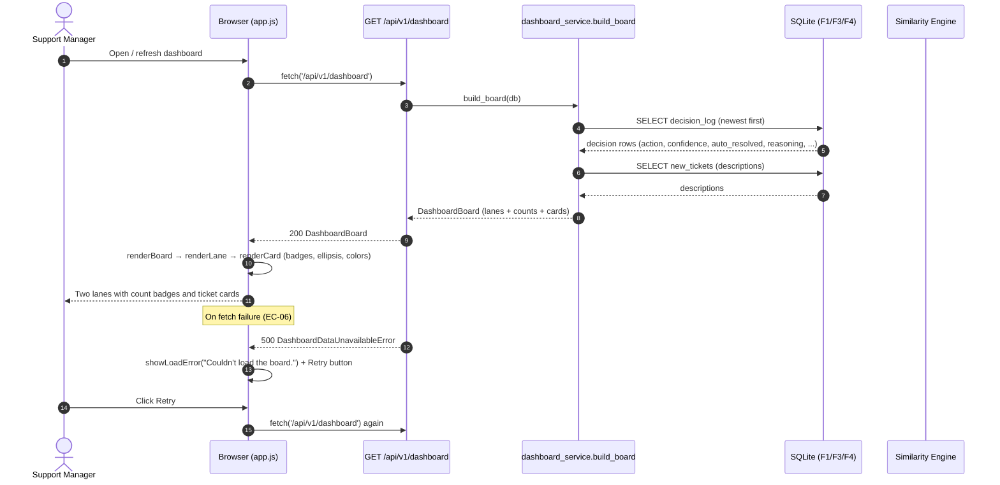
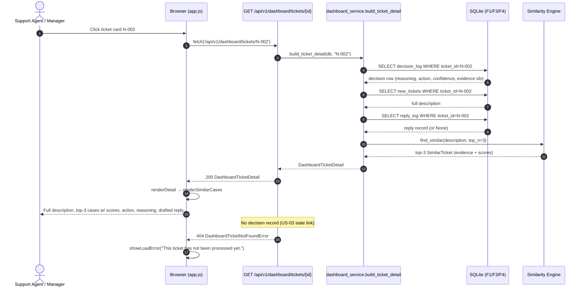

# Technical Specification: Two-Lane Dashboard

| Metadata | Details |
|---|---|
| **Feature Name** | Two-Lane Dashboard |
| **Feature ID** | FEAT-005 (F5) |
| **Derived From** | `features/F5-two-lane-dashboard/1_spec.md` |
| **Status** | Draft |
| **Author** | Technical Architect (AI) |
| **Created Date** | 2026-08-08 |

---

## 1. System Architecture & Components

F5 is a **read-only presentation layer** over the F1/F3/F4 data stores. It introduces **no new database tables**: the board and detail views are derived aggregates composed at request time from existing persisted data. A thin backend aggregation layer (`dashboard_service`) exposes a single board endpoint and a single detail endpoint so the frontend performs exactly one fetch per view.

### 1.1 Component Breakdown

| # | Component | Layer | Responsibility |
|---|---|---|---|
| C1 | `dashboard_models.py` | Backend · Models | Pydantic contracts: `DashboardBoard`, `DashboardTicketCard`, `DashboardTicketDetail`, lane/level enums. |
| C2 | `dashboard_service.py` | Backend · Service | Read-only aggregation: `build_board`, `build_ticket_detail`, plus pure helpers `lane_for`, `confidence_level`, `truncate_description`. |
| C3 | `dashboard.py` | Backend · Routes | FastAPI router: `GET /api/v1/dashboard` and `GET /api/v1/dashboard/tickets/{ticket_id}`. Maps service exceptions to HTTP statuses. |
| C4 | `index.html` | Frontend | Static page: two lane sections, error banner, detail panel container. |
| C5 | `style.css` | Frontend | Lane layout (side-by-side ≥1280px), card styles, confidence color coding, empty/error states, detail panel. |
| C6 | `app.js` | Frontend | Vanilla JS: fetch board → render lanes/cards; click card → fetch detail → render panel; retry on failure. |
| C7 | `config.py` additions | Backend · Core | Dashboard display constants (`STM_DASHBOARD_*`). |
| C8 | `main.py` edit | Backend · Entry | Register `dashboard.router`. |

### 1.2 Data Flow

```
F1 new_tickets ──┐
F3 decision_log ─┼──► dashboard_service.build_board ──► GET /api/v1/dashboard ──► app.js ──► DOM lanes
F4 reply_log   ──┘                                                                    (cards + badges)
                                                                    ▲
F1 new_tickets ──┐                                                 │ click
F3 decision_log ─┼──► dashboard_service.build_ticket_detail ──► GET /api/v1/dashboard/tickets/{id} ──► detail panel
F4 reply_log   ──┤
F2 find_similar ──┘   (deterministic top-3 evidence + scores)
```

> **Evidence-fidelity note (BR-03):** `decision_log.similar_ticket_ids` persists only the top-3 evidence **ids**. The per-evidence `similarity_score` is not persisted, so `build_ticket_detail` recomputes the ranked top-3 via F2 `similarity_service.find_similar(db, description, top_n=RESOLUTION_TOP_N_PRECEDENTS)`. F2 scoring is deterministic and the resolved-tickets corpus is static after F1 seeding, so the recomputed set is identical to the evidence used at decision time. The `reasoning`, `confidence`, `action`, and `refund_amount` are always read verbatim from `decision_log` (never recomputed — BR-02).

### 1.3 Read-Only Constraint (BR-05)

F5 exposes **GET-only** endpoints. It never mutates lanes, decisions, or replies. Human override is a future F6 feature.

---

## 2. Interface Definitions & Function Signatures

> These signatures are the CONTRACT used by test-generators to create unbiased TDD unit tests. They must be precise and complete.

### 2.1 Pydantic Models (`backend/app/models/dashboard_models.py`)

```python
from enum import Enum
from typing import List, Optional

from pydantic import BaseModel, Field


class DashboardLane(str, Enum):
    """The two dashboard lanes. Assignment follows BR-01 exactly —
    a ticket belongs to exactly one lane, decided by ``auto_resolved``."""

    AUTO_RESOLVED = "auto_resolved"
    NEEDS_REVIEW = "needs_review"


class ConfidenceLevel(str, Enum):
    """Display buckets for confidence color-coding (US-02 S1, EC-04).

    Derived ONLY from the persisted decision confidence via
    ``confidence_level()``; the underlying score is never altered (BR-02).
    """

    HIGH = "high"
    MEDIUM = "medium"
    LOW = "low"


class DashboardTicketCard(BaseModel):
    """Compact summary rendered on a lane card (US-02)."""

    ticket_id: str = Field(..., description="F1 new_tickets.ticket_id, e.g. 'N-002'.")
    description_preview: str = Field(
        ..., description="Full description truncated with '…' via truncate_description() (EC-03)."
    )
    action: Optional[str] = Field(
        None,
        description="Canonical action string ('refund' | 'redelivery' | 'coupon') applied (auto) or suggested (review); None when escalated without precedent guidance.",
    )
    confidence: float = Field(..., ge=0.0, le=1.0, description="Persisted decision confidence, unmodified (BR-02).")
    confidence_level: ConfidenceLevel = Field(
        ..., description="Color bucket derived from confidence (high/medium/low)."
    )
    lane: DashboardLane = Field(..., description="Lane assignment per BR-01.")
    auto_resolved: bool = Field(..., description="True iff the ticket was auto-resolved.")
    escalation_reason: Optional[str] = Field(
        None, description="Canonical escalation reason string; null for auto-resolved tickets."
    )
    created_at: str = Field(..., description="ISO-8601 UTC decision timestamp (from decision_log).")


class DashboardLaneSection(BaseModel):
    """One lane with its ticket list and count badge (US-01 S1/S2, EC-01)."""

    label: str = Field(..., description="Human-readable lane label, e.g. 'Auto-Resolved'.")
    count: int = Field(..., ge=0, description="Number of tickets in this lane (badge).")
    tickets: List[DashboardTicketCard] = Field(
        default_factory=list,
        description="Lane tickets, newest decision first (created_at DESC, ticket_id DESC). Empty when the lane is empty (EC-01).",
    )


class DashboardBoard(BaseModel):
    """Full board payload — both lanes, always present (BR-04)."""

    loaded_at: str = Field(..., description="ISO-8601 UTC timestamp of aggregation.")
    auto_resolved: DashboardLaneSection = Field(..., description="Auto-Resolved lane section.")
    needs_review: DashboardLaneSection = Field(..., description="Needs Human Review lane section.")


class SimilarCaseEvidence(BaseModel):
    """One top-3 similar past case with its score, shown in the detail view (US-03)."""

    ticket_id: str = Field(..., description="Resolved past-case id (H-1000 style).")
    description: str = Field(..., description="Full description of the past case.")
    action_taken: str = Field(..., description="Action that was taken for the past case.")
    resolution_note: str = Field(..., description="Resolution note of the past case.")
    similarity_score: float = Field(..., ge=0.0, le=1.0, description="Cosine similarity used at decision time.")


class SimilarCasesStatus(str, Enum):
    """Whether the detail view has evidence to show (US-03 S1/S2, EC-02)."""

    FOUND = "found"
    NONE = "none"  # no similar past cases / no history / cannot match


class ReplySummary(BaseModel):
    """Drafted customer reply surfaced in the detail view (US-03, F4 integration)."""

    final_body: str = Field(..., description="Customer-facing reply text (agent's edit or original draft).")
    variant: str = Field(..., description="F4 ReplyVariant value, e.g. 'action_confirmed'.")
    status: str = Field(..., description="F4 ReplyStatus value, 'draft' or 'sent'.")


class DashboardTicketDetail(BaseModel):
    """Full read-only detail payload for one ticket (US-03)."""

    ticket_id: str = Field(..., description="F1 new_tickets.ticket_id.")
    order_id: str = Field(..., description="F1 orders_context.order_id linked to the ticket.")
    description: str = Field(..., description="Full, untruncated ticket description (EC-03).")
    action: Optional[str] = Field(None, description="Applied (auto) or suggested (review) canonical action.")
    confidence: float = Field(..., ge=0.0, le=1.0, description="Persisted decision confidence (BR-02).")
    confidence_level: ConfidenceLevel = Field(..., description="Color bucket for the detail view.")
    lane: DashboardLane = Field(..., description="Lane assignment per BR-01.")
    auto_resolved: bool = Field(..., description="True iff auto-resolved.")
    escalation_reason: Optional[str] = Field(None, description="Canonical escalation reason; null when auto-resolved.")
    reasoning: str = Field(..., description="Plain-language decision reasoning, verbatim from decision_log (BR-03).")
    refund_amount: Optional[float] = Field(None, description="Computed refund amount in INR for refund actions; else null.")
    similar_cases: List[SimilarCaseEvidence] = Field(
        default_factory=list,
        description="Top-3 evidence with scores (US-03 S1). Empty when similar_cases_status is NONE (EC-02).",
    )
    similar_cases_status: SimilarCasesStatus = Field(
        ..., description="FOUND when evidence exists, else NONE (US-03 S2, EC-02)."
    )
    reply: Optional[ReplySummary] = Field(
        None, description="Drafted customer reply if a reply record exists; None → frontend fallback message."
    )
    created_at: str = Field(..., description="ISO-8601 UTC decision timestamp.")
```

### 2.2 Pure Engine Functions (`backend/app/services/dashboard_service.py`)

```python
from enum import Enum
from typing import Optional

from app.models.dashboard_models import ConfidenceLevel, DashboardLane


def lane_for(auto_resolved: bool) -> DashboardLane:
    """Map the persisted resolution outcome to a dashboard lane (BR-01).

    Args:
        auto_resolved: The persisted ``decision_log.auto_resolved`` flag.

    Returns:
        DashboardLane.AUTO_RESOLVED when True, else DashboardLane.NEEDS_REVIEW.

    Raises:
        No exceptions.
    """
    ...


def confidence_level(
    score: float,
    high_threshold: float = 0.75,
    medium_threshold: float = 0.40,
) -> ConfidenceLevel:
    """Bucket a confidence score for color-coding (US-02 S1, EC-04).

    Boundary rule is inclusive at the high threshold and inclusive at the
    medium threshold (matches the `>=` resolution boundary BR-02):
      - HIGH   when score >= high_threshold
      - MEDIUM when medium_threshold <= score < high_threshold
      - LOW    when score < medium_threshold

    Args:
        score: Confidence in [0.0, 1.0].
        high_threshold: High bucket floor (default 0.75, aligns with
            STM_RESOLUTION_CONFIDENCE_THRESHOLD).
        medium_threshold: Medium bucket floor (default 0.40).

    Returns:
        The ConfidenceLevel bucket.

    Raises:
        ValueError: If score is outside [0.0, 1.0], or if thresholds are
            not within [0.0, 1.0] or high_threshold < medium_threshold.
    """
    ...


def truncate_description(text: str, max_chars: int = 120) -> str:
    """Shorten a long description for card display with a '…' ellipsis (EC-03).

    The single ellipsis character U+2026 replaces the removed tail; the
    returned string is never longer than max_chars. Text at or under
    max_chars is returned unchanged.

    Args:
        text: The full ticket description.
        max_chars: Maximum preview length, must be >= 1.

    Returns:
        The preview string (unmodified when len(text) <= max_chars).

    Raises:
        ValueError: If max_chars < 1.
    """
    ...
```

### 2.3 Service Functions (`backend/app/services/dashboard_service.py`)

```python
from typing import List, Optional, Tuple

from sqlalchemy.ext.asyncio import AsyncSession

from app.models.dashboard_models import DashboardBoard, DashboardTicketCard, DashboardTicketDetail


class DashboardError(Exception):
    """Base class for all F5 dashboard errors."""


class DashboardDataUnavailableError(DashboardError):
    """Raised when the underlying F1/F3/F4 data cannot be read (→ 500, EC-06)."""


class DashboardTicketNotFoundError(DashboardError):
    """Raised when no decision record exists for a requested ticket (→ 404)."""


async def build_board(db: AsyncSession) -> DashboardBoard:
    """Aggregate the full two-lane board (US-01, US-04).

    Sources (all read-only):
      - ``decision_log`` (F3): lane, action, confidence, escalation_reason,
        refund_amount, created_at, evidence ids.
      - ``new_tickets`` (F1): full description (truncated for the card).
    Tickets are included iff they have a decision record; ordering is
    newest-first (created_at DESC, ticket_id DESC). Both lane sections are
    always present with accurate count badges (BR-04, EC-01).

    Args:
        db: Async DB session.

    Returns:
        A DashboardBoard with populated auto_resolved and needs_review
        sections and per-lane counts.

    Raises:
        DashboardDataUnavailableError: If any source table cannot be read
            (unavailable DB or F1/F3 engine failure).
    """
    ...


async def build_ticket_detail(db: AsyncSession, ticket_id: str) -> Optional[DashboardTicketDetail]:
    """Aggregate full read-only detail for one ticket (US-03, EC-02).

    Composes the persisted decision (verbatim reasoning/confidence/action),
    the full F1 description, the F4 reply record (if any), and the top-3
    evidence recomputed deterministically via F2 find_similar for scores
    (BR-03 note in §1.2).

    Args:
        db: Async DB session.
        ticket_id: F1 new_tickets.ticket_id.

    Returns:
        The DashboardTicketDetail, or None when no decision record exists
        for ``ticket_id`` (caller maps None → 404).

    Raises:
        DashboardDataUnavailableError: If required data cannot be read.
    """
    ...


async def _load_lane_cards(
    db: AsyncSession, auto_resolved: bool
) -> Tuple[List[DashboardTicketCard], int]:
    """Internal helper: fetch + map + count cards for one lane (BR-01)."""
    ...
```

### 2.4 Route Handlers (`backend/app/routes/dashboard.py`)

```python
from fastapi import APIRouter, Depends, HTTPException
from sqlalchemy.ext.asyncio import AsyncSession

from app.core.database import get_db
from app.models.dashboard_models import DashboardBoard, DashboardTicketDetail
from app.services import dashboard_service

router = APIRouter(prefix="/api/v1", tags=["dashboard"])


@router.get("/dashboard", response_model=DashboardBoard)
async def dashboard_board_endpoint(
    db: AsyncSession = Depends(get_db),
) -> DashboardBoard:
    """Return the full two-lane board (US-01, US-04).

    Raises:
        HTTPException(500): On DashboardDataUnavailableError (EC-06).
    """
    ...


@router.get("/dashboard/tickets/{ticket_id}", response_model=DashboardTicketDetail)
async def dashboard_ticket_detail_endpoint(
    ticket_id: str,
    db: AsyncSession = Depends(get_db),
) -> DashboardTicketDetail:
    """Return full read-only detail for one ticket (US-03).

    Raises:
        HTTPException(404): When no decision record exists for ticket_id.
        HTTPException(500): On DashboardDataUnavailableError (EC-06).
    """
    ...
```

### 2.5 Frontend Functions (`frontend/app.js`)

> All functions are global in vanilla JS (no framework). They are documented for the implementer; pytest coverage targets the backend contracts in §2.1–§2.4.

```javascript
/**
 * Fetch GET /api/v1/dashboard and render the board. On failure shows the
 * error banner with a Retry button (US-04 S2, EC-06). Never renders a
 * partial board.
 * @returns {Promise<void>}
 */
async function loadDashboard() { /* ... */ }

/**
 * Render both lane sections into #board. Both lanes are always rendered,
 * even with zero tickets (BR-04, EC-01).
 * @param {DashboardBoard} board - payload from GET /api/v1/dashboard
 */
function renderBoard(board) { /* ... */ }

/**
 * Render a single lane: header label + count badge + cards or empty-state
 * message "No tickets here yet." (US-01 S1/S2, EC-01).
 * @param {DashboardLaneSection} section
 * @param {string} laneClass - 'lane--auto' | 'lane--review'
 * @returns {HTMLElement}
 */
function renderLane(section, laneClass) { /* ... */ }

/**
 * Render one ticket card: truncated description, action label (or
 * "Needs human review" when escalated), and a color-coded confidence
 * badge (US-02 S1/S2, EC-03, EC-05). Clicking calls openDetail(ticket_id).
 * @param {DashboardTicketCard} card
 * @returns {HTMLElement}
 */
function renderCard(card) { /* ... */ }

/**
 * Fetch GET /api/v1/dashboard/tickets/{ticketId} and render the detail
 * panel (US-03 S1/S2). Shows a loading state, then the full payload.
 * @param {string} ticketId
 * @returns {Promise<void>}
 */
async function openDetail(ticketId) { /* ... */ }

/**
 * Render full ticket detail: full description, top-3 similar past cases
 * with scores, action, reasoning, drafted reply (US-03 S1). When
 * similar_cases_status === 'none', renders "No similar past cases were
 * found." and still shows action/reasoning/reply (US-03 S2, EC-02).
 * @param {DashboardTicketDetail} detail
 */
function renderDetail(detail) { /* ... */ }

/**
 * Render the top-3 similar past cases list, each with its similarity score.
 * @param {Array<SimilarCaseEvidence>} cases
 * @returns {HTMLElement}
 */
function renderSimilarCases(cases) { /* ... */ }

/**
 * Show the "Couldn't load the board" banner with a Retry button that
 * re-invokes loadDashboard (US-04 S2, EC-06).
 * @param {string} message
 */
function showLoadError(message) { /* ... */ }

/**
 * Map a ConfidenceLevel to the CSS modifier class:
 * 'confidence--high' | 'confidence--medium' | 'confidence--low'.
 * @param {string} level
 * @returns {string}
 */
function confidenceClass(level) { /* ... */ }

/**
 * Escape user-controlled text before injecting into innerHTML (XSS safety).
 * @param {string} text
 * @returns {string}
 */
function escapeHtml(text) { /* ... */ }
```

### 2.6 Configuration Additions (`backend/app/core/config.py`)

```python
# Dashboard settings (env prefix: STM_)
DASHBOARD_PREVIEW_CHARS: int = 120   # EC-03: card description truncation length (aligns with F4 quote ceiling)
DASHBOARD_CONFIDENCE_HIGH: float = 0.75  # EC-04: high-confidence bucket floor (aligns with F3 threshold)
DASHBOARD_CONFIDENCE_MEDIUM: float = 0.40  # EC-04: medium-confidence bucket floor
DASHBOARD_TOP_EVIDENCE: int = 3     # BR-03: top-N evidence shown (aligns with F3 top-N precedents)
```

---

## 3. Data Models & Schemas

### 3.1 Database Tables

F5 introduces **no new tables**. It reads existing F1/F3/F4 tables:

| Table | Owner | Columns Consumed by F5 |
|---|---|---|
| `decision_log` | F3 | `ticket_id`, `order_id`, `action`, `confidence`, `auto_resolved`, `escalation_reason`, `similar_ticket_ids` (JSON), `reasoning`, `refund_amount`, `created_at` |
| `new_tickets` | F1 | `ticket_id`, `order_id`, `description` |
| `reply_log` | F4 | `ticket_id`, `variant`, `final_body`, `status` |
| `resolved_tickets` | F1 | (via F2 `find_similar`) `ticket_id`, `description`, `action_taken`, `resolution_note` |

### 3.2 Field-Level Schema Reference

| Model | Field | Type | Nullable | Constraints |
|---|---|---|---|---|
| `DashboardTicketCard` | `ticket_id` | `str` | No | PK reference; non-empty |
| | `description_preview` | `str` | No | ≤ `DASHBOARD_PREVIEW_CHARS` chars, ends with `…` when truncated |
| | `action` | `str?` | Yes | `refund` \| `redelivery` \| `coupon`; None when escalated w/o guidance |
| | `confidence` | `float` | No | `0.0 ≤ c ≤ 1.0` |
| | `confidence_level` | `ConfidenceLevel` | No | `high` \| `medium` \| `low` |
| | `lane` | `DashboardLane` | No | `auto_resolved` \| `needs_review` |
| | `auto_resolved` | `bool` | No | BR-01 |
| | `escalation_reason` | `str?` | Yes | enum string; null iff auto_resolved |
| | `created_at` | `str` | No | ISO-8601 UTC |
| `DashboardLaneSection` | `label` | `str` | No | fixed: `Auto-Resolved` / `Needs Human Review` |
| | `count` | `int` | No | `≥ 0`; equals `len(tickets)` |
| | `tickets` | `List[DashboardTicketCard]` | No | empty when count = 0 |
| `DashboardBoard` | `loaded_at` | `str` | No | ISO-8601 UTC |
| | `auto_resolved` | `DashboardLaneSection` | No | always present (BR-04) |
| | `needs_review` | `DashboardLaneSection` | No | always present (BR-04) |
| `SimilarCaseEvidence` | `ticket_id` | `str` | No | non-empty |
| | `description` | `str` | No | full text |
| | `action_taken` | `str` | No | non-empty |
| | `resolution_note` | `str` | No | non-empty |
| | `similarity_score` | `float` | No | `0.0 ≤ s ≤ 1.0` |
| `DashboardTicketDetail` | `ticket_id` | `str` | No | non-empty |
| | `order_id` | `str` | No | non-empty |
| | `description` | `str` | No | full, untruncated (EC-03) |
| | `action` | `str?` | Yes | as card |
| | `confidence` | `float` | No | `0.0 ≤ c ≤ 1.0` |
| | `confidence_level` | `ConfidenceLevel` | No | as card |
| | `lane` | `DashboardLane` | No | BR-01 |
| | `auto_resolved` | `bool` | No | BR-01 |
| | `escalation_reason` | `str?` | Yes | null iff auto_resolved |
| | `reasoning` | `str` | No | verbatim from decision_log (BR-03) |
| | `refund_amount` | `float?` | Yes | INR; present for refund actions |
| | `similar_cases` | `List[SimilarCaseEvidence]` | No | empty when status = NONE (EC-02) |
| | `similar_cases_status` | `SimilarCasesStatus` | No | `found` \| `none` |
| | `reply` | `ReplySummary?` | Yes | None → frontend fallback |
| | `created_at` | `str` | No | ISO-8601 UTC |

---

## 4. API Contracts

### 4.1 `GET /api/v1/dashboard`

Fetches the full two-lane board (US-01, US-04). Read-only.

- **Request Parameters**: None (query params are not supported in v1; pagination is out of scope — the board returns all processed tickets compactly, per EC-05).
- **Response (200 OK)**:

```json
{
  "loaded_at": "2026-08-08T10:15:30.123456+00:00",
  "auto_resolved": {
    "label": "Auto-Resolved",
    "count": 2,
    "tickets": [
      {
        "ticket_id": "N-002",
        "description_preview": "milk packet missing from my order…",
        "action": "redelivery",
        "confidence": 0.93,
        "confidence_level": "high",
        "lane": "auto_resolved",
        "auto_resolved": true,
        "escalation_reason": null,
        "created_at": "2026-08-08T09:00:00+00:00"
      }
    ]
  },
  "needs_review": {
    "label": "Needs Human Review",
    "count": 1,
    "tickets": [
      {
        "ticket_id": "N-003",
        "description_preview": "fruits were rotten…",
        "action": null,
        "confidence": 0.31,
        "confidence_level": "low",
        "lane": "needs_review",
        "auto_resolved": false,
        "escalation_reason": "low_confidence",
        "created_at": "2026-08-08T08:45:00+00:00"
      }
    ]
  }
}
```

- **Response (500 Internal Server Error)** — data source unavailable (EC-06, US-04 S2):

```json
{
  "detail": "Dashboard data unavailable: unable to read decision log"
}
```

- **Response (400 Bad Request)**: Not applicable for this endpoint.

- **Response (404 Not Found)**: Not applicable for this endpoint.

### 4.2 `GET /api/v1/dashboard/tickets/{ticket_id}`

Fetches full read-only detail for one processed ticket (US-03).

- **Request Parameters**:
  - Path: `ticket_id` (str, required) — F1 `new_tickets.ticket_id` (e.g. `N-002`).
- **Response (200 OK)**:

```json
{
  "ticket_id": "N-002",
  "order_id": "ORD-1001",
  "description": "milk packet missing from my order, delivered today at 6pm",
  "action": "redelivery",
  "confidence": 0.93,
  "confidence_level": "high",
  "lane": "auto_resolved",
  "auto_resolved": true,
  "escalation_reason": null,
  "reasoning": "Auto-resolved: all 3 similar past cases were resolved by redelivery and confidence 0.93 meets the 0.75 threshold.",
  "refund_amount": null,
  "similar_cases": [
    {
      "ticket_id": "H-1000",
      "description": "milk packet missing from my order",
      "action_taken": "redelivery",
      "resolution_note": "missing item re-sent",
      "similarity_score": 0.93
    }
  ],
  "similar_cases_status": "found",
  "reply": {
    "final_body": "Thank you for reaching out. We are sorry the milk packet was missing — we have arranged a redelivery, matching how similar issues were resolved in the past.",
    "variant": "action_confirmed",
    "status": "draft"
  },
  "created_at": "2026-08-08T09:00:00+00:00"
}
```

- **Response (404 Not Found)** — no decision record for the ticket:

```json
{
  "detail": "no decision record for ticket N-999"
}
```

- **Response (500 Internal Server Error)** — data source unavailable (EC-06):

```json
{
  "detail": "Dashboard data unavailable: unable to read decision log"
}
```

- **Response (400 Bad Request)**: Not applicable for this endpoint (empty path param is rejected by routing).

---

## 5. Error Types & Handling

| Error Code | Trigger | HTTP Status | User Message (Frontend) |
|---|---|---|---|
| `ERR_DASH_001` | `DashboardDataUnavailableError` — F1/F3/F4 source tables unreadable (EC-06, US-04 S2) | 500 | "Couldn't load the board." + Retry button |
| `ERR_DASH_002` | `DashboardTicketNotFoundError` — no decision record for `ticket_id` (US-03) | 404 | "This ticket has not been processed yet." (opened from stale link) |
| `ERR_DASH_003` | `ValueError` from `confidence_level()` — score outside [0,1] or invalid thresholds | 500 (internal invariant) | "Couldn't load the board." + Retry |
| `ERR_DASH_004` | `ValueError` from `truncate_description()` — `max_chars < 1` | 500 (internal invariant) | "Couldn't load the board." + Retry |
| `ERR_DASH_005` | Missing `reply_log` record for a processed ticket (US-03 detail) | None (soft) | "No drafted reply available yet." in detail panel |
| `ERR_DASH_006` | Lane with zero tickets (EC-01, US-01 S2) | None (soft) | "No tickets here yet." in the empty lane |

---

## 6. Spec-to-Component Traceability

| User Story / Rule / Edge Case (from 1_spec.md) | Technical Component | Function/Endpoint |
|---|---|---|
| US-01 S1: Two labeled lanes + count badges | C2, C6 | `build_board()` → `GET /api/v1/dashboard`; `renderBoard()` / `renderLane()` |
| US-01 S2: Empty lane shows friendly message | C6 | `renderLane()` empty-state branch (ERR_DASH_006) |
| US-02 S1: Card shows description, action, color-coded confidence | C2, C6 | `truncate_description()`, `confidence_level()`; `renderCard()` |
| US-02 S2: Long description shortened with ellipsis; full text in detail | C2 | `truncate_description()`; `build_ticket_detail()` → `DashboardTicketDetail.description` |
| US-03 S1: Detail shows full description, top-3 similar cases with scores, action, reasoning, reply | C2, C6 | `build_ticket_detail()` → `GET /api/v1/dashboard/tickets/{id}`; `renderDetail()` / `renderSimilarCases()` |
| US-03 S2: No similar cases → explicit message, still show action/reasoning/reply | C2, C6 | `SimilarCasesStatus.NONE`; `renderDetail()` (ERR_DASH_005 for missing reply) |
| US-04 S1: New decisions reflected on open/refresh | C2 | `build_board()` reads `decision_log` live on every request |
| US-04 S2: Data unavailable → clear message + retry | C3, C6 | `DashboardDataUnavailableError` → 500; `showLoadError()` (ERR_DASH_001) |
| BR-01: Lane assignment exactly follows resolution outcome | C2 | `lane_for(auto_resolved)` |
| BR-02: Confidence displayed unmodified from decision | C2 | `confidence` read verbatim from `decision_log`; `confidence_level()` only buckets for color |
| BR-03: Evidence fidelity — top-3 cases, action, reasoning, reply are the exact decision items | C2 | reasoning/action from `decision_log`; reply from `reply_log`; evidence recomputed deterministically via F2 (§1.2 note) |
| BR-04: Both lanes always visible with empty-state | C2, C6 | `DashboardBoard` always has both sections; `renderBoard()` (BR-04) |
| BR-05: Dashboard is read-only viewing | C3 | GET-only endpoints; no mutation |
| EC-01: No tickets processed yet | C2, C6 | empty lane sections + zero badges; empty-state messages |
| EC-02: Escalated due to no similar cases (novel issue) | C2 | `similar_cases_status = none` + explicit message |
| EC-03: Very long description | C2, C5 | `truncate_description()` + CSS ellipsis on card; full text in detail |
| EC-04: Confidence at decision boundary | C2 | `confidence_level()` inclusive boundary rule (0.75 → high, 0.40 → medium); score shown unmodified |
| EC-05: Very high volume | C2, C5, C6 | compact cards, running count badges, single-click detail |
| EC-06: Data source temporarily unavailable | C3, C6 | 500 + `showLoadError()` + Retry |

---

## 7. Sequence Diagrams

### 7.1 Primary Workflow: Load Dashboard Board (US-01, US-04)



### 7.2 Secondary Workflow: Open Ticket Detail (US-03)



---

## 8. Integration & Registration Notes

1. **Router registration (C8):** Add `dashboard` to the import and `app.include_router(dashboard.router)` in `backend/app/main.py` after `replies.router`.
2. **Route ordering:** `/dashboard/tickets/{ticket_id}` has no sibling literal-path conflicts today; keep it under the `/api/v1/dashboard` prefix to mirror F4's `/replies` convention.
3. **F3 dependency:** `build_board` / `build_ticket_detail` read `decision_log` via the ORM model `ResolutionDecisionLog` (not via F3 REST endpoints) to avoid HTTP-internal calls; service-layer reuse mirrors `resolution_service.list_decisions`.
4. **F4 dependency:** `reply` is resolved via `reply_service.get_reply(db, ticket_id)` (service-level, no HTTP).
5. **F2 dependency:** `similar_cases` is resolved via `similarity_service.find_similar(db, description, top_n=settings.RESOLUTION_TOP_N_PRECEDENTS)` (service-level, no HTTP). This recomputation is deterministic (§1.2 note).
6. **Config:** add `DASHBOARD_*` settings to `Settings` in `backend/app/core/config.py` (§2.6).
7. **Frontend layout (C5):** lanes are side-by-side at ≥1280px (two-column flex/grid), stacking on narrower widths. Confidence badges use `confidence--high` (green), `confidence--medium` (amber), `confidence--low` (red).
8. **Read-only (BR-05):** no POST/PUT/DELETE endpoints are added by F5.
