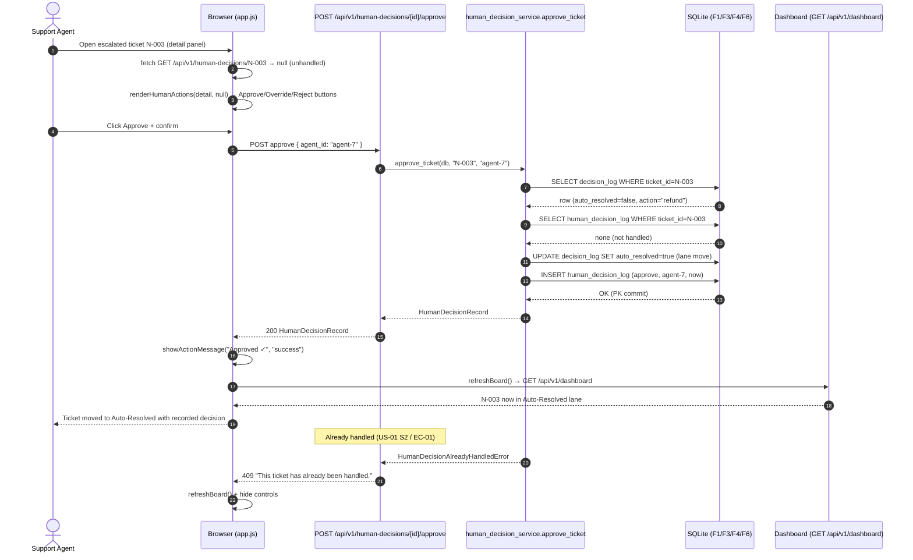
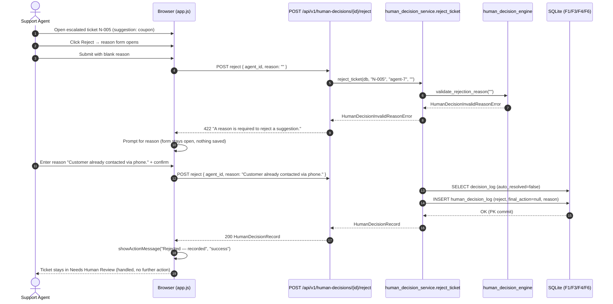
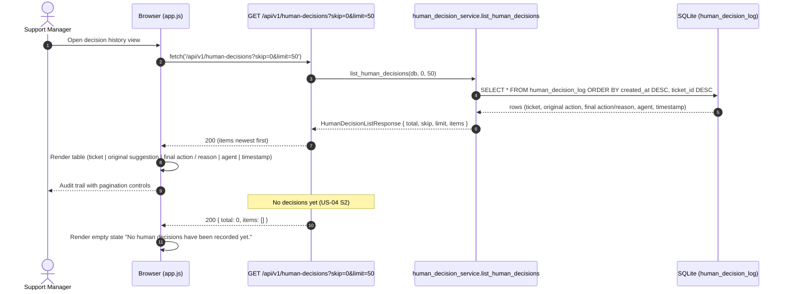

# Technical Specification: Human Override Controls

| Metadata | Details |
|---|---|
| **Feature Name** | Human Override Controls |
| **Feature ID** | FEAT-006 (F6) |
| **Derived From** | `features/F6-human-override-controls/1_spec.md` |
| **Status** | Draft |
| **Author** | Technical Architect (AI) |
| **Created Date** | 2026-08-08 |

---

## 1. System Architecture & Components

F6 closes the loop on the **Needs Human Review** lane: it adds the write path that F5 deliberately omits. A thin backend service (`human_decision_service`) accepts **approve / override / reject** actions from an identified agent, records every decision in a new F6-owned `human_decision_log` table, and — for approve/override — flips the existing F3 `decision_log.auto_resolved` flag to `True` so the ticket surfaces in the **Auto-Resolved** lane on the F5 board with zero changes to F5's read contracts. Policy validation reuses F3's order-context rules so a human override can never violate business constraints that the engine already enforces.

### 1.1 Component Breakdown

| # | Component | Layer | Responsibility |
|---|---|---|---|
| C1 | `human_decision_models.py` | Backend · Models | Pydantic contracts: `ApproveRequest`, `OverrideRequest`, `RejectRequest`, `HumanDecisionRecord`, `HumanDecisionListResponse`, enum `HumanAction`. |
| C2 | `human_decision_engine.py` | Backend · Engine | Pure, I/O-free decision helpers: action normalization, override policy gate (delegates to F3 `action_allowed_by_order`), rejection-reason validation, refund amount derivation. |
| C3 | `human_decision_service.py` | Backend · Service | Orchestration + persistence: `approve_ticket`, `override_ticket`, `reject_ticket`, `list_human_decisions`, `get_human_decision`. Owns the `human_decision_log` table and the `decision_log` lane flip. |
| C4 | `human_decisions.py` | Backend · Routes | FastAPI router: `POST .../approve`, `POST .../override`, `POST .../reject`, `GET /api/v1/human-decisions`, `GET /api/v1/human-decisions/{ticket_id}`. Maps service exceptions to HTTP statuses. |
| C5 | `db_models.py` edit | Backend · Models | New ORM table `HumanDecisionLog` (`human_decision_log`). |
| C6 | `config.py` edit | Backend · Core | F6 constants (`STM_HUMAN_OVERRIDE_REFUND_RATIO`). |
| C7 | `main.py` edit | Backend · Entry | Register `human_decisions.router`. |
| C8 | `index.html` + `style.css` | Frontend | Agent sign-in control, human-action controls inside the detail panel, override/reject form, action message area, styles. |
| C9 | `app.js` | Frontend | Vanilla JS: sign-in, approve/override/reject flows, handled-status check on detail open, board refresh after a decision, error rendering. |

### 1.2 Data Flow

```
Agent (identified) ──► POST /api/v1/human-decisions/{ticket_id}/approve|override|reject
                              │
                              ▼
              human_decision_service (F6)
                 │ 1. read decision_log (F3) — ticket must be escalated & unhandled
                 │ 2. [override] order-context policy gate (F3 action_allowed_by_order)
                 │ 3. [override] edited reply → reply_log (F4 edit semantics)
                 │ 4. approve/override → decision_log.auto_resolved = True (lane move)
                 │ 5. INSERT human_decision_log (PK ticket_id → one-decision-per-ticket)
                 ▼
        F5 GET /api/v1/dashboard ──► approved/overridden ticket now in Auto-Resolved lane
```

> **Lane-move note (US-01 S1, US-02 S1):** F5's `build_board` derives lanes purely from `decision_log.auto_resolved`. F6 moves a ticket by flipping that flag (approve/override) so F5 needs **no** contract change. **Rejected** tickets keep `auto_resolved = False` and stay visible in the Needs Human Review lane (US-03 S1: "remains visible for manual handling elsewhere") but are still final: the `human_decision_log` PK makes them non-actionable (BR "One final decision per ticket").

### 1.3 One-Final-Decision Invariant & Concurrency (EC-01)

`human_decision_log.ticket_id` is the **primary key**. The service pre-checks for an existing row (friendly 409) *and* relies on the PK constraint to break the EC-01 race: if two agents act simultaneously, the second `INSERT` raises `IntegrityError`, which the service maps to `HumanDecisionAlreadyHandledError` → 409 with no duplicate record and no state change.

### 1.4 Read-Only Boundary

F6 **only** mutates three tables: `decision_log` (lane + final action + refund), `reply_log` (edited reply body during override), and its own `human_decision_log`. It never touches `new_tickets`, `orders_context`, or `resolved_tickets` (F1 owns those).

---

## 2. Interface Definitions & Function Signatures

> These signatures are the CONTRACT used by test-generators to create unbiased TDD unit tests. They must be precise and complete.

### 2.1 Pydantic Models (`backend/app/models/human_decision_models.py`)

```python
from enum import Enum
from typing import List, Optional

from pydantic import BaseModel, Field

from app.models.resolution_models import ResolutionAction


class HumanAction(str, Enum):
    """The three human decisions an agent can record on an escalated ticket.

    APPROVE  - accept the system's suggested action as final (US-01)
    OVERRIDE - replace the suggested action with a different one (US-02)
    REJECT   - decline the suggestion; never applied (US-03)
    """

    APPROVE = "approve"
    OVERRIDE = "override"
    REJECT = "reject"


class ApproveRequest(BaseModel):
    """Request body for the approve endpoint (US-01)."""

    agent_id: str = Field(
        ...,
        min_length=1,
        examples=["agent-7"],
        description="Identity of the acting agent; required for the audit trail (BR 'Agents must be identifiable').",
    )


class OverrideRequest(BaseModel):
    """Request body for the override endpoint (US-02)."""

    agent_id: str = Field(
        ...,
        min_length=1,
        examples=["agent-7"],
        description="Identity of the acting agent (audit requirement).",
    )
    action: ResolutionAction = Field(
        ...,
        description="New final action. Only 'refund' | 'redelivery' | 'coupon' are accepted; 'other' is rejected by the service (ERR_HUM_008).",
    )
    reply_body: Optional[str] = Field(
        None,
        examples=["We are sorry for the trouble — a full refund has been initiated."],
        description="Agent's edited customer reply. When provided (non-blank), it becomes the final reply in reply_log and is stored in final_reply.",
    )


class RejectRequest(BaseModel):
    """Request body for the reject endpoint (US-03)."""

    agent_id: str = Field(
        ...,
        min_length=1,
        examples=["agent-7"],
        description="Identity of the acting agent (audit requirement).",
    )
    reason: str = Field(
        ...,
        min_length=1,
        examples=["Customer already contacted via phone; issue resolved manually."],
        description="Mandatory explanation for the rejection. Blank → ERR_HUM_005 (EC-03).",
    )


class HumanDecisionRecord(BaseModel):
    """One persisted human decision — the audit-row contract (US-04)."""

    ticket_id: str = Field(..., description="F1 new_tickets.ticket_id; PK of human_decision_log.")
    order_id: str = Field(..., description="F1 orders_context.order_id linked to the ticket.")
    agent_action: HumanAction = Field(..., description="approve | override | reject.")
    original_action: Optional[str] = Field(
        None,
        description="The suggested action from decision_log at action time (US-02 S1 audit of the original suggestion); None when escalated without guidance.",
    )
    final_action: Optional[str] = Field(
        None,
        description="Final applied action for approve/override; None for reject (suggestion never applied — US-03 S1).",
    )
    rejection_reason: Optional[str] = Field(
        None,
        description="Required for reject; null otherwise (US-03 S1).",
    )
    final_reply: Optional[str] = Field(
        None,
        description="Edited reply body persisted during an override (US-02 S1); null when the drafted reply stands.",
    )
    agent_id: str = Field(..., description="Identity of the agent who acted.")
    created_at: str = Field(..., description="ISO-8601 UTC timestamp of the decision.")

    @property
    def handled(self) -> bool:
        """A human decision always means the ticket is final (BR 'One final decision per ticket')."""
        return True


class HumanDecisionListResponse(BaseModel):
    """Offset-paginated human-decision history (matches F1/F3/F4 pagination convention)."""

    total: int = Field(..., ge=0, description="Total number of human decisions recorded.")
    skip: int = Field(..., ge=0, description="Offset used for this page.")
    limit: int = Field(..., ge=1, description="Page size used for this page.")
    items: List[HumanDecisionRecord] = Field(
        default_factory=list,
        description="Newest-first entries (created_at DESC, ticket_id DESC) — US-04 S1, EC-06.",
    )
```

### 2.2 Pure Engine Functions (`backend/app/services/human_decision_engine.py`)

```python
from typing import Optional

from app.models.resolution_models import ResolutionAction
from app.services.resolution_engine import action_allowed_by_order, apply_refund_cap


class HumanDecisionEngineError(Exception):
    """Base class for all F6 human-decision engine errors."""


class HumanDecisionPolicyBlockedError(HumanDecisionEngineError):
    """Raised when an override action violates order-context policy (→ 422, EC-02/US-02 S2)."""


class HumanDecisionInvalidReasonError(HumanDecisionEngineError):
    """Raised when a rejection has no reason (→ 422, EC-03/US-03 S2)."""


class HumanDecisionInvalidActionError(HumanDecisionEngineError):
    """Raised when an override action is not refund/redelivery/coupon (→ 422, ERR_HUM_008)."""


def normalize_override_action(action: str) -> ResolutionAction:
    """Validate and canonicalize an override action string (US-02).

    Only the three applicable actions are accepted: 'refund', 'redelivery',
    'coupon'. F3's 'other' is a history-only marker that a human can never
    select as a final action.

    Args:
        action: Raw action string from the override request.

    Returns:
        The canonical ResolutionAction.

    Raises:
        HumanDecisionInvalidActionError: If ``action`` is not one of
            refund/redelivery/coupon (case-insensitive), including 'other'.
    """
    ...


def validate_override_policy(action: ResolutionAction, order_status: str) -> None:
    """Enforce order-context policy on a manual override (US-02 S2, EC-02).

    Delegates to the F3 rule ``action_allowed_by_order`` so the human lane
    honors exactly the same constraint the engine enforces at decision time:
    ``redelivery`` is never allowed when the order status is ``cancelled``.

    Args:
        action: The override's final action.
        order_status: Raw F1 ``orders_context.status`` string (may be blank).

    Raises:
        HumanDecisionPolicyBlockedError: When the action is not allowed for
            this order (e.g. redelivery on a cancelled order).
    """
    ...


def validate_rejection_reason(reason: str) -> None:
    """Require a non-blank reason for a rejection (US-03 S2, EC-03).

    Args:
        reason: The agent-supplied rejection reason.

    Raises:
        HumanDecisionInvalidReasonError: If ``reason`` is None, empty, or
            whitespace-only.
    """
    ...


def final_refund_for(
    action: ResolutionAction,
    order_value: float,
    refund_ratio: float = 1.0,
) -> Optional[float]:
    """Derive the refund amount for a final action (US-02 S1).

    A human-chosen ``refund`` applies ``round(order_value * refund_ratio, 2)``
    capped at the order value via F3 ``apply_refund_cap`` (BR-05). Any other
    action yields None.

    Args:
        action: The final action (approve or override).
        order_value: F1 ``orders_context.value`` in INR (0.0 when unknown).
        refund_ratio: Fraction of order value applied to a manual refund
            (config ``STM_HUMAN_OVERRIDE_REFUND_RATIO``, default 1.0 → full refund).

    Returns:
        The capped refund amount in INR for ``refund``, else None.
    """
    ...
```

### 2.3 Service Functions (`backend/app/services/human_decision_service.py`)

```python
from typing import List, Optional, Tuple

from sqlalchemy.ext.asyncio import AsyncSession

from app.models.human_decision_models import HumanAction, HumanDecisionRecord
from app.models.resolution_models import ResolutionAction


class HumanDecisionError(Exception):
    """Base class for all F6 human-decision service errors."""


class HumanDecisionTicketNotFoundError(HumanDecisionError):
    """Raised when a ticket has no decision record (→ 404, EC-04)."""


class HumanDecisionAlreadyHandledError(HumanDecisionError):
    """Raised when the ticket already has a human decision (→ 409, US-01 S2 / EC-01)."""


class HumanDecisionNotActionableError(HumanDecisionError):
    """Raised when the ticket is not in the Needs Human Review lane (→ 409, BR 'Only escalated tickets can be acted on')."""


class HumanDecisionNoSuggestionError(HumanDecisionError):
    """Raised on approve when the escalated ticket has no suggested action (→ 422, ERR_HUM_009)."""


class HumanDecisionInvalidAgentError(HumanDecisionError):
    """Raised when agent_id is missing/blank (→ 422, BR 'Agents must be identifiable')."""


class HumanDecisionPersistenceError(HumanDecisionError):
    """Raised when the decision cannot be persisted (→ 500, ERR_HUM_007)."""


async def approve_ticket(db: AsyncSession, ticket_id: str, agent_id: str) -> HumanDecisionRecord:
    """Approve the suggested action and resolve the ticket (US-01 S1).

    Validates the agent, loads the F3 decision record, and rejects the call
    when the ticket is unavailable (EC-04), already handled (US-01 S2 /
    EC-01), not in the review lane, or carries no suggested action
    (ERR_HUM_009). On success: flips ``decision_log.auto_resolved`` to True
    (lane move to Auto-Resolved), leaves ``decision_log.action`` as the
    suggested action, and inserts a ``human_decision_log`` row
    (agent_action=approve, original_action=final_action=suggested).

    Args:
        db: Async DB session.
        ticket_id: F1 new_tickets.ticket_id.
        agent_id: Identity of the acting agent (audit requirement).

    Returns:
        The recorded HumanDecisionRecord (200).

    Raises:
        HumanDecisionInvalidAgentError: Blank ``agent_id`` (→ 422).
        HumanDecisionTicketNotFoundError: No decision record for ``ticket_id`` (→ 404).
        HumanDecisionNotActionableError: Ticket is auto-resolved (→ 409).
        HumanDecisionAlreadyHandledError: A human decision already exists (→ 409).
        HumanDecisionNoSuggestionError: No suggested action to approve (→ 422).
        HumanDecisionPersistenceError: Commit/DB failure, incl. IntegrityError
            from a concurrent insert (→ 500; the concurrent loser surfaces as
            AlreadyHandled on the caller's re-read) (→ 500 / EC-01).
    """
    ...


async def override_ticket(
    db: AsyncSession,
    ticket_id: str,
    agent_id: str,
    action: ResolutionAction,
    reply_body: Optional[str] = None,
) -> HumanDecisionRecord:
    """Replace the suggested action and resolve the ticket (US-02 S1).

    Loads the order context via ``ticket_service.get_order`` and enforces the
    F3 policy gate (US-02 S2 / EC-02). On success: persists the edited reply
    (when ``reply_body`` is non-blank) through F4 edit semantics, flips
    ``decision_log.auto_resolved`` to True, sets ``decision_log.action`` to
    the new action, sets ``decision_log.refund_amount`` for refund actions,
    and inserts a ``human_decision_log`` row preserving the original
    suggestion in ``original_action``.

    Args:
        db: Async DB session.
        ticket_id: F1 new_tickets.ticket_id.
        agent_id: Identity of the acting agent.
        action: The new final action (refund | redelivery | coupon).
        reply_body: Optional edited reply; non-blank values update reply_log.

    Returns:
        The recorded HumanDecisionRecord (200).

    Raises:
        HumanDecisionInvalidAgentError: Blank ``agent_id`` (→ 422).
        HumanDecisionTicketNotFoundError: No decision record (→ 404).
        HumanDecisionNotActionableError: Ticket is auto-resolved (→ 409).
        HumanDecisionAlreadyHandledError: A human decision already exists (→ 409).
        HumanDecisionInvalidActionError: Action not refund/redelivery/coupon (→ 422).
        HumanDecisionPolicyBlockedError: Action forbidden by order context
            (e.g. redelivery on a cancelled order) (→ 422).
        HumanDecisionPersistenceError: Commit/DB failure (→ 500).
    """
    ...


async def reject_ticket(db: AsyncSession, ticket_id: str, agent_id: str, reason: str) -> HumanDecisionRecord:
    """Reject the suggested action with a documented reason (US-03 S1).

    The ticket stays in the Needs Human Review lane (``decision_log`` is not
    mutated) but becomes final via the ``human_decision_log`` PK (BR 'One
    final decision per ticket'). The suggested action is never applied
    (``final_action`` is null).

    Args:
        db: Async DB session.
        ticket_id: F1 new_tickets.ticket_id.
        agent_id: Identity of the acting agent.
        reason: Mandatory rejection explanation (US-03 S2 / EC-03).

    Returns:
        The recorded HumanDecisionRecord (200).

    Raises:
        HumanDecisionInvalidAgentError: Blank ``agent_id`` (→ 422).
        HumanDecisionTicketNotFoundError: No decision record (→ 404).
        HumanDecisionNotActionableError: Ticket is auto-resolved (→ 409).
        HumanDecisionAlreadyHandledError: A human decision already exists (→ 409).
        HumanDecisionInvalidReasonError: Blank/whitespace-only ``reason`` (→ 422).
        HumanDecisionPersistenceError: Commit/DB failure (→ 500).
    """
    ...


async def list_human_decisions(
    db: AsyncSession, skip: int = 0, limit: int = 50
) -> Tuple[List[HumanDecisionRecord], int]:
    """List the full human-decision audit history, newest first (US-04 S1, EC-06).

    Args:
        db: Async DB session.
        skip: Offset (>= 0).
        limit: Page size (>= 1, <= MAX_PAGE_LIMIT).

    Returns:
        A ``(items, total)`` tuple. ``items`` is empty when no human decision
        has been recorded yet (US-04 S2 — an empty list is a valid 200, not an
        error).
    """
    ...


async def get_human_decision(db: AsyncSession, ticket_id: str) -> Optional[HumanDecisionRecord]:
    """Return the single human decision for a ticket (F6 detail/status check).

    Args:
        db: Async DB session.
        ticket_id: F1 new_tickets.ticket_id.

    Returns:
        The HumanDecisionRecord, or None when no human has acted on the ticket
        (caller maps None → 404).
    """
    ...
```

### 2.4 Route Handlers (`backend/app/routes/human_decisions.py`)

```python
from typing import Optional

from fastapi import APIRouter, Depends, HTTPException, Query
from sqlalchemy.ext.asyncio import AsyncSession

from app.core.database import get_db
from app.models.human_decision_models import (
    ApproveRequest,
    HumanDecisionListResponse,
    HumanDecisionRecord,
    OverrideRequest,
    RejectRequest,
)
from app.models.resolution_models import ResolutionAction
from app.services import human_decision_service
from app.services.human_decision_engine import (
    HumanDecisionEngineError,
    HumanDecisionInvalidActionError,
    HumanDecisionInvalidReasonError,
    HumanDecisionPolicyBlockedError,
)
from app.services.reply_service import ReplyEngineError, ReplyNotFoundError, ReplyAlreadySentError

router = APIRouter(prefix="/api/v1", tags=["human-decisions"])


@router.post("/human-decisions/{ticket_id}/approve", response_model=HumanDecisionRecord)
async def approve_human_decision_endpoint(
    ticket_id: str,
    payload: ApproveRequest,
    db: AsyncSession = Depends(get_db),
) -> HumanDecisionRecord:
    """Approve the suggested action on an escalated ticket (US-01)."""
    try:
        return await human_decision_service.approve_ticket(db, ticket_id, payload.agent_id)
    except human_decision_service.HumanDecisionTicketNotFoundError as exc:
        raise HTTPException(status_code=404, detail=str(exc)) from exc
    except human_decision_service.HumanDecisionNotActionableError as exc:
        raise HTTPException(status_code=409, detail=str(exc)) from exc
    except human_decision_service.HumanDecisionAlreadyHandledError as exc:
        raise HTTPException(status_code=409, detail=str(exc)) from exc
    except human_decision_service.HumanDecisionInvalidAgentError as exc:
        raise HTTPException(status_code=422, detail=str(exc)) from exc
    except human_decision_service.HumanDecisionNoSuggestionError as exc:
        raise HTTPException(status_code=422, detail=str(exc)) from exc
    except human_decision_service.HumanDecisionPersistenceError as exc:
        raise HTTPException(status_code=500, detail=f"Human decision failed: {exc}") from exc


@router.post("/human-decisions/{ticket_id}/override", response_model=HumanDecisionRecord)
async def override_human_decision_endpoint(
    ticket_id: str,
    payload: OverrideRequest,
    db: AsyncSession = Depends(get_db),
) -> HumanDecisionRecord:
    """Override the suggested action with a new one (US-02)."""
    try:
        return await human_decision_service.override_ticket(
            db, ticket_id, payload.agent_id, payload.action, payload.reply_body
        )
    except human_decision_service.HumanDecisionTicketNotFoundError as exc:
        raise HTTPException(status_code=404, detail=str(exc)) from exc
    except human_decision_service.HumanDecisionNotActionableError as exc:
        raise HTTPException(status_code=409, detail=str(exc)) from exc
    except human_decision_service.HumanDecisionAlreadyHandledError as exc:
        raise HTTPException(status_code=409, detail=str(exc)) from exc
    except (
        human_decision_service.HumanDecisionInvalidAgentError,
        HumanDecisionInvalidActionError,
        HumanDecisionPolicyBlockedError,
    ) as exc:
        raise HTTPException(status_code=422, detail=str(exc)) from exc
    except human_decision_service.HumanDecisionPersistenceError as exc:
        raise HTTPException(status_code=500, detail=f"Human decision failed: {exc}") from exc


@router.post("/human-decisions/{ticket_id}/reject", response_model=HumanDecisionRecord)
async def reject_human_decision_endpoint(
    ticket_id: str,
    payload: RejectRequest,
    db: AsyncSession = Depends(get_db),
) -> HumanDecisionRecord:
    """Reject the suggested action with a reason (US-03)."""
    try:
        return await human_decision_service.reject_ticket(db, ticket_id, payload.agent_id, payload.reason)
    except human_decision_service.HumanDecisionTicketNotFoundError as exc:
        raise HTTPException(status_code=404, detail=str(exc)) from exc
    except human_decision_service.HumanDecisionNotActionableError as exc:
        raise HTTPException(status_code=409, detail=str(exc)) from exc
    except human_decision_service.HumanDecisionAlreadyHandledError as exc:
        raise HTTPException(status_code=409, detail=str(exc)) from exc
    except (
        human_decision_service.HumanDecisionInvalidAgentError,
        HumanDecisionInvalidReasonError,
    ) as exc:
        raise HTTPException(status_code=422, detail=str(exc)) from exc
    except human_decision_service.HumanDecisionPersistenceError as exc:
        raise HTTPException(status_code=500, detail=f"Human decision failed: {exc}") from exc


# NOTE: registered BEFORE /human-decisions/{ticket_id} so a literal path never
# collides with the {ticket_id} parameter (F4 convention, §8 note 2).
@router.get("/human-decisions", response_model=HumanDecisionListResponse)
async def list_human_decisions_endpoint(
    skip: int = Query(default=0, ge=0),
    limit: int = Query(default=50, ge=1, le=500),
    db: AsyncSession = Depends(get_db),
) -> HumanDecisionListResponse:
    """List the human-decision audit history, newest first (US-04, EC-06)."""
    try:
        items, total = await human_decision_service.list_human_decisions(db, skip, limit)
    except human_decision_service.HumanDecisionPersistenceError as exc:
        raise HTTPException(status_code=500, detail=f"Human decision failed: {exc}") from exc
    return HumanDecisionListResponse(total=total, skip=skip, limit=limit, items=items)


@router.get("/human-decisions/{ticket_id}", response_model=HumanDecisionRecord)
async def get_human_decision_endpoint(
    ticket_id: str,
    db: AsyncSession = Depends(get_db),
) -> HumanDecisionRecord:
    """Return the human decision for one ticket (handled-status check)."""
    try:
        record = await human_decision_service.get_human_decision(db, ticket_id)
    except human_decision_service.HumanDecisionPersistenceError as exc:
        raise HTTPException(status_code=500, detail=f"Human decision failed: {exc}") from exc
    if record is None:
        raise HTTPException(status_code=404, detail=f"no human decision for ticket {ticket_id}")
    return record
```

### 2.5 ORM Model Addition (`backend/app/models/db_models.py`)

```python
class HumanDecisionLog(Base):
    __tablename__ = "human_decision_log"

    ticket_id = Column(String, primary_key=True, index=True)
    order_id = Column(String, nullable=False)
    agent_action = Column(String, nullable=False)          # 'approve' | 'override' | 'reject'
    original_action = Column(String, nullable=True)        # suggested action at decision time
    final_action = Column(String, nullable=True)           # final action (approve/override); null for reject
    rejection_reason = Column(String, nullable=True)       # required for reject
    final_reply = Column(String, nullable=True)            # edited reply body during override
    agent_id = Column(String, nullable=False)
    created_at = Column(String, nullable=False)            # ISO-8601 UTC
```

### 2.6 Frontend Functions (`frontend/app.js`)

> All functions are global in vanilla JS (no framework). They extend F5's `openDetail` / `renderDetail` — the human-action controls are rendered inside the existing detail panel. pytest coverage targets the backend contracts in §2.1–§2.4.

```javascript
/**
 * Read the signed-in agent id from localStorage ('stm_agent_id').
 * @returns {string|null} agent id, or null when not signed in.
 */
function getAgentId() { /* ... */ }

/**
 * Persist the agent id from #agent-signin into localStorage and update the
 * sign-in status text. Called on #agent-save-btn click.
 */
function saveAgent() { /* ... */ }

/**
 * POST /api/v1/human-decisions/{ticketId}/approve (US-01). Requires a
 * signed-in agent. On 409 shows "already handled" and refreshes; on success
 * shows a confirmation and refreshes the board.
 * @param {string} ticketId
 * @returns {Promise<void>}
 */
async function approveTicket(ticketId) { /* ... */ }

/**
 * POST /api/v1/human-decisions/{ticketId}/override (US-02). Sends the chosen
 * action + optional edited reply. On 422 surfaces the policy/invalid message
 * inline and keeps the form open; on 409 shows "already handled" and refreshes.
 * @param {string} ticketId
 * @param {string} action - 'refund' | 'redelivery' | 'coupon'
 * @param {string} replyBody - edited reply text (may be empty)
 * @returns {Promise<void>}
 */
async function submitOverride(ticketId, action, replyBody) { /* ... */ }

/**
 * POST /api/v1/human-decisions/{ticketId}/reject (US-03). On 422 (blank
 * reason) prompts the agent to enter a reason; on success refreshes.
 * @param {string} ticketId
 * @param {string} reason
 * @returns {Promise<void>}
 */
async function submitReject(ticketId, reason) { /* ... */ }

/**
 * Render Approve / Override / Reject controls in the detail panel. Shown only
 * when the ticket lane is 'needs_review' AND no human decision exists yet;
 * otherwise the panel shows a handled/read-only note (US-01 S2, BR-06).
 * @param {DashboardTicketDetail} detail - F5 detail payload
 * @param {HumanDecisionRecord|null} humanDecision - F6 status, or null
 */
function renderHumanActions(detail, humanDecision) { /* ... */ }

/**
 * Open the override form inside the detail panel: action selector pre-filled
 * with the suggested action + editable reply textarea (US-02 S1).
 * @param {DashboardTicketDetail} detail
 */
function openOverrideForm(detail) { /* ... */ }

/**
 * Open the reject form: reason textarea (US-03 S1). Submitting with a blank
 * reason shows the required-reason message (US-03 S2).
 * @param {DashboardTicketDetail} detail
 */
function openRejectForm(detail) { /* ... */ }

/**
 * Re-fetch GET /api/v1/dashboard and re-render the board after a human
 * action so the lane move is visible (US-01 S1, US-02 S1).
 * @returns {Promise<void>}
 */
async function refreshBoard() { /* ... */ }

/**
 * Show an action result or error message in #action-message.
 * @param {string} message
 * @param {string} kind - 'success' | 'error' | 'info'
 */
function showActionMessage(message, kind) { /* ... */ }
```

> **Extension of F5 `openDetail` (C9):** after rendering the F5 detail, the F6 code additionally fetches `GET /api/v1/human-decisions/{ticket_id}`; a 200 → `humanDecision`, a 404 → `null`. The result is passed to `renderHumanActions(detail, humanDecision)`. This hides the controls for already-handled tickets (including rejected ones, which stay in the review lane).

### 2.7 Configuration Additions (`backend/app/core/config.py`)

```python
# Human Override Controls settings (env prefix: STM_)
HUMAN_OVERRIDE_REFUND_RATIO: float = 1.0  # US-02: manual refund = 100% of order value (capped at order value)
```

> Pagination for `GET /api/v1/human-decisions` reuses the existing `DEFAULT_PAGE_LIMIT` (50) and `MAX_PAGE_LIMIT` (500) settings.

---

## 3. Data Models & Schemas

### 3.1 Database Tables

| Table | Owner | F6 Role |
|---|---|---|
| `human_decision_log` | **F6 (new)** | Audit trail of every human decision; PK `ticket_id` enforces the one-decision-per-ticket invariant. |
| `decision_log` | F3 | **Read** for the suggested action / lane; **write** `auto_resolved`, `action`, `refund_amount` on approve/override (lane move). |
| `reply_log` | F4 | **Read** the drafted reply; **write** `final_body`/`edited_by`/`edited_at` when an override edits the reply. |
| `orders_context` | F1 | **Read** `status` (policy gate) and `value` (refund amount) during override. |
| `new_tickets` | F1 | **Read** (via F1 service) only if a ticket description is needed; not required by the core write path. |

### 3.2 Field-Level Schema Reference

| Model | Field | Type | Nullable | Constraints |
|---|---|---|---|---|
| `HumanDecisionLog` (ORM) | `ticket_id` | `str` | No | PK; FK semantics to `new_tickets.ticket_id` |
| | `order_id` | `str` | No | from `decision_log.order_id` |
| | `agent_action` | `str` | No | `approve` \| `override` \| `reject` |
| | `original_action` | `str?` | Yes | canonical action or null |
| | `final_action` | `str?` | Yes | null iff `agent_action == reject` |
| | `rejection_reason` | `str?` | Yes | non-blank iff `agent_action == reject` |
| | `final_reply` | `str?` | Yes | non-blank when an override edits the reply |
| | `agent_id` | `str` | No | non-blank |
| | `created_at` | `str` | No | ISO-8601 UTC |
| `ApproveRequest` | `agent_id` | `str` | No | `min_length=1` |
| `OverrideRequest` | `agent_id` | `str` | No | `min_length=1` |
| | `action` | `ResolutionAction` | No | only `refund` \| `redelivery` \| `coupon` accepted by service |
| | `reply_body` | `str?` | Yes | blank → no reply change |
| `RejectRequest` | `agent_id` | `str` | No | `min_length=1` |
| | `reason` | `str` | No | `min_length=1` |
| `HumanDecisionRecord` | `ticket_id` | `str` | No | non-empty |
| | `order_id` | `str` | No | non-empty |
| | `agent_action` | `HumanAction` | No | `approve` \| `override` \| `reject` |
| | `original_action` | `str?` | Yes | null when no guidance |
| | `final_action` | `str?` | Yes | null for reject |
| | `rejection_reason` | `str?` | Yes | non-null for reject |
| | `final_reply` | `str?` | Yes | non-null when edited |
| | `agent_id` | `str` | No | non-empty |
| | `created_at` | `str` | No | ISO-8601 UTC |
| `HumanDecisionListResponse` | `total` | `int` | No | `≥ 0` |
| | `skip` | `int` | No | `≥ 0` |
| | `limit` | `int` | No | `1 ≤ limit ≤ 500` |
| | `items` | `List[HumanDecisionRecord]` | No | empty when `total = 0` (US-04 S2) |

---

## 4. API Contracts

### 4.1 `POST /api/v1/human-decisions/{ticket_id}/approve`

Approves the suggested action on an escalated ticket and moves it to Auto-Resolved (US-01).

- **Request Parameters**:
  - Path: `ticket_id` (str, required) — F1 `new_tickets.ticket_id`.
  - Body:
    ```json
    { "agent_id": "agent-7" }
    ```
- **Response (200 OK)**:
  ```json
  {
    "ticket_id": "N-003",
    "order_id": "ORD-9902",
    "agent_action": "approve",
    "original_action": "refund",
    "final_action": "refund",
    "rejection_reason": null,
    "final_reply": null,
    "agent_id": "agent-7",
    "created_at": "2026-08-08T15:30:00.123456+00:00"
  }
  ```
- **Response (404 Not Found)** — no decision record / ticket unavailable (EC-04):
  ```json
  { "detail": "ticket not found: N-999" }
  ```
- **Response (409 Conflict)** — already handled (US-01 S2 / EC-01) or not in the review lane:
  ```json
  { "detail": "ticket N-003 has already been handled by a human agent" }
  ```
  ```json
  { "detail": "only tickets awaiting human review can be acted on" }
  ```
- **Response (422 Unprocessable Entity)** — blank `agent_id` (BR "Agents must be identifiable") or no suggested action to approve (ERR_HUM_009):
  ```json
  { "detail": "agent identity is required to record a human decision" }
  ```
- **Response (500 Internal Server Error)** — persistence/DB failure:
  ```json
  { "detail": "Human decision failed: unable to persist human decision for N-003" }
  ```

### 4.2 `POST /api/v1/human-decisions/{ticket_id}/override`

Replaces the suggested action with a new one and (optionally) an edited reply (US-02).

- **Request Parameters**:
  - Path: `ticket_id` (str, required).
  - Body:
    ```json
    {
      "agent_id": "agent-7",
      "action": "refund",
      "reply_body": "We are sorry for the trouble — a full refund of ₹999 has been initiated."
    }
    ```
- **Response (200 OK)**:
  ```json
  {
    "ticket_id": "N-003",
    "order_id": "ORD-9902",
    "agent_action": "override",
    "original_action": "coupon",
    "final_action": "refund",
    "rejection_reason": null,
    "final_reply": "We are sorry for the trouble — a full refund of ₹999 has been initiated.",
    "agent_id": "agent-7",
    "created_at": "2026-08-08T15:31:00.123456+00:00"
  }
  ```
- **Response (404 Not Found)** — no decision record / ticket unavailable:
  ```json
  { "detail": "ticket not found: N-999" }
  ```
- **Response (409 Conflict)** — already handled (EC-01) or not in the review lane.
- **Response (422 Unprocessable Entity)** — blank `agent_id`, invalid action (not refund/redelivery/coupon), or **policy-blocked override** (US-02 S2 / EC-02):
  ```json
  { "detail": "redelivery is not allowed for cancelled orders" }
  ```
- **Response (500 Internal Server Error)** — persistence/DB failure.

### 4.3 `POST /api/v1/human-decisions/{ticket_id}/reject`

Rejects the suggested action with a documented reason; the ticket stays in the review lane but is final (US-03).

- **Request Parameters**:
  - Path: `ticket_id` (str, required).
  - Body:
    ```json
    { "agent_id": "agent-7", "reason": "Customer already contacted via phone; issue resolved manually." }
    ```
- **Response (200 OK)**:
  ```json
  {
    "ticket_id": "N-003",
    "order_id": "ORD-9902",
    "agent_action": "reject",
    "original_action": "coupon",
    "final_action": null,
    "rejection_reason": "Customer already contacted via phone; issue resolved manually.",
    "final_reply": null,
    "agent_id": "agent-7",
    "created_at": "2026-08-08T15:32:00.123456+00:00"
  }
  ```
- **Response (404 Not Found)** — no decision record / ticket unavailable.
- **Response (409 Conflict)** — already handled (EC-01) or not in the review lane.
- **Response (422 Unprocessable Entity)** — blank `agent_id` or **blank rejection reason** (US-03 S2 / EC-03):
  ```json
  { "detail": "a reason is required to reject a suggestion" }
  ```
- **Response (500 Internal Server Error)** — persistence/DB failure.

### 4.4 `GET /api/v1/human-decisions`

Lists the human-decision audit history, newest first, page by page (US-04, EC-06).

- **Request Parameters**:
  - Query: `skip` (int, default 0, `ge=0`), `limit` (int, default 50, `ge=1`, `le=500`).
- **Response (200 OK)**:
  ```json
  {
    "total": 3,
    "skip": 0,
    "limit": 50,
    "items": [
      {
        "ticket_id": "N-003",
        "order_id": "ORD-9902",
        "agent_action": "reject",
        "original_action": "coupon",
        "final_action": null,
        "rejection_reason": "Customer already contacted via phone.",
        "final_reply": null,
        "agent_id": "agent-7",
        "created_at": "2026-08-08T15:32:00+00:00"
      },
      {
        "ticket_id": "N-002",
        "order_id": "ORD-9901",
        "agent_action": "approve",
        "original_action": "redelivery",
        "final_action": "redelivery",
        "rejection_reason": null,
        "final_reply": null,
        "agent_id": "agent-3",
        "created_at": "2026-08-08T14:10:00+00:00"
      }
    ]
  }
  ```
- **Response (200 OK, empty history — US-04 S2, not an error)**:
  ```json
  { "total": 0, "skip": 0, "limit": 50, "items": [] }
  ```
- **Response (500 Internal Server Error)** — DB read failure:
  ```json
  { "detail": "Human decision failed: unable to read human decision log" }
  ```
- **Response (400/404)**: Not applicable — invalid query params are rejected by FastAPI validation (422).

### 4.5 `GET /api/v1/human-decisions/{ticket_id}`

Returns the single human decision for a ticket (F6 handled-status check).

- **Request Parameters**:
  - Path: `ticket_id` (str, required).
- **Response (200 OK)**: a single `HumanDecisionRecord` (shape as §4.1).
- **Response (404 Not Found)** — no human decision recorded:
  ```json
  { "detail": "no human decision for ticket N-003" }
  ```
- **Response (500 Internal Server Error)** — DB read failure.

---

## 5. Error Types & Handling

| Error Code | Trigger | HTTP Status | User Message (Frontend) |
|---|---|---|---|
| `ERR_HUM_001` | `HumanDecisionTicketNotFoundError` — no `decision_log` record for the ticket (EC-04) | 404 | "This ticket is unavailable or has not been processed." |
| `ERR_HUM_002` | `HumanDecisionAlreadyHandledError` — a human decision already exists (US-01 S2, EC-01) | 409 | "This ticket has already been handled." |
| `ERR_HUM_003` | `HumanDecisionNotActionableError` — ticket is auto-resolved (BR "Only escalated tickets can be acted on") | 409 | "Only tickets awaiting human review can be acted on." |
| `ERR_HUM_004` | `HumanDecisionPolicyBlockedError` — override violates order context, e.g. redelivery on a cancelled order (US-02 S2, EC-02) | 422 | "Redelivery is not allowed for cancelled orders." |
| `ERR_HUM_005` | `HumanDecisionInvalidReasonError` — rejection without a reason (US-03 S2, EC-03) | 422 | "A reason is required to reject a suggestion." |
| `ERR_HUM_006` | `HumanDecisionInvalidAgentError` — missing/blank agent identity (BR "Agents must be identifiable") | 422 | "Please sign in to record a decision." |
| `ERR_HUM_007` | `HumanDecisionPersistenceError` — DB/commit failure | 500 | "Couldn't record your decision. Please try again." |
| `ERR_HUM_008` | `HumanDecisionInvalidActionError` — override action not refund/redelivery/coupon | 422 | "Choose a valid action: refund, redelivery, or coupon." |
| `ERR_HUM_009` | `HumanDecisionNoSuggestionError` — approve with no suggested action | 422 | "This ticket has no suggested action to approve. Use Override or Reject." |
| `ERR_HUM_010` | No human decisions recorded yet (US-04 S2) | None (soft) | "No human decisions have been recorded yet." in history view |

---

## 6. Spec-to-Component Traceability

| User Story / Rule / Edge Case (from 1_spec.md) | Technical Component | Function/Endpoint |
|---|---|---|
| US-01 S1: Approve succeeds → Auto-Resolved + recorded with agent identity/action/timestamp | C3, C4 | `approve_ticket()` → `POST /api/v1/human-decisions/{ticket_id}/approve`; `decision_log.auto_resolved = True` |
| US-01 S2: Already-handled ticket → no duplicate, clear message | C3, C4 | `HumanDecisionAlreadyHandledError` → 409 (ERR_HUM_002) |
| US-02 S1: Override succeeds → new action + edited reply final, original suggestion recorded | C3, C4 | `override_ticket()` → `POST .../override`; `original_action` preserved in `human_decision_log`; `reply_log.final_body` updated |
| US-02 S2: Override blocked by policy constraint → refused with explanation, ticket unchanged | C2, C3 | `validate_override_policy()` (delegates F3 `action_allowed_by_order`) → `HumanDecisionPolicyBlockedError` → 422 (ERR_HUM_004) |
| US-03 S1: Reject succeeds with reason → marked rejected, never applied, recorded | C3, C4 | `reject_ticket()` → `POST .../reject`; `final_action=None`, `rejection_reason` persisted |
| US-03 S2: Rejection without reason → not saved, prompted | C2, C3 | `validate_rejection_reason()` → `HumanDecisionInvalidReasonError` → 422 (ERR_HUM_005) |
| US-04 S1: History newest first with ticket/suggestion/final action/agent/timestamp | C3, C4, C9 | `list_human_decisions()` → `GET /api/v1/human-decisions` (created_at DESC, ticket_id DESC) |
| US-04 S2: No history yet → empty state, not an error | C3, C4, C9 | `total=0` + empty `items` (200); frontend empty-state message (ERR_HUM_010) |
| BR: Only escalated tickets can be acted on | C3 | `HumanDecisionNotActionableError` when `decision_log.auto_resolved` is True (→ 409, ERR_HUM_003) |
| BR: One final decision per ticket | C3, C5 | `human_decision_log` PK + pre-check + `IntegrityError` mapping (→ 409) |
| BR: Override must respect order context | C2 | `validate_override_policy()` → 422 (ERR_HUM_004) |
| BR: Rejection requires a reason | C2 | `validate_rejection_reason()` → 422 (ERR_HUM_005) |
| BR: Every human decision is recorded with agent identity + timestamp | C3, C5 | `HumanDecisionLog` insert with `agent_id`, `created_at` (ISO-8601 UTC) |
| BR: Agents must be identifiable | C1, C3 | Pydantic `min_length=1` + `HumanDecisionInvalidAgentError` → 422 (ERR_HUM_006) |
| EC-01: Two agents act simultaneously → first wins, no duplicate | C3, C5 | PK constraint + `IntegrityError` → `HumanDecisionAlreadyHandledError` → 409 |
| EC-02: Policy-forbidden override → blocked, ticket unchanged | C2, C3 | `validate_override_policy()` → 422; no `decision_log`/`human_decision_log` write |
| EC-03: Reject without reason → not saved | C2, C3 | `validate_rejection_reason()` → 422; no insert |
| EC-04: Ticket details no longer loadable → friendly error, no action, no record | C3, C4 | `HumanDecisionTicketNotFoundError` → 404 (ERR_HUM_001) |
| EC-05: Form left open / browser closed → nothing recorded until confirm | C9 | frontend-only: no backend call until form submit; no partial state (no draft rows) |
| EC-06: History grows large → newest-first + pagination | C3, C4 | `GET /api/v1/human-decisions` with `skip`/`limit` |

---

## 7. Sequence Diagrams

### 7.1 Primary Workflow: Approve a Suggestion (US-01)



### 7.2 Workflow: Override with Policy Gate (US-02)

```mermaid
sequenceDiagram
    autonumber
    actor Agent as Support Agent
    participant UI as Browser (app.js)
    participant API as POST /api/v1/human-decisions/{id}/override
    participant SVC as human_decision_service.override_ticket
    participant ENG as human_decision_engine (F3 policy)
    participant DB as SQLite (F1/F3/F4/F6)
    participant F5 as Dashboard (GET /api/v1/dashboard)

    Agent->>UI: Open escalated ticket N-004 (suggestion: coupon)
    Agent->>UI: Click Override → form opens (action selector + reply textarea)
    Agent->>UI: Pick "redelivery", edit reply, confirm
    UI->>API: POST override { agent_id, action:"redelivery", reply_body:"..." }
    API->>SVC: override_ticket(db, "N-004", "agent-7", redelivery, reply)
    SVC->>DB: SELECT decision_log (auto_resolved=false, action="coupon")
    SVC->>DB: SELECT orders_context (status="cancelled")
    SVC->>ENG: validate_override_policy(redelivery, "cancelled")
    ENG-->>SVC: HumanDecisionPolicyBlockedError (redelivery blocked on cancelled)
    SVC-->>API: HumanDecisionPolicyBlockedError
    API-->>UI: 422 "Redelivery is not allowed for cancelled orders."
    UI->>UI: showActionMessage(error) — form stays open, ticket unchanged
    UI-->>Agent: Policy message shown; no decision recorded; ticket still in Needs Human Review

    Note over SVC: Policy-valid override path
    SVC->>ENG: validate_override_policy(refund, "cancelled") → allowed
    SVC->>DB: UPDATE reply_log SET final_body=reply_body (F4 edit)
    SVC->>DB: UPDATE decision_log SET auto_resolved=true, action="refund", refund_amount=999
    SVC->>DB: INSERT human_decision_log (override, original=coupon, final=refund)
    SVC-->>API: HumanDecisionRecord
    API-->>UI: 200 HumanDecisionRecord
    UI->>F5: refreshBoard()
    F5-->>UI: N-004 now in Auto-Resolved lane
```

### 7.3 Workflow: Reject a Suggestion (US-03)



### 7.4 Workflow: Audit Decision History (US-04)



---

## 8. Integration & Registration Notes

1. **Router registration (C7):** Add `human_decisions` to the import and `app.include_router(human_decisions.router)` in `backend/app/main.py` after `dashboard.router`.
2. **Route ordering:** Register `GET /api/v1/human-decisions` before `GET /api/v1/human-decisions/{ticket_id}` (mirrors F4's `/replies` vs `/replies/{ticket_id}` convention). The three `POST .../{ticket_id}/approve|override|reject` sub-paths are unambiguous.
3. **F3 reuse (policy + refund):** `validate_override_policy` delegates to `resolution_engine.action_allowed_by_order`; `final_refund_for` uses `resolution_engine.apply_refund_cap`. No new policy rules are introduced — the human lane honors the same order-context constraints as the engine (US-02 S2 / EC-02).
4. **F4 reuse (edited reply):** An override with a non-blank `reply_body` persists the edit through `reply_service.edit_reply(db, ticket_id, body, edited_by=agent_id)`. `ReplyNotFoundError` (no draft record) and `ReplyAlreadySentError` (sent reply is immutable) are tolerated — the edited text is still recorded as `final_reply` in `human_decision_log`.
5. **F1 reuse (order facts):** `override_ticket` loads order context via `ticket_service.get_order(db, decision.order_id)` for the policy gate and refund amount; a missing order behaves as an unrestricted policy check with `order_value = 0.0` (refund → `0.0`).
6. **F5 integration (lane move):** approve/override set `decision_log.auto_resolved = True`; F5's `build_board` picks this up on the next fetch with no contract change. Reject leaves `auto_resolved` untouched (ticket stays visible in the review lane but is final). The F6 frontend suppresses controls for handled tickets by fetching `GET /api/v1/human-decisions/{ticket_id}` when a detail opens.
7. **Concurrency (EC-01):** `human_decision_log.ticket_id` is a PK. The service pre-checks for a friendly 409, and the `IntegrityError` from a concurrent insert is mapped to `HumanDecisionAlreadyHandledError` after rollback — exactly one decision per ticket is guaranteed at the database level.
8. **Atomicity:** the service performs all mutations (`decision_log` update + `human_decision_log` insert + optional `reply_log` edit) before a single commit. `reply_service.edit_reply` may commit internally; implementers should order the reply edit first and treat a failure there as a tolerated non-blocking condition (per note 4) so the human decision insert/commit remains the authoritative record.
9. **Config:** add `STM_HUMAN_OVERRIDE_REFUND_RATIO` (default `1.0`) to `Settings` (§2.7). Pagination reuses `DEFAULT_PAGE_LIMIT` / `MAX_PAGE_LIMIT`.
10. **Frontend (C8/C9):** add `#agent-signin` + `#agent-save-btn` + `#agent-status` to the header, and `#action-controls`, `#action-form`, `#action-message` containers to the detail panel. Extend F5's `openDetail` to fetch the F6 handled status, then call `renderHumanActions(detail, humanDecision)`. Action buttons are rendered **only** when `lane === "needs_review"` and no decision exists; otherwise the panel shows the handled/read-only note.
