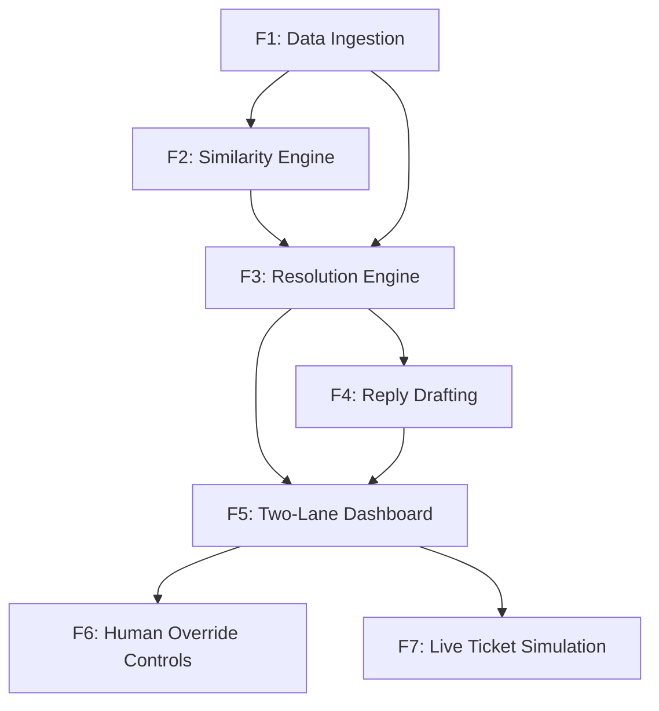

# Features Index — Zepto Support Ticket Manager

> Generated by `feature-planner` from [Q3-Design.md](file:///Users/rohit/Documents/support_ticket_manager/Q3-Design.md)
> Date: 2026-08-08

---

## Feature Dependency Graph



---

## Feature List

### Core Features (must complete first)

| ID | Feature Name | Description | Depends On | Priority |
|----|---|---|---|---|
| F1 | **Data Ingestion & Storage** | Load and persist `resolved_tickets.csv`, `new_tickets.csv`, and `orders_context.csv`. Expose CRUD-style read APIs for tickets and orders. Establish the database schema (SQLite) and Pydantic models. | — | P0 |
| F2 | **Similarity Engine** | Given a new ticket description, compute TF-IDF similarity against all resolved tickets and return the **top-3** most similar past cases with similarity scores. | F1 | P0 |
| F3 | **Resolution Engine** | For a new ticket: pull top-3 similar tickets (F2), pull order context (F1), apply confidence threshold to decide **auto-resolve** vs **escalate-to-human**. Enforce context constraints (e.g., no redelivery on cancelled orders). When precedents disagree on action, always escalate. Log every decision with confidence, chosen action (`refund` / `redelivery` / `coupon`), and reasoning. | F1, F2 | P0 |
| F4 | **Reply Drafting** | Generate a customer-facing drafted reply for every ticket — both auto-resolved and escalated. The reply must cite the top-3 precedent tickets used and explain the chosen action. | F3 | P0 |
| F5 | **Two-Lane Dashboard** | Frontend board with two lanes: **Auto-Resolved** and **Needs Human Review**. Each ticket card shows: ticket description, top-3 similar past cases, chosen/suggested action, confidence score, and drafted reply. | F3, F4 | P0 |

### Bonus Features (only after core is complete)

| ID | Feature Name | Description | Depends On | Priority |
|----|---|---|---|---|
| F6 | **Human Override Controls** | On the Needs-Human lane, allow a human agent to **approve**, **reject**, or **override** the suggested action. All decisions are logged with timestamps and agent ID. | F5 | P1 |
| F7 | **Live Ticket Simulation** | A real-time ticket-stream simulation that feeds new tickets into the system one-by-one, visually animating them landing in the correct lane on the dashboard. | F5 | P1 |

---

## Feature Details

### F1 · Data Ingestion & Storage

**User Stories**
- As a system, I ingest the three CSV datasets on startup so all historical and incoming data is queryable.
- As a developer, I have Pydantic models and DB tables for `ResolvedTicket`, `NewTicket`, and `OrderContext`.

**Acceptance Criteria**
- All three CSVs are parsed and loaded into SQLite tables.
- REST endpoints exist to list/get resolved tickets, new tickets, and order context.
- Invalid or malformed rows are skipped with a logged warning.
- The system can be re-seeded without duplicating data.

**Key Entities**
- `ResolvedTicket`: id, description, action_taken, resolution_note, csat_score
- `NewTicket`: id, description, order_id
- `OrderContext`: order_id, items, value, delivery_time, status

---

### F2 · Similarity Engine

**User Stories**
- As the resolution engine, I request the top-N similar resolved tickets for a given description and receive ranked results with scores.

**Acceptance Criteria**
- TF-IDF vectorizer is fitted on all resolved ticket descriptions.
- Given a query string, returns top-3 resolved tickets sorted by cosine similarity.
- Similarity scores are between 0.0 and 1.0.
- Response time < 500 ms for a single query.

**Key Interfaces**
- `find_similar(description: str, top_n: int = 3) → list[SimilarTicket]`
- `SimilarTicket`: resolved_ticket_id, description, action_taken, resolution_note, similarity_score

---

### F3 · Resolution Engine

**User Stories**
- As a system, I automatically resolve routine tickets when confidence is high and escalate uncertain ones to a human lane.
- As a system, I never auto-resolve when precedents disagree on the action.
- As a system, I respect order context constraints (e.g., no redelivery for cancelled orders).

**Acceptance Criteria**
- Confidence threshold is configurable (default: 0.75).
- If top-3 precedents agree on action AND confidence ≥ threshold → auto-resolve.
- If top-3 precedents disagree on action → escalate regardless of score.
- If order status is `cancelled`, `redelivery` action is suppressed → escalate.
- Refund amount never exceeds order value.
- Every decision is logged: ticket_id, action, confidence, similar_ticket_ids, reasoning, auto_resolved (bool), timestamp.

**Key Interfaces**
- `resolve_ticket(ticket_id: int) → ResolutionDecision`
- `ResolutionDecision`: ticket_id, action, confidence, auto_resolved, similar_tickets, reasoning, drafted_reply

---

### F4 · Reply Drafting

**User Stories**
- As a customer, I receive a clear, empathetic reply explaining what action was taken and why.
- As a human agent, I see a pre-drafted reply I can send as-is or edit before sending.

**Acceptance Criteria**
- Every resolved/escalated ticket gets a drafted reply string.
- The reply references the action taken (or suggested) and mentions precedent evidence.
- Tone is professional and empathetic.
- Reply is generated deterministically from templates (no external LLM dependency).

**Key Interfaces**
- `draft_reply(decision: ResolutionDecision) → str`

---

### F5 · Two-Lane Dashboard

**User Stories**
- As a support manager, I see all processed tickets organized into Auto-Resolved and Needs-Human lanes.
- As a support manager, I can click any ticket card to see full details including similar cases, confidence, and the drafted reply.

**Acceptance Criteria**
- Two columns/lanes rendered: "Auto-Resolved" and "Needs Human Review".
- Each ticket card shows: description (truncated), action, confidence score (color-coded), ticket count badge per lane.
- Clicking a card expands to show: full description, top-3 similar past tickets with scores, chosen action, reasoning, drafted reply.
- Dashboard fetches data from backend REST API.
- Responsive layout (works on 1280px+ screens).

---

### F6 · Human Override Controls *(Bonus)*

**User Stories**
- As a human agent, I can approve, reject, or override the suggested action for escalated tickets.
- As a support manager, I can audit all human decisions in a log.

**Acceptance Criteria**
- Escalated ticket cards have Approve / Override / Reject buttons.
- Override allows selecting a different action (refund / redelivery / coupon) + editing the reply.
- All human actions are logged: ticket_id, original_suggestion, final_action, agent_action (approve/override/reject), timestamp.
- Approved/overridden tickets move to the Auto-Resolved lane.

---

### F7 · Live Ticket Simulation *(Bonus)*

**User Stories**
- As a demo viewer, I see tickets appearing on the dashboard in real-time as if a live stream is running.

**Acceptance Criteria**
- A "Start Simulation" button feeds `new_tickets.csv` entries one-by-one with a configurable delay.
- Each ticket is processed through F2 → F3 → F4 pipeline and animated into the correct lane.
- A progress indicator shows how many tickets have been processed.
- Simulation can be paused/stopped.

---

## Recommended Build Order

```
F1 → F2 → F3 → F4 → F5 → F6 → F7
```

> [!IMPORTANT]
> Complete **F1–F5** (core) before starting any bonus feature. A small finished system beats a large broken one.

---

## Validation Scenarios Mapping

| Scenario (from Q3-Design §6) | Covered By |
|---|---|
| Clear missing-item ticket auto-resolved with precedent citation | F2 + F3 + F4 |
| Novel ticket with low similarity → human lane | F3 |
| Conflicting precedents → escalated, not guessed | F3 |
| Cancelled-order context constraint blocks redelivery | F1 + F3 |
